# Inventory schema v7 — entity relationship diagrams

Generated from `inventory_schema.sql` (v7, 2026-09-30): 100 tables, 289 foreign keys, covering only the Inventory, Discovery and Reconciliation modules. Diagrams are Mermaid; GitHub and most editors render them. Each domain cluster is drawn on its own so the picture stays readable; tables that belong to another cluster appear as a bare box with the cluster they live in.

## Legend

| Notation | Meaning |
|---|---|
| `||--o{` | one to many (parent required) |
| `|o--o{` | one to many (parent optional) |
| `||--o|` | one to one |
| `(cascade)` | deleting the parent removes the child |
| `PK / FK / UK` | primary key, foreign key, part of a unique key |
| `more_n_attributes` | n descriptive columns not shown; audit columns are omitted everywhere |

## Overview — how the clusters connect

Arrows run from the hub table to the tables that reference it (only cross-cluster references to hub tables are drawn; every within-cluster foreign key appears in the cluster diagrams below).

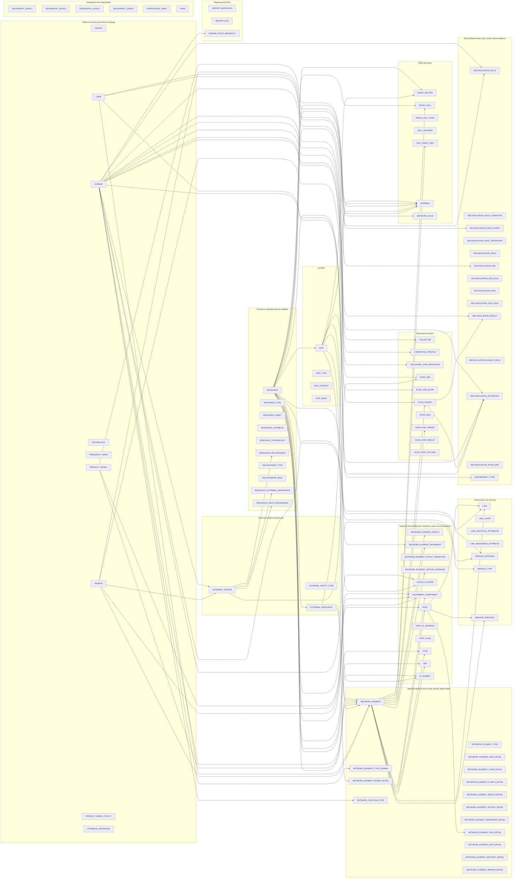

## Platform, tenancy and shared catalogs

TENANT roots every CUSTOMER_ID. USER is a CDC reference copy from User Management (teams / groups stay there and are referenced by code). DOMAIN, TECHNOLOGY, VENDOR and PRODUCT_MODEL are global catalogs (no tenant column).

Tables: `TENANT`, `USER`, `DOMAIN`, `TECHNOLOGY`, `FREQUENCY_BAND`, `VENDOR`, `PRODUCT_MODEL`, `PRODUCT_MODEL_POLICY`, `ATTRIBUTE_DEFINITION`. Referenced from other clusters: `NETWORK_ELEMENT_TYPE`, `RESOURCE_TYPE`

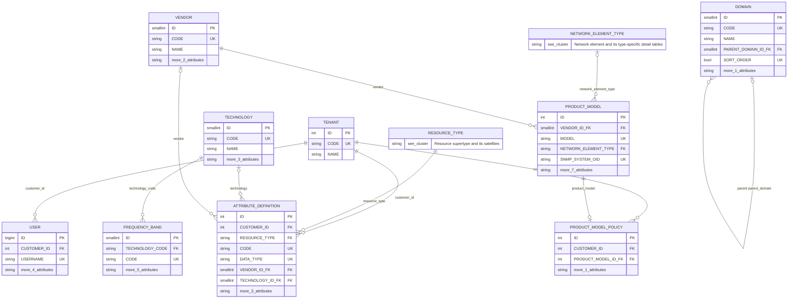

| Table | Columns | Foreign keys | Referenced by |
|---|---|---|---|
| `TENANT` | 5 | 0 | ANTENNA, ATTRIBUTE_DEFINITION, CELL_ANTENNA, CELL_RADIO_UNIT, CLOUD_CLUSTER, COLLECTOR, CREDENTIAL_PROFILE, DOMAIN_TRUST_SNAPSHOT, EQUIPMENT_COMPONENT, EXTERNAL_RESOURCE, EXTERNAL_SYSTEM, GEOGRAPHY_LEVEL1, GEOGRAPHY_LEVEL2, GEOGRAPHY_LEVEL3, GEOGRAPHY_LEVEL4, IP_SUBNET, LINK, LINK_MICROWAVE_ATTRIBUTE, LINK_PROTOCOL_ATTRIBUTE, NETWORK_ELEMENT, NETWORK_ELEMENT_CORE_DETAIL, NETWORK_ELEMENT_HEALTH, NETWORK_ELEMENT_IP_MPLS_DETAIL, NETWORK_ELEMENT_MICROWAVE_DETAIL, NETWORK_ELEMENT_MOVEMENT, NETWORK_ELEMENT_OPTICAL_DETAIL, NETWORK_ELEMENT_PON_DETAIL, NETWORK_ELEMENT_POWER_DETAIL, NETWORK_ELEMENT_RAN_DETAIL, NETWORK_ELEMENT_SECURITY_DETAIL, NETWORK_ELEMENT_SERVER_DETAIL, NETWORK_ELEMENT_SWITCH_DETAIL, NETWORK_ELEMENT_VIRTUAL_INSTANCE, NETWORK_ELEMENT_WIFI_DETAIL, NETWORK_SLICE, OPERATIONAL_AREA, PLMN, PORT, PORT_IP_ADDRESS, PORT_VLAN, PRODUCT_MODEL_POLICY, RADIO_CELL, RADIO_CELL_PLMN, RADIO_SECTOR, RECONCILIATION_EXCEPTION, RECONCILIATION_JOB, RECONCILIATION_JOB_RULE, RECONCILIATION_RESULT, RECONCILIATION_RESULT_FIELD, RECONCILIATION_RULE, RECONCILIATION_RULE_CONDITION, RECONCILIATION_RULE_EVENT, RECONCILIATION_RUN, RECONCILIATION_RUN_RULE, REPORT_DEFINITION, REPORT_RUN, RESOURCE, RESOURCE_ASSET, RESOURCE_ATTRIBUTE, RESOURCE_EXTERNAL_REFERENCE, RESOURCE_FIELD_PROVENANCE, RESOURCE_RELATIONSHIP, RESOURCE_TECHNOLOGY, SCAN_JOB, SCAN_JOB_SCOPE, SCAN_RUN, SCAN_RUN_TARGET, SCAN_STEP_PAYLOAD, SCAN_STEP_RESULT, SCAN_TARGET, SERVICE_ENDPOINT, SERVICE_INSTANCE, SITE, SITE_CONTACT, SITE_ISSUE, USER, VLAN, VRF |
| `USER` | 12 | 1 | NETWORK_ELEMENT, RECONCILIATION_EXCEPTION, RECONCILIATION_RULE, RECONCILIATION_RULE_EVENT |
| `DOMAIN` | 6 | 1 | COLLECTOR, CREDENTIAL_PROFILE, DISCOVERY_STEP_DEFINITION, DISCREPANCY_TYPE, DOMAIN_TRUST_SNAPSHOT, EXTERNAL_SYSTEM, NETWORK_ELEMENT, NETWORK_ELEMENT_TYPE_DOMAIN, NETWORK_FUNCTION_TYPE, RECONCILIATION_EXCEPTION, RECONCILIATION_JOB, RECONCILIATION_RULE, SCAN_JOB, SERVICE_INSTANCE, SERVICE_TYPE |
| `TECHNOLOGY` | 6 | 0 | ATTRIBUTE_DEFINITION, FREQUENCY_BAND, RESOURCE_TECHNOLOGY |
| `FREQUENCY_BAND` | 8 | 1 | RADIO_CELL |
| `VENDOR` | 5 | 0 | ANTENNA, ATTRIBUTE_DEFINITION, EQUIPMENT_COMPONENT, EXTERNAL_SYSTEM, NETWORK_ELEMENT, PRODUCT_MODEL, SCAN_TARGET |
| `PRODUCT_MODEL` | 12 | 2 | ANTENNA, EQUIPMENT_COMPONENT, NETWORK_ELEMENT, PRODUCT_MODEL_POLICY |
| `PRODUCT_MODEL_POLICY` | 9 | 2 | — |
| `ATTRIBUTE_DEFINITION` | 15 | 4 | RESOURCE_ATTRIBUTE |

## Geography and organisation

Four geography levels chain down to the pin area a SITE binds to; OPERATIONAL_AREA is the Region > Circle > Zone > Division > Territory ownership tree; PLMN lists the operator's mobile network codes.

Tables: `GEOGRAPHY_LEVEL1`, `GEOGRAPHY_LEVEL2`, `GEOGRAPHY_LEVEL3`, `GEOGRAPHY_LEVEL4`, `OPERATIONAL_AREA`, `PLMN`

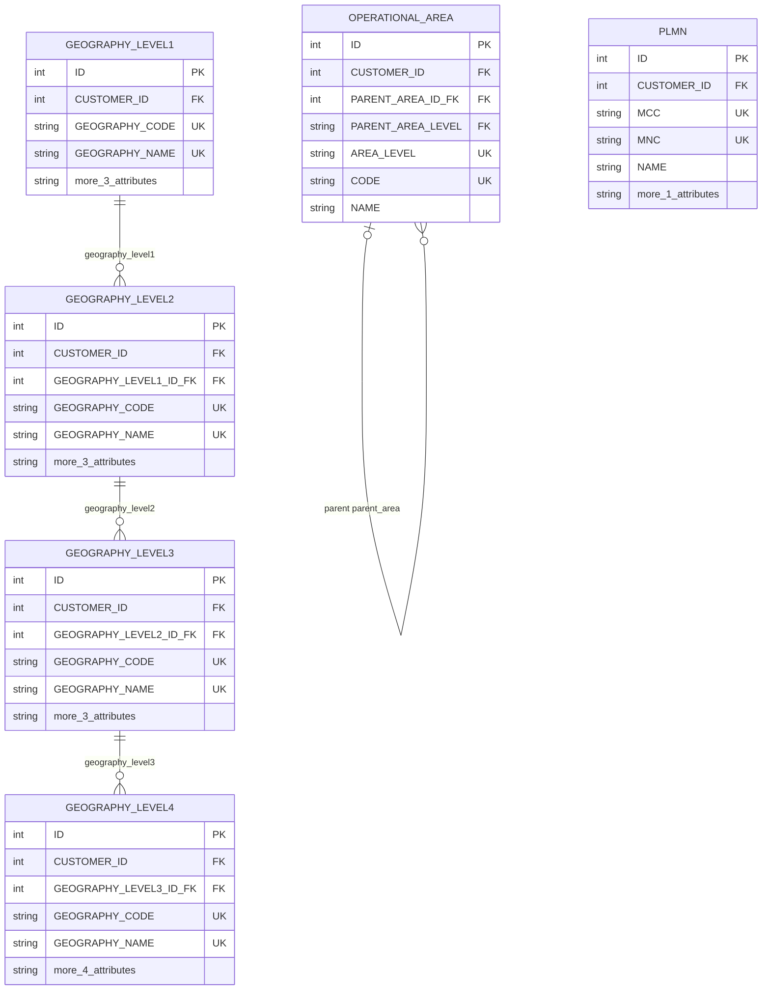

| Table | Columns | Foreign keys | Referenced by |
|---|---|---|---|
| `GEOGRAPHY_LEVEL1` | 12 | 1 | GEOGRAPHY_LEVEL2 |
| `GEOGRAPHY_LEVEL2` | 13 | 2 | GEOGRAPHY_LEVEL3 |
| `GEOGRAPHY_LEVEL3` | 13 | 2 | GEOGRAPHY_LEVEL4 |
| `GEOGRAPHY_LEVEL4` | 14 | 2 | SITE |
| `OPERATIONAL_AREA` | 14 | 2 | CREDENTIAL_PROFILE, SCAN_JOB, SITE |
| `PLMN` | 11 | 1 | NETWORK_ELEMENT_RAN_DETAIL, NETWORK_SLICE, RADIO_CELL_PLMN |

## Resource supertype and its satellites

RESOURCE is the supertype row of every inventory object; each subtype carries a constant RESOURCE_TYPE bound by a composite FK so a row can only claim a supertype of its own type. The satellites (asset, attributes, technologies, relationships, external references, provenance) hang off RESOURCE, so they work for any subtype.

Tables: `RESOURCE`, `RESOURCE_TYPE`, `RESOURCE_ASSET`, `RESOURCE_ATTRIBUTE`, `RESOURCE_TECHNOLOGY`, `RESOURCE_RELATIONSHIP`, `RELATIONSHIP_TYPE`, `RELATIONSHIP_RULE`, `RESOURCE_EXTERNAL_REFERENCE`, `RESOURCE_FIELD_PROVENANCE`. Referenced from other clusters: `ATTRIBUTE_DEFINITION`, `EXTERNAL_SYSTEM`, `RECONCILIATION_FIELD`, `TECHNOLOGY`

```mermaid
erDiagram
  TECHNOLOGY {
    string see_cluster "Platform, tenancy and shared catalogs"
  }
  RECONCILIATION_FIELD {
    string see_cluster "Reconciliation rules, jobs, results and exceptions"
  }
  EXTERNAL_SYSTEM {
    string see_cluster "External systems and proxies"
  }
  ATTRIBUTE_DEFINITION {
    string see_cluster "Platform, tenancy and shared catalogs"
  }
  RESOURCE {
    bigint ID PK
    int CUSTOMER_ID FK
    string RESOURCE_TYPE FK
  }
  RESOURCE_TYPE {
    string CODE PK
    string NAME 
    string more_3_attributes
  }
  RESOURCE_ASSET {
    int ID PK
    int CUSTOMER_ID FK
    bigint RESOURCE_ID_FK FK
    string ASSET_TAG UK
    string more_11_attributes
  }
  RESOURCE_ATTRIBUTE {
    bigint ID PK
    int CUSTOMER_ID FK
    bigint RESOURCE_ID_FK FK
    string RESOURCE_TYPE FK
    int ATTRIBUTE_DEFINITION_ID_FK FK
    string DATA_TYPE FK
    string more_4_attributes
  }
  RESOURCE_TECHNOLOGY {
    bigint ID PK
    int CUSTOMER_ID FK
    bigint RESOURCE_ID_FK FK
    smallint TECHNOLOGY_ID_FK FK
    string more_1_attributes
  }
  RESOURCE_RELATIONSHIP {
    bigint ID PK
    int CUSTOMER_ID FK
    string RELATIONSHIP_TYPE FK
    bigint FROM_RESOURCE_ID_FK FK
    string FROM_RESOURCE_TYPE FK
    bigint TO_RESOURCE_ID_FK FK
    string TO_RESOURCE_TYPE FK
    smallint SEQUENCE_NUMBER UK
    int EXTERNAL_SYSTEM_ID_FK FK
    string more_3_attributes
  }
  RELATIONSHIP_TYPE {
    string CODE PK
    string NAME 
    string more_4_attributes
  }
  RELATIONSHIP_RULE {
    smallint ID PK
    string RELATIONSHIP_TYPE FK
    string FROM_RESOURCE_TYPE FK
    string TO_RESOURCE_TYPE FK
  }
  RESOURCE_EXTERNAL_REFERENCE {
    bigint ID PK
    int CUSTOMER_ID FK
    bigint RESOURCE_ID_FK FK
    int EXTERNAL_SYSTEM_ID_FK FK
    string EXTERNAL_ID UK
    bool SYSTEM_OF_RECORD_FLAG UK
    string more_3_attributes
  }
  RESOURCE_FIELD_PROVENANCE {
    bigint ID PK
    int CUSTOMER_ID FK
    bigint RESOURCE_ID_FK FK
    string FIELD_CODE FK
    int EXTERNAL_SYSTEM_ID_FK FK
    string more_5_attributes
  }
  RESOURCE_TYPE ||--o{ RESOURCE : "resource_type"
  RESOURCE ||--o| RESOURCE_ASSET : "resource (cascade)"
  ATTRIBUTE_DEFINITION ||--o{ RESOURCE_ATTRIBUTE : "attribute_definition"
  RESOURCE ||--o{ RESOURCE_ATTRIBUTE : "resource (cascade)"
  RESOURCE ||--o{ RESOURCE_TECHNOLOGY : "resource (cascade)"
  TECHNOLOGY ||--o{ RESOURCE_TECHNOLOGY : "technology"
  EXTERNAL_SYSTEM |o--o{ RESOURCE_RELATIONSHIP : "external_system"
  RESOURCE ||--o{ RESOURCE_RELATIONSHIP : "from_resource (cascade)"
  RELATIONSHIP_RULE ||--o{ RESOURCE_RELATIONSHIP : "relationship_type"
  RESOURCE ||--o{ RESOURCE_RELATIONSHIP : "to_resource (cascade)"
  RESOURCE_TYPE ||--o{ RELATIONSHIP_RULE : "from_resource_type"
  RELATIONSHIP_TYPE ||--o{ RELATIONSHIP_RULE : "relationship_type"
  RESOURCE_TYPE ||--o{ RELATIONSHIP_RULE : "to_resource_type"
  EXTERNAL_SYSTEM ||--o{ RESOURCE_EXTERNAL_REFERENCE : "external_system"
  RESOURCE ||--o{ RESOURCE_EXTERNAL_REFERENCE : "resource (cascade)"
  EXTERNAL_SYSTEM |o--o{ RESOURCE_FIELD_PROVENANCE : "external_system"
  RECONCILIATION_FIELD ||--o{ RESOURCE_FIELD_PROVENANCE : "field_code"
  RESOURCE ||--o{ RESOURCE_FIELD_PROVENANCE : "resource (cascade)"
```

| Table | Columns | Foreign keys | Referenced by |
|---|---|---|---|
| `RESOURCE` | 4 | 2 | ANTENNA, CLOUD_CLUSTER, EQUIPMENT_COMPONENT, EXTERNAL_RESOURCE, IP_SUBNET, LINK, NETWORK_ELEMENT, NETWORK_SLICE, PORT, RADIO_CELL, RADIO_SECTOR, RECONCILIATION_EXCEPTION, RECONCILIATION_RESULT, RESOURCE_ASSET, RESOURCE_ATTRIBUTE, RESOURCE_EXTERNAL_REFERENCE, RESOURCE_FIELD_PROVENANCE, RESOURCE_RELATIONSHIP, RESOURCE_TECHNOLOGY, SERVICE_INSTANCE, SITE, VLAN, VRF |
| `RESOURCE_TYPE` | 5 | 0 | ATTRIBUTE_DEFINITION, RECONCILIATION_FIELD, RELATIONSHIP_RULE, RESOURCE |
| `RESOURCE_ASSET` | 20 | 2 | — |
| `RESOURCE_ATTRIBUTE` | 15 | 3 | — |
| `RESOURCE_TECHNOLOGY` | 10 | 3 | — |
| `RESOURCE_RELATIONSHIP` | 18 | 5 | — |
| `RELATIONSHIP_TYPE` | 6 | 0 | RELATIONSHIP_RULE |
| `RELATIONSHIP_RULE` | 4 | 3 | RESOURCE_RELATIONSHIP |
| `RESOURCE_EXTERNAL_REFERENCE` | 14 | 3 | — |
| `RESOURCE_FIELD_PROVENANCE` | 15 | 4 | — |

## Location

SITE hosts equipment and is referenced by devices, sectors, antennas, cloud clusters, subnets, movements and scan scopes. Building detail (floors, rooms, racks, power feeds) is owned by Passive Inventory; a device points at its rack through an EXTERNAL_RESOURCE proxy.

Tables: `SITE`, `SITE_TYPE`, `SITE_CONTACT`, `SITE_ISSUE`. Referenced from other clusters: `GEOGRAPHY_LEVEL4`, `OPERATIONAL_AREA`, `RESOURCE`

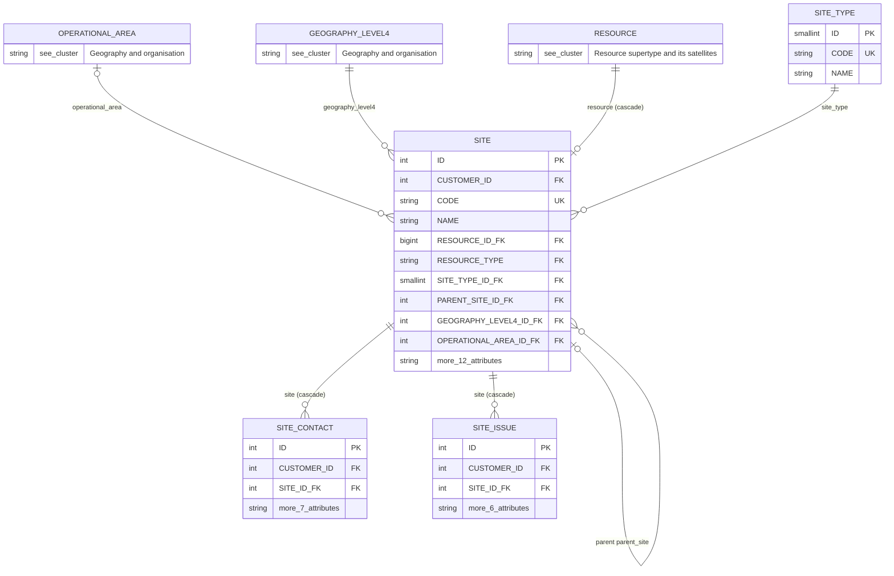

| Table | Columns | Foreign keys | Referenced by |
|---|---|---|---|
| `SITE` | 29 | 6 | ANTENNA, CLOUD_CLUSTER, IP_SUBNET, NETWORK_ELEMENT, NETWORK_ELEMENT_MOVEMENT, RADIO_SECTOR, SCAN_JOB_SCOPE, SITE_CONTACT, SITE_ISSUE |
| `SITE_TYPE` | 3 | 0 | SITE |
| `SITE_CONTACT` | 15 | 2 | — |
| `SITE_ISSUE` | 14 | 2 | — |

## Network element and its type-specific detail tables

NETWORK_ELEMENT is the golden record of a device. Its type (NETWORK_ELEMENT_TYPE) decides which 1:1 detail table exists; the detail row is bound to the device by (id, type) and to the catalog by (type, detail table), so a router can never own a RAN detail row.

Tables: `NETWORK_ELEMENT`, `NETWORK_ELEMENT_TYPE`, `NETWORK_ELEMENT_TYPE_DOMAIN`, `NETWORK_ELEMENT_RAN_DETAIL`, `NETWORK_ELEMENT_CORE_DETAIL`, `NETWORK_ELEMENT_IP_MPLS_DETAIL`, `NETWORK_ELEMENT_SWITCH_DETAIL`, `NETWORK_ELEMENT_OPTICAL_DETAIL`, `NETWORK_ELEMENT_MICROWAVE_DETAIL`, `NETWORK_ELEMENT_PON_DETAIL`, `NETWORK_ELEMENT_WIFI_DETAIL`, `NETWORK_ELEMENT_SECURITY_DETAIL`, `NETWORK_ELEMENT_SERVER_DETAIL`, `NETWORK_ELEMENT_POWER_DETAIL`, `NETWORK_FUNCTION_TYPE`. Referenced from other clusters: `CLOUD_CLUSTER`, `DOMAIN`, `EXTERNAL_RESOURCE`, `PLMN`, `PORT`, `PRODUCT_MODEL`, `RESOURCE`, `SITE`, `USER`, `VENDOR`

```mermaid
erDiagram
  VENDOR {
    string see_cluster "Platform, tenancy and shared catalogs"
  }
  USER {
    string see_cluster "Platform, tenancy and shared catalogs"
  }
  SITE {
    string see_cluster "Location"
  }
  RESOURCE {
    string see_cluster "Resource supertype and its satellites"
  }
  PRODUCT_MODEL {
    string see_cluster "Platform, tenancy and shared catalogs"
  }
  PORT {
    string see_cluster "Network element lifecycle, hardware, ports and virtualisation"
  }
  PLMN {
    string see_cluster "Geography and organisation"
  }
  EXTERNAL_RESOURCE {
    string see_cluster "External systems and proxies"
  }
  DOMAIN {
    string see_cluster "Platform, tenancy and shared catalogs"
  }
  CLOUD_CLUSTER {
    string see_cluster "Network element lifecycle, hardware, ports and virtualisation"
  }
  NETWORK_ELEMENT {
    int ID PK
    int CUSTOMER_ID FK
    bigint RESOURCE_ID_FK FK
    string RESOURCE_TYPE FK
    string NETWORK_ELEMENT_NAME UK
    string NETWORK_ELEMENT_TYPE FK
    smallint DOMAIN_ID_FK FK
    smallint VENDOR_ID_FK FK
    int PRODUCT_MODEL_ID_FK FK
    int SITE_ID_FK FK
    int RACK_EXTERNAL_RESOURCE_ID_FK FK
    int PARENT_NETWORK_ELEMENT_ID_FK FK
    bigint DECOMMISSIONED_BY_FK FK
    string more_20_attributes
  }
  NETWORK_ELEMENT_TYPE {
    smallint ID PK
    string CODE UK
    string NAME 
    string DETAIL_TABLE UK
    bool SORT_ORDER UK
    string more_2_attributes
  }
  NETWORK_ELEMENT_TYPE_DOMAIN {
    smallint ID PK
    string NETWORK_ELEMENT_TYPE_CODE FK
    smallint DOMAIN_ID_FK FK
  }
  NETWORK_ELEMENT_RAN_DETAIL {
    int ID PK
    int CUSTOMER_ID FK
    int NETWORK_ELEMENT_ID_FK FK
    string NETWORK_ELEMENT_TYPE FK
    string DETAIL_TABLE FK
    int PRIMARY_PLMN_ID_FK FK
    int CONTROLLER_NETWORK_ELEMENT_ID_FK FK
    string CONTROLLER_NETWORK_ELEMENT_TYPE FK
    string more_10_attributes
  }
  NETWORK_ELEMENT_CORE_DETAIL {
    int ID PK
    int CUSTOMER_ID FK
    int NETWORK_ELEMENT_ID_FK FK
    string NETWORK_ELEMENT_TYPE FK
    string DETAIL_TABLE FK
    string NETWORK_FUNCTION_TYPE_CODE FK
    string more_5_attributes
  }
  NETWORK_ELEMENT_IP_MPLS_DETAIL {
    int ID PK
    int CUSTOMER_ID FK
    int NETWORK_ELEMENT_ID_FK FK
    string NETWORK_ELEMENT_TYPE FK
    string DETAIL_TABLE FK
    string more_18_attributes
  }
  NETWORK_ELEMENT_SWITCH_DETAIL {
    int ID PK
    int CUSTOMER_ID FK
    int NETWORK_ELEMENT_ID_FK FK
    string NETWORK_ELEMENT_TYPE FK
    string DETAIL_TABLE FK
    string more_9_attributes
  }
  NETWORK_ELEMENT_OPTICAL_DETAIL {
    int ID PK
    int CUSTOMER_ID FK
    int NETWORK_ELEMENT_ID_FK FK
    string NETWORK_ELEMENT_TYPE FK
    string DETAIL_TABLE FK
    string more_10_attributes
  }
  NETWORK_ELEMENT_MICROWAVE_DETAIL {
    int ID PK
    int CUSTOMER_ID FK
    int NETWORK_ELEMENT_ID_FK FK
    string NETWORK_ELEMENT_TYPE FK
    string DETAIL_TABLE FK
    string more_7_attributes
  }
  NETWORK_ELEMENT_PON_DETAIL {
    int ID PK
    int CUSTOMER_ID FK
    int NETWORK_ELEMENT_ID_FK FK
    string NETWORK_ELEMENT_TYPE FK
    string DETAIL_TABLE FK
    int PARENT_OLT_NETWORK_ELEMENT_ID_FK FK
    int SERVING_PON_PORT_ID_FK FK
    string more_7_attributes
  }
  NETWORK_ELEMENT_WIFI_DETAIL {
    int ID PK
    int CUSTOMER_ID FK
    int NETWORK_ELEMENT_ID_FK FK
    string NETWORK_ELEMENT_TYPE FK
    string DETAIL_TABLE FK
    int WLAN_CONTROLLER_NETWORK_ELEMENT_ID_FK FK
    string more_17_attributes
  }
  NETWORK_ELEMENT_SECURITY_DETAIL {
    int ID PK
    int CUSTOMER_ID FK
    int NETWORK_ELEMENT_ID_FK FK
    string NETWORK_ELEMENT_TYPE FK
    string DETAIL_TABLE FK
    int HIGH_AVAILABILITY_PEER_NETWORK_ELEMENT_ID_FK FK
    string more_9_attributes
  }
  NETWORK_ELEMENT_SERVER_DETAIL {
    int ID PK
    int CUSTOMER_ID FK
    int NETWORK_ELEMENT_ID_FK FK
    string NETWORK_ELEMENT_TYPE FK
    string DETAIL_TABLE FK
    int CLOUD_CLUSTER_ID_FK FK
    string more_9_attributes
  }
  NETWORK_ELEMENT_POWER_DETAIL {
    int ID PK
    int CUSTOMER_ID FK
    int NETWORK_ELEMENT_ID_FK FK
    string NETWORK_ELEMENT_TYPE FK
    string DETAIL_TABLE FK
    int POWER_UNIT_EXTERNAL_RESOURCE_ID_FK FK
    string more_5_attributes
  }
  NETWORK_FUNCTION_TYPE {
    smallint ID PK
    string CODE UK
    string NAME 
    smallint DOMAIN_ID_FK FK
    string more_2_attributes
  }
  USER |o--o{ NETWORK_ELEMENT : "decommissioned_by"
  DOMAIN ||--o{ NETWORK_ELEMENT : "domain"
  NETWORK_ELEMENT_TYPE_DOMAIN ||--o{ NETWORK_ELEMENT : "network_element_type"
  NETWORK_ELEMENT |o--o{ NETWORK_ELEMENT : "parent parent_network_element"
  PRODUCT_MODEL |o--o{ NETWORK_ELEMENT : "vendor"
  RESOURCE ||--o| NETWORK_ELEMENT : "resource (cascade)"
  SITE ||--o{ NETWORK_ELEMENT : "site"
  EXTERNAL_RESOURCE |o--o{ NETWORK_ELEMENT : "rack_external_resource"
  VENDOR |o--o{ NETWORK_ELEMENT : "vendor"
  DOMAIN ||--o{ NETWORK_ELEMENT_TYPE_DOMAIN : "domain"
  NETWORK_ELEMENT_TYPE ||--o{ NETWORK_ELEMENT_TYPE_DOMAIN : "network_element_type_code"
  NETWORK_ELEMENT |o--o{ NETWORK_ELEMENT_RAN_DETAIL : "controller_network_element"
  NETWORK_ELEMENT_TYPE ||--o{ NETWORK_ELEMENT_RAN_DETAIL : "network_element_type"
  NETWORK_ELEMENT ||--o| NETWORK_ELEMENT_RAN_DETAIL : "network_element (cascade)"
  PLMN |o--o{ NETWORK_ELEMENT_RAN_DETAIL : "primary_plmn"
  NETWORK_ELEMENT_TYPE ||--o{ NETWORK_ELEMENT_CORE_DETAIL : "network_element_type"
  NETWORK_ELEMENT ||--o| NETWORK_ELEMENT_CORE_DETAIL : "network_element (cascade)"
  NETWORK_FUNCTION_TYPE ||--o{ NETWORK_ELEMENT_CORE_DETAIL : "network_function_type_code"
  NETWORK_ELEMENT_TYPE ||--o{ NETWORK_ELEMENT_IP_MPLS_DETAIL : "network_element_type"
  NETWORK_ELEMENT ||--o| NETWORK_ELEMENT_IP_MPLS_DETAIL : "network_element (cascade)"
  NETWORK_ELEMENT_TYPE ||--o{ NETWORK_ELEMENT_SWITCH_DETAIL : "network_element_type"
  NETWORK_ELEMENT ||--o| NETWORK_ELEMENT_SWITCH_DETAIL : "network_element (cascade)"
  NETWORK_ELEMENT_TYPE ||--o{ NETWORK_ELEMENT_OPTICAL_DETAIL : "network_element_type"
  NETWORK_ELEMENT ||--o| NETWORK_ELEMENT_OPTICAL_DETAIL : "network_element (cascade)"
  NETWORK_ELEMENT_TYPE ||--o{ NETWORK_ELEMENT_MICROWAVE_DETAIL : "network_element_type"
  NETWORK_ELEMENT ||--o| NETWORK_ELEMENT_MICROWAVE_DETAIL : "network_element (cascade)"
  NETWORK_ELEMENT_TYPE ||--o{ NETWORK_ELEMENT_PON_DETAIL : "network_element_type"
  NETWORK_ELEMENT ||--o| NETWORK_ELEMENT_PON_DETAIL : "network_element (cascade)"
  NETWORK_ELEMENT |o--o{ NETWORK_ELEMENT_PON_DETAIL : "parent_olt_network_element"
  PORT |o--o{ NETWORK_ELEMENT_PON_DETAIL : "parent_olt_network_element"
  NETWORK_ELEMENT_TYPE ||--o{ NETWORK_ELEMENT_WIFI_DETAIL : "network_element_type"
  NETWORK_ELEMENT ||--o| NETWORK_ELEMENT_WIFI_DETAIL : "network_element (cascade)"
  NETWORK_ELEMENT |o--o{ NETWORK_ELEMENT_WIFI_DETAIL : "wlan_controller_network_element"
  NETWORK_ELEMENT |o--o{ NETWORK_ELEMENT_SECURITY_DETAIL : "high_availability_peer_network_element"
  NETWORK_ELEMENT_TYPE ||--o{ NETWORK_ELEMENT_SECURITY_DETAIL : "network_element_type"
  NETWORK_ELEMENT ||--o| NETWORK_ELEMENT_SECURITY_DETAIL : "network_element (cascade)"
  CLOUD_CLUSTER |o--o{ NETWORK_ELEMENT_SERVER_DETAIL : "cloud_cluster"
  NETWORK_ELEMENT_TYPE ||--o{ NETWORK_ELEMENT_SERVER_DETAIL : "network_element_type"
  NETWORK_ELEMENT ||--o| NETWORK_ELEMENT_SERVER_DETAIL : "network_element (cascade)"
  NETWORK_ELEMENT_TYPE ||--o{ NETWORK_ELEMENT_POWER_DETAIL : "network_element_type"
  NETWORK_ELEMENT ||--o| NETWORK_ELEMENT_POWER_DETAIL : "network_element (cascade)"
  EXTERNAL_RESOURCE |o--o{ NETWORK_ELEMENT_POWER_DETAIL : "power_unit_external_resource"
  DOMAIN ||--o{ NETWORK_FUNCTION_TYPE : "domain"
```

| Table | Columns | Foreign keys | Referenced by |
|---|---|---|---|
| `NETWORK_ELEMENT` | 40 | 10 | CELL_RADIO_UNIT, EQUIPMENT_COMPONENT, LINK, NETWORK_ELEMENT_CORE_DETAIL, NETWORK_ELEMENT_HEALTH, NETWORK_ELEMENT_IP_MPLS_DETAIL, NETWORK_ELEMENT_MICROWAVE_DETAIL, NETWORK_ELEMENT_MOVEMENT, NETWORK_ELEMENT_OPTICAL_DETAIL, NETWORK_ELEMENT_PON_DETAIL, NETWORK_ELEMENT_POWER_DETAIL, NETWORK_ELEMENT_RAN_DETAIL, NETWORK_ELEMENT_SECURITY_DETAIL, NETWORK_ELEMENT_SERVER_DETAIL, NETWORK_ELEMENT_SWITCH_DETAIL, NETWORK_ELEMENT_VIRTUAL_INSTANCE, NETWORK_ELEMENT_WIFI_DETAIL, PORT, RADIO_CELL, SCAN_RUN_TARGET, SCAN_TARGET, SERVICE_ENDPOINT, VLAN, VRF |
| `NETWORK_ELEMENT_TYPE` | 7 | 0 | NETWORK_ELEMENT_CORE_DETAIL, NETWORK_ELEMENT_IP_MPLS_DETAIL, NETWORK_ELEMENT_MICROWAVE_DETAIL, NETWORK_ELEMENT_OPTICAL_DETAIL, NETWORK_ELEMENT_PON_DETAIL, NETWORK_ELEMENT_POWER_DETAIL, NETWORK_ELEMENT_RAN_DETAIL, NETWORK_ELEMENT_SECURITY_DETAIL, NETWORK_ELEMENT_SERVER_DETAIL, NETWORK_ELEMENT_SWITCH_DETAIL, NETWORK_ELEMENT_TYPE_DOMAIN, NETWORK_ELEMENT_WIFI_DETAIL, PRODUCT_MODEL |
| `NETWORK_ELEMENT_TYPE_DOMAIN` | 3 | 2 | NETWORK_ELEMENT |
| `NETWORK_ELEMENT_RAN_DETAIL` | 23 | 5 | — |
| `NETWORK_ELEMENT_CORE_DETAIL` | 16 | 4 | — |
| `NETWORK_ELEMENT_IP_MPLS_DETAIL` | 28 | 3 | — |
| `NETWORK_ELEMENT_SWITCH_DETAIL` | 19 | 3 | — |
| `NETWORK_ELEMENT_OPTICAL_DETAIL` | 20 | 3 | — |
| `NETWORK_ELEMENT_MICROWAVE_DETAIL` | 17 | 3 | — |
| `NETWORK_ELEMENT_PON_DETAIL` | 19 | 5 | — |
| `NETWORK_ELEMENT_WIFI_DETAIL` | 28 | 4 | — |
| `NETWORK_ELEMENT_SECURITY_DETAIL` | 20 | 4 | — |
| `NETWORK_ELEMENT_SERVER_DETAIL` | 20 | 4 | — |
| `NETWORK_ELEMENT_POWER_DETAIL` | 16 | 4 | — |
| `NETWORK_FUNCTION_TYPE` | 6 | 1 | NETWORK_ELEMENT_CORE_DETAIL |

## Network element lifecycle, hardware, ports and virtualisation

Health, stock movements (FK-bound to the allowed transitions), the hardware tree (components can nest, both bound to the same device), ports with their IPs and VLANs, VRFs, and the VNF/CNF instance record with its host and cloud cluster.

Tables: `NETWORK_ELEMENT_HEALTH`, `NETWORK_ELEMENT_MOVEMENT`, `NETWORK_ELEMENT_STOCK_TRANSITION`, `NETWORK_ELEMENT_VIRTUAL_INSTANCE`, `CLOUD_CLUSTER`, `EQUIPMENT_COMPONENT`, `PORT`, `PORT_IP_ADDRESS`, `PORT_VLAN`, `VLAN`, `VRF`, `IP_SUBNET`. Referenced from other clusters: `DOMAIN`, `EXTERNAL_RESOURCE`, `NETWORK_ELEMENT_TYPE_DOMAIN`, `PRODUCT_MODEL`, `RESOURCE`, `SERVICE_INSTANCE`, `SITE`, `USER`, `VENDOR`

```mermaid
erDiagram
  VENDOR {
    string see_cluster "Platform, tenancy and shared catalogs"
  }
  USER {
    string see_cluster "Platform, tenancy and shared catalogs"
  }
  SITE {
    string see_cluster "Location"
  }
  SERVICE_INSTANCE {
    string see_cluster "Connectivity and services"
  }
  RESOURCE {
    string see_cluster "Resource supertype and its satellites"
  }
  PRODUCT_MODEL {
    string see_cluster "Platform, tenancy and shared catalogs"
  }
  NETWORK_ELEMENT_TYPE_DOMAIN {
    string see_cluster "Network element and its type-specific detail tables"
  }
  EXTERNAL_RESOURCE {
    string see_cluster "External systems and proxies"
  }
  DOMAIN {
    string see_cluster "Platform, tenancy and shared catalogs"
  }
  NETWORK_ELEMENT {
    int ID PK
    int CUSTOMER_ID FK
    bigint RESOURCE_ID_FK FK
    string RESOURCE_TYPE FK
    string NETWORK_ELEMENT_NAME UK
    string NETWORK_ELEMENT_TYPE FK
    smallint DOMAIN_ID_FK FK
    smallint VENDOR_ID_FK FK
    int PRODUCT_MODEL_ID_FK FK
    int SITE_ID_FK FK
    int RACK_EXTERNAL_RESOURCE_ID_FK FK
    int PARENT_NETWORK_ELEMENT_ID_FK FK
    bigint DECOMMISSIONED_BY_FK FK
    string more_20_attributes
  }
  NETWORK_ELEMENT_HEALTH {
    int ID PK
    int CUSTOMER_ID FK
    int NETWORK_ELEMENT_ID_FK FK
    string more_8_attributes
  }
  NETWORK_ELEMENT_MOVEMENT {
    int ID PK
    int CUSTOMER_ID FK
    int NETWORK_ELEMENT_ID_FK FK
    string FROM_STATE FK
    string TO_STATE FK
    int FROM_SITE_ID_FK FK
    int TO_SITE_ID_FK FK
    string more_3_attributes
  }
  NETWORK_ELEMENT_STOCK_TRANSITION {
    smallint ID PK
    string FROM_STATE UK
    string TO_STATE UK
    string more_1_attributes
  }
  NETWORK_ELEMENT_VIRTUAL_INSTANCE {
    int ID PK
    int CUSTOMER_ID FK
    int NETWORK_ELEMENT_ID_FK FK
    string NETWORK_ELEMENT_RESOURCE_TYPE FK
    string INSTANCE_UUID UK
    int CLOUD_CLUSTER_ID_FK FK
    int HOST_NETWORK_ELEMENT_ID_FK FK
    string HOST_RESOURCE_TYPE FK
    string more_4_attributes
  }
  CLOUD_CLUSTER {
    int ID PK
    int CUSTOMER_ID FK
    bigint RESOURCE_ID_FK FK
    string RESOURCE_TYPE FK
    string CODE UK
    int SITE_ID_FK FK
    string more_1_attributes
  }
  EQUIPMENT_COMPONENT {
    int ID PK
    int CUSTOMER_ID FK
    bigint RESOURCE_ID_FK FK
    string RESOURCE_TYPE FK
    int NETWORK_ELEMENT_ID_FK FK
    int PARENT_COMPONENT_ID_FK FK
    string NAME UK
    smallint VENDOR_ID_FK FK
    int PRODUCT_MODEL_ID_FK FK
    string more_10_attributes
  }
  PORT {
    int ID PK
    int CUSTOMER_ID FK
    bigint RESOURCE_ID_FK FK
    string RESOURCE_TYPE FK
    int NETWORK_ELEMENT_ID_FK FK
    int EQUIPMENT_COMPONENT_ID_FK FK
    int TRANSCEIVER_COMPONENT_ID_FK FK
    int PARENT_PORT_ID_FK FK
    int VRF_ID_FK FK
    string NAME UK
    string more_15_attributes
  }
  PORT_IP_ADDRESS {
    int ID PK
    int CUSTOMER_ID FK
    int PORT_ID_FK FK
    binary IP_ADDRESS_BINARY UK
    int IP_SUBNET_ID_FK FK
    string more_3_attributes
  }
  PORT_VLAN {
    int ID PK
    int CUSTOMER_ID FK
    int NETWORK_ELEMENT_ID_FK FK
    int PORT_ID_FK FK
    int VLAN_ID_FK FK
    string more_2_attributes
  }
  VLAN {
    int ID PK
    int CUSTOMER_ID FK
    bigint RESOURCE_ID_FK FK
    string RESOURCE_TYPE FK
    int NETWORK_ELEMENT_ID_FK FK
    smallint VLAN_NUMBER UK
    string NAME 
    string more_3_attributes
  }
  VRF {
    int ID PK
    int CUSTOMER_ID FK
    bigint RESOURCE_ID_FK FK
    string RESOURCE_TYPE FK
    int NETWORK_ELEMENT_ID_FK FK
    string NAME UK
    int SERVICE_INSTANCE_ID_FK FK
    string more_4_attributes
  }
  IP_SUBNET {
    int ID PK
    int CUSTOMER_ID FK
    bigint RESOURCE_ID_FK FK
    string RESOURCE_TYPE FK
    bool PREFIX_LENGTH UK
    binary NETWORK_ADDRESS_BINARY UK
    int SERVICE_INSTANCE_ID_FK FK
    int ROUTING_CONTEXT_KEY UK
    int PARENT_SUBNET_ID_FK FK
    int SITE_ID_FK FK
    string more_5_attributes
  }
  USER |o--o{ NETWORK_ELEMENT : "decommissioned_by"
  DOMAIN ||--o{ NETWORK_ELEMENT : "domain"
  NETWORK_ELEMENT_TYPE_DOMAIN ||--o{ NETWORK_ELEMENT : "network_element_type"
  NETWORK_ELEMENT |o--o{ NETWORK_ELEMENT : "parent parent_network_element"
  PRODUCT_MODEL |o--o{ NETWORK_ELEMENT : "vendor"
  RESOURCE ||--o| NETWORK_ELEMENT : "resource (cascade)"
  SITE ||--o{ NETWORK_ELEMENT : "site"
  EXTERNAL_RESOURCE |o--o{ NETWORK_ELEMENT : "rack_external_resource"
  VENDOR |o--o{ NETWORK_ELEMENT : "vendor"
  NETWORK_ELEMENT ||--o| NETWORK_ELEMENT_HEALTH : "network_element (cascade)"
  SITE |o--o{ NETWORK_ELEMENT_MOVEMENT : "from_site"
  NETWORK_ELEMENT_STOCK_TRANSITION ||--o{ NETWORK_ELEMENT_MOVEMENT : "from_state"
  NETWORK_ELEMENT ||--o{ NETWORK_ELEMENT_MOVEMENT : "network_element"
  SITE |o--o{ NETWORK_ELEMENT_MOVEMENT : "to_site"
  CLOUD_CLUSTER |o--o{ NETWORK_ELEMENT_VIRTUAL_INSTANCE : "cloud_cluster"
  NETWORK_ELEMENT |o--o{ NETWORK_ELEMENT_VIRTUAL_INSTANCE : "host_network_element"
  NETWORK_ELEMENT ||--o| NETWORK_ELEMENT_VIRTUAL_INSTANCE : "network_element (cascade)"
  RESOURCE ||--o| CLOUD_CLUSTER : "resource (cascade)"
  SITE ||--o{ CLOUD_CLUSTER : "site"
  NETWORK_ELEMENT ||--o{ EQUIPMENT_COMPONENT : "network_element"
  EQUIPMENT_COMPONENT |o--o{ EQUIPMENT_COMPONENT : "parent network_element"
  PRODUCT_MODEL |o--o{ EQUIPMENT_COMPONENT : "vendor"
  RESOURCE ||--o| EQUIPMENT_COMPONENT : "resource (cascade)"
  VENDOR |o--o{ EQUIPMENT_COMPONENT : "vendor"
  EQUIPMENT_COMPONENT |o--o{ PORT : "network_element"
  NETWORK_ELEMENT ||--o{ PORT : "network_element"
  PORT |o--o{ PORT : "parent network_element"
  RESOURCE ||--o| PORT : "resource (cascade)"
  EQUIPMENT_COMPONENT |o--o{ PORT : "network_element"
  VRF |o--o{ PORT : "network_element"
  IP_SUBNET |o--o{ PORT_IP_ADDRESS : "ip_subnet"
  PORT ||--o{ PORT_IP_ADDRESS : "port (cascade)"
  PORT ||--o{ PORT_VLAN : "network_element (cascade)"
  VLAN ||--o{ PORT_VLAN : "network_element (cascade)"
  NETWORK_ELEMENT ||--o{ VLAN : "network_element"
  RESOURCE ||--o| VLAN : "resource (cascade)"
  NETWORK_ELEMENT ||--o{ VRF : "network_element"
  RESOURCE ||--o| VRF : "resource (cascade)"
  SERVICE_INSTANCE |o--o{ VRF : "service_instance"
  IP_SUBNET |o--o{ IP_SUBNET : "parent parent_subnet"
  RESOURCE ||--o| IP_SUBNET : "resource (cascade)"
  SERVICE_INSTANCE |o--o{ IP_SUBNET : "service_instance"
  SITE |o--o{ IP_SUBNET : "site"
```

| Table | Columns | Foreign keys | Referenced by |
|---|---|---|---|
| `NETWORK_ELEMENT_HEALTH` | 16 | 2 | — |
| `NETWORK_ELEMENT_MOVEMENT` | 15 | 5 | — |
| `NETWORK_ELEMENT_STOCK_TRANSITION` | 4 | 0 | NETWORK_ELEMENT_MOVEMENT |
| `NETWORK_ELEMENT_VIRTUAL_INSTANCE` | 17 | 4 | — |
| `CLOUD_CLUSTER` | 14 | 3 | NETWORK_ELEMENT_SERVER_DETAIL, NETWORK_ELEMENT_VIRTUAL_INSTANCE |
| `EQUIPMENT_COMPONENT` | 25 | 6 | PORT |
| `PORT` | 30 | 7 | LINK, NETWORK_ELEMENT_PON_DETAIL, PORT_IP_ADDRESS, PORT_VLAN, SERVICE_ENDPOINT |
| `PORT_IP_ADDRESS` | 13 | 3 | — |
| `PORT_VLAN` | 12 | 3 | — |
| `VLAN` | 15 | 3 | PORT_VLAN |
| `VRF` | 16 | 4 | PORT |
| `IP_SUBNET` | 20 | 5 | PORT_IP_ADDRESS |

## RAN radio layer

Sectors group antennas and cells at a site. A cell belongs to a node (BTS, NodeB, eNodeB, gNodeB or gNB-DU), radiates through antennas and radio units, and broadcasts one or more PLMNs (RAN sharing).

Tables: `RADIO_SECTOR`, `RADIO_CELL`, `RADIO_CELL_PLMN`, `CELL_ANTENNA`, `CELL_RADIO_UNIT`, `ANTENNA`, `NETWORK_SLICE`. Referenced from other clusters: `EXTERNAL_RESOURCE`, `NETWORK_ELEMENT`, `PRODUCT_MODEL`, `RESOURCE`, `SITE`, `TECHNOLOGY`, `VENDOR`

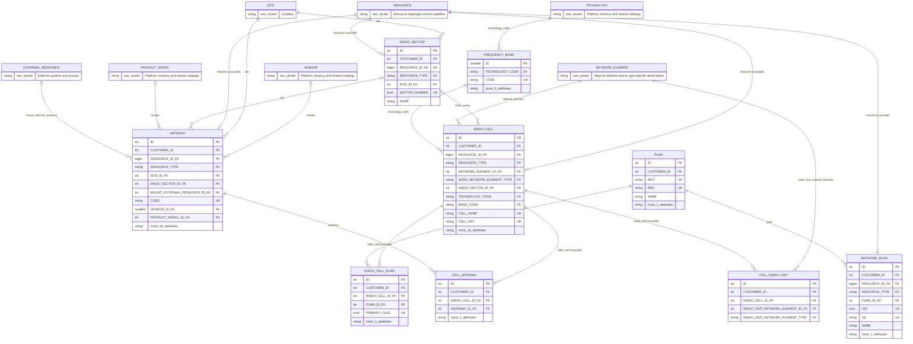

| Table | Columns | Foreign keys | Referenced by |
|---|---|---|---|
| `RADIO_SECTOR` | 12 | 3 | ANTENNA, RADIO_CELL |
| `RADIO_CELL` | 29 | 5 | CELL_ANTENNA, CELL_RADIO_UNIT, RADIO_CELL_PLMN |
| `RADIO_CELL_PLMN` | 11 | 3 | — |
| `CELL_ANTENNA` | 10 | 3 | — |
| `CELL_RADIO_UNIT` | 10 | 3 | — |
| `ANTENNA` | 31 | 7 | CELL_ANTENNA |
| `NETWORK_SLICE` | 14 | 3 | — |

## Connectivity and services

LINK joins two devices (and optionally two ports) at one of the 45 catalogued layers; protocol and microwave attributes are 1:1 extensions. SERVICE_INSTANCE terminates on devices through SERVICE_ENDPOINT; VRFs and IP subnets can be tied to an L3VPN service.

Tables: `LINK`, `LINK_LAYER`, `LINK_PROTOCOL_ATTRIBUTE`, `LINK_MICROWAVE_ATTRIBUTE`, `SERVICE_INSTANCE`, `SERVICE_TYPE`, `SERVICE_ENDPOINT`. Referenced from other clusters: `DOMAIN`, `NETWORK_ELEMENT`, `PORT`, `RESOURCE`, `SITE`

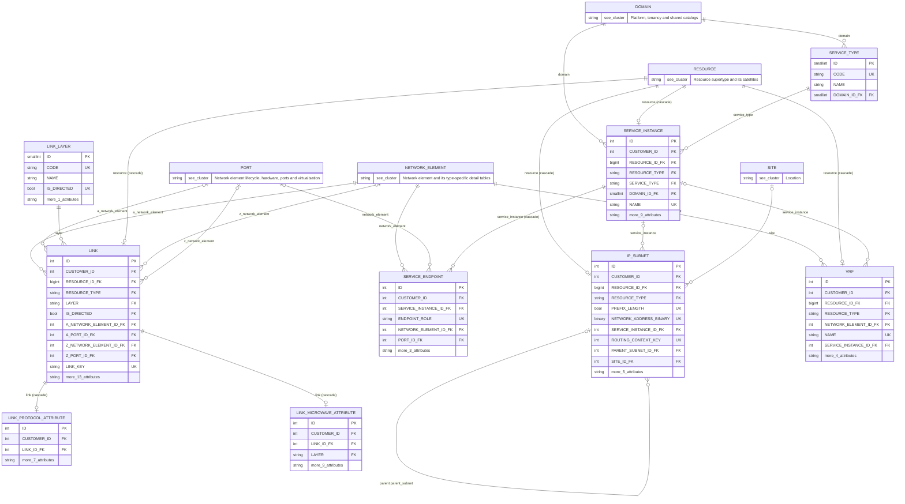

| Table | Columns | Foreign keys | Referenced by |
|---|---|---|---|
| `LINK` | 30 | 7 | LINK_MICROWAVE_ATTRIBUTE, LINK_PROTOCOL_ATTRIBUTE |
| `LINK_LAYER` | 5 | 0 | LINK |
| `LINK_PROTOCOL_ATTRIBUTE` | 15 | 2 | — |
| `LINK_MICROWAVE_ATTRIBUTE` | 18 | 2 | — |
| `SERVICE_INSTANCE` | 22 | 4 | IP_SUBNET, SERVICE_ENDPOINT, VRF |
| `SERVICE_TYPE` | 4 | 1 | SERVICE_INSTANCE |
| `SERVICE_ENDPOINT` | 14 | 4 | — |

## External systems and proxies

EXTERNAL_SYSTEM is the registry of every system data is exchanged with. EXTERNAL_RESOURCE is a lightweight proxy (id + label) for objects owned elsewhere, such as Passive Inventory assets, racks and fiber plant; the entity type must be one the owning system type may hold.

Tables: `EXTERNAL_SYSTEM`, `EXTERNAL_ENTITY_TYPE`, `EXTERNAL_RESOURCE`. Referenced from other clusters: `DOMAIN`, `RECONCILIATION_FIELD`, `RESOURCE`, `VENDOR`

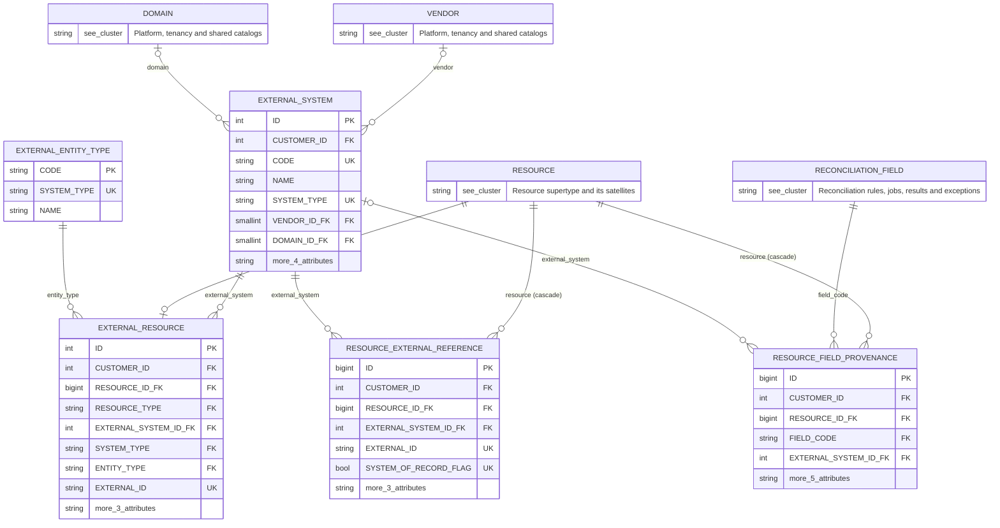

| Table | Columns | Foreign keys | Referenced by |
|---|---|---|---|
| `EXTERNAL_SYSTEM` | 18 | 3 | EXTERNAL_RESOURCE, RESOURCE_EXTERNAL_REFERENCE, RESOURCE_FIELD_PROVENANCE, RESOURCE_RELATIONSHIP, SCAN_JOB |
| `EXTERNAL_ENTITY_TYPE` | 3 | 0 | EXTERNAL_RESOURCE |
| `EXTERNAL_RESOURCE` | 16 | 4 | ANTENNA, NETWORK_ELEMENT, NETWORK_ELEMENT_POWER_DETAIL |

## Discovery execution

A SCAN_JOB (collector or external-system source) has scopes and targets; each SCAN_RUN records one result per target, each result one step line per collector step, with the raw payload split out and encrypted.

Tables: `COLLECTOR`, `CREDENTIAL_PROFILE`, `DISCOVERY_STEP_DEFINITION`, `SCAN_JOB`, `SCAN_JOB_SCOPE`, `SCAN_TARGET`, `SCAN_RUN`, `SCAN_RUN_TARGET`, `SCAN_STEP_RESULT`, `SCAN_STEP_PAYLOAD`. Referenced from other clusters: `DOMAIN`, `EXTERNAL_SYSTEM`, `NETWORK_ELEMENT`, `OPERATIONAL_AREA`, `SITE`, `VENDOR`

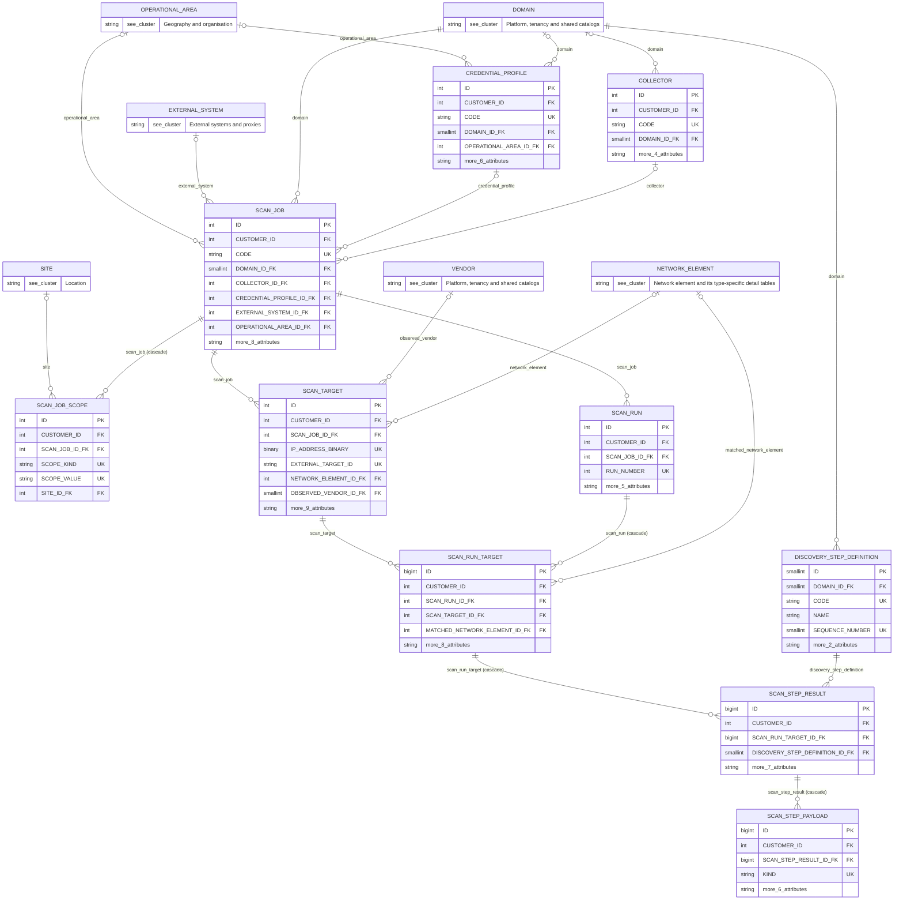

| Table | Columns | Foreign keys | Referenced by |
|---|---|---|---|
| `COLLECTOR` | 15 | 2 | SCAN_JOB |
| `CREDENTIAL_PROFILE` | 18 | 3 | SCAN_JOB |
| `DISCOVERY_STEP_DEFINITION` | 7 | 1 | SCAN_STEP_RESULT |
| `SCAN_JOB` | 23 | 6 | SCAN_JOB_SCOPE, SCAN_RUN, SCAN_TARGET |
| `SCAN_JOB_SCOPE` | 11 | 3 | — |
| `SCAN_TARGET` | 21 | 4 | RECONCILIATION_EXCEPTION, RECONCILIATION_RESULT, SCAN_RUN_TARGET |
| `SCAN_RUN` | 14 | 2 | RECONCILIATION_RUN, SCAN_RUN_TARGET |
| `SCAN_RUN_TARGET` | 18 | 4 | SCAN_STEP_RESULT |
| `SCAN_STEP_RESULT` | 16 | 3 | SCAN_STEP_PAYLOAD |
| `SCAN_STEP_PAYLOAD` | 15 | 2 | — |

## Reconciliation rules, jobs, results and exceptions

Rules carry conditions, lifecycle events (FK-bound to the allowed transitions) and roles. Jobs run rules; a run produces per-rule figures and per-subject results with field-level evidence. Exceptions are the human workflow raised from results and mapped to states through RECONCILIATION_STATE_MAP.

Tables: `RECONCILIATION_RULE`, `RECONCILIATION_RULE_CONDITION`, `RECONCILIATION_RULE_EVENT`, `RECONCILIATION_RULE_TRANSITION`, `RECONCILIATION_FIELD`, `RECONCILIATION_JOB`, `RECONCILIATION_JOB_RULE`, `RECONCILIATION_RUN`, `RECONCILIATION_RUN_RULE`, `RECONCILIATION_RESULT`, `RECONCILIATION_RESULT_FIELD`, `RECONCILIATION_EXCEPTION`, `RECONCILIATION_STATE_MAP`, `DISCREPANCY_TYPE`. Referenced from other clusters: `DOMAIN`, `RESOURCE`, `RESOURCE_TYPE`, `SCAN_RUN`, `SCAN_TARGET`, `USER`

```mermaid
erDiagram
  USER {
    string see_cluster "Platform, tenancy and shared catalogs"
  }
  SCAN_TARGET {
    string see_cluster "Discovery execution"
  }
  SCAN_RUN {
    string see_cluster "Discovery execution"
  }
  RESOURCE_TYPE {
    string see_cluster "Resource supertype and its satellites"
  }
  RESOURCE {
    string see_cluster "Resource supertype and its satellites"
  }
  DOMAIN {
    string see_cluster "Platform, tenancy and shared catalogs"
  }
  RECONCILIATION_RULE {
    int ID PK
    int CUSTOMER_ID FK
    string CODE UK
    string NAME 
    smallint DOMAIN_ID_FK FK
    bigint OWNER_ID_FK FK
    bigint REVIEWER_ID_FK FK
    bigint APPROVER_ID_FK FK
    bigint EXECUTOR_ID_FK FK
    string more_9_attributes
  }
  RECONCILIATION_RULE_CONDITION {
    int ID PK
    int CUSTOMER_ID FK
    int RECONCILIATION_RULE_ID_FK FK
    smallint SEQUENCE_NUMBER UK
    string SOURCE_FIELD_CODE FK
    string TARGET_FIELD_CODE FK
    string more_4_attributes
  }
  RECONCILIATION_RULE_EVENT {
    int ID PK
    int CUSTOMER_ID FK
    int RECONCILIATION_RULE_ID_FK FK
    string FROM_STATUS FK
    string TO_STATUS FK
    string ACTION FK
    bigint ACTOR_ID_FK FK
    string more_2_attributes
  }
  RECONCILIATION_RULE_TRANSITION {
    smallint ID PK
    string FROM_STATUS UK
    string TO_STATUS UK
    string ACTION UK
    string more_1_attributes
  }
  RECONCILIATION_FIELD {
    string CODE PK
    string RESOURCE_TYPE FK
    string more_2_attributes
  }
  RECONCILIATION_JOB {
    int ID PK
    int CUSTOMER_ID FK
    string CODE UK
    smallint DOMAIN_ID_FK FK
    string more_6_attributes
  }
  RECONCILIATION_JOB_RULE {
    int ID PK
    int CUSTOMER_ID FK
    int RECONCILIATION_JOB_ID_FK FK
    int RECONCILIATION_RULE_ID_FK FK
  }
  RECONCILIATION_RUN {
    int ID PK
    int CUSTOMER_ID FK
    int RECONCILIATION_JOB_ID_FK FK
    int SCAN_RUN_ID_FK FK
    string more_3_attributes
  }
  RECONCILIATION_RUN_RULE {
    int ID PK
    int CUSTOMER_ID FK
    int RECONCILIATION_RUN_ID_FK FK
    int RECONCILIATION_RULE_ID_FK FK
    string more_3_attributes
  }
  RECONCILIATION_RESULT {
    bigint ID PK
    int CUSTOMER_ID FK
    int RECONCILIATION_RUN_ID_FK FK
    int RECONCILIATION_RULE_ID_FK FK
    bigint RESOURCE_ID_FK FK
    int SCAN_TARGET_ID_FK FK
    string SUBJECT_KIND UK
    bigint SUBJECT_ID UK
    string more_4_attributes
  }
  RECONCILIATION_RESULT_FIELD {
    bigint ID PK
    int CUSTOMER_ID FK
    bigint RECONCILIATION_RESULT_ID_FK FK
    string FIELD_CODE FK
    string more_4_attributes
  }
  RECONCILIATION_EXCEPTION {
    int ID PK
    int CUSTOMER_ID FK
    string CODE UK
    smallint DISCREPANCY_TYPE_ID_FK FK
    smallint DOMAIN_ID_FK FK
    int RECONCILIATION_RULE_ID_FK FK
    bigint RECONCILIATION_RESULT_ID_FK FK
    bigint RESOURCE_ID_FK FK
    int SCAN_TARGET_ID_FK FK
    bigint ASSIGNEE_ID_FK FK
    bigint DISPOSITION_BY_FK FK
    string more_14_attributes
  }
  RECONCILIATION_STATE_MAP {
    string OUTCOME PK
    string more_3_attributes
  }
  DISCREPANCY_TYPE {
    smallint ID PK
    string CODE UK
    smallint DOMAIN_ID_FK FK
    string more_2_attributes
  }
  USER ||--o{ RECONCILIATION_RULE : "approver"
  DOMAIN ||--o{ RECONCILIATION_RULE : "domain"
  USER ||--o{ RECONCILIATION_RULE : "executor"
  USER ||--o{ RECONCILIATION_RULE : "owner"
  USER ||--o{ RECONCILIATION_RULE : "reviewer"
  RECONCILIATION_RULE ||--o{ RECONCILIATION_RULE_CONDITION : "reconciliation_rule (cascade)"
  RECONCILIATION_FIELD ||--o{ RECONCILIATION_RULE_CONDITION : "source_field_code"
  RECONCILIATION_FIELD |o--o{ RECONCILIATION_RULE_CONDITION : "target_field_code"
  USER ||--o{ RECONCILIATION_RULE_EVENT : "actor"
  RECONCILIATION_RULE_TRANSITION ||--o{ RECONCILIATION_RULE_EVENT : "from_status"
  RECONCILIATION_RULE ||--o{ RECONCILIATION_RULE_EVENT : "reconciliation_rule"
  RESOURCE_TYPE |o--o{ RECONCILIATION_FIELD : "resource_type"
  DOMAIN ||--o{ RECONCILIATION_JOB : "domain"
  RECONCILIATION_JOB ||--o{ RECONCILIATION_JOB_RULE : "reconciliation_job (cascade)"
  RECONCILIATION_RULE ||--o{ RECONCILIATION_JOB_RULE : "reconciliation_rule"
  RECONCILIATION_JOB ||--o{ RECONCILIATION_RUN : "reconciliation_job"
  SCAN_RUN |o--o{ RECONCILIATION_RUN : "scan_run"
  RECONCILIATION_RULE ||--o{ RECONCILIATION_RUN_RULE : "reconciliation_rule"
  RECONCILIATION_RUN ||--o{ RECONCILIATION_RUN_RULE : "reconciliation_run (cascade)"
  RECONCILIATION_RULE ||--o{ RECONCILIATION_RESULT : "reconciliation_rule"
  RECONCILIATION_RUN ||--o{ RECONCILIATION_RESULT : "reconciliation_run (cascade)"
  RESOURCE |o--o{ RECONCILIATION_RESULT : "resource"
  SCAN_TARGET |o--o{ RECONCILIATION_RESULT : "scan_target"
  RECONCILIATION_FIELD ||--o{ RECONCILIATION_RESULT_FIELD : "field_code"
  RECONCILIATION_RESULT ||--o{ RECONCILIATION_RESULT_FIELD : "reconciliation_result (cascade)"
  USER |o--o{ RECONCILIATION_EXCEPTION : "assignee"
  DISCREPANCY_TYPE ||--o{ RECONCILIATION_EXCEPTION : "discrepancy_type"
  USER |o--o{ RECONCILIATION_EXCEPTION : "disposition_by"
  DOMAIN ||--o{ RECONCILIATION_EXCEPTION : "domain"
  RECONCILIATION_RESULT |o--o{ RECONCILIATION_EXCEPTION : "reconciliation_result"
  RECONCILIATION_RULE |o--o{ RECONCILIATION_EXCEPTION : "reconciliation_rule"
  RESOURCE |o--o{ RECONCILIATION_EXCEPTION : "resource"
  SCAN_TARGET |o--o{ RECONCILIATION_EXCEPTION : "scan_target"
  DOMAIN ||--o{ DISCREPANCY_TYPE : "domain"
```

| Table | Columns | Foreign keys | Referenced by |
|---|---|---|---|
| `RECONCILIATION_RULE` | 25 | 6 | RECONCILIATION_EXCEPTION, RECONCILIATION_JOB_RULE, RECONCILIATION_RESULT, RECONCILIATION_RULE_CONDITION, RECONCILIATION_RULE_EVENT, RECONCILIATION_RUN_RULE |
| `RECONCILIATION_RULE_CONDITION` | 15 | 4 | — |
| `RECONCILIATION_RULE_EVENT` | 14 | 4 | — |
| `RECONCILIATION_RULE_TRANSITION` | 5 | 0 | RECONCILIATION_RULE_EVENT |
| `RECONCILIATION_FIELD` | 4 | 1 | RECONCILIATION_RESULT_FIELD, RECONCILIATION_RULE_CONDITION, RESOURCE_FIELD_PROVENANCE |
| `RECONCILIATION_JOB` | 17 | 2 | RECONCILIATION_JOB_RULE, RECONCILIATION_RUN |
| `RECONCILIATION_JOB_RULE` | 9 | 3 | — |
| `RECONCILIATION_RUN` | 12 | 3 | RECONCILIATION_RESULT, RECONCILIATION_RUN_RULE |
| `RECONCILIATION_RUN_RULE` | 12 | 3 | — |
| `RECONCILIATION_RESULT` | 12 | 5 | RECONCILIATION_EXCEPTION, RECONCILIATION_RESULT_FIELD |
| `RECONCILIATION_RESULT_FIELD` | 13 | 3 | — |
| `RECONCILIATION_EXCEPTION` | 30 | 9 | — |
| `RECONCILIATION_STATE_MAP` | 4 | 0 | — |
| `DISCREPANCY_TYPE` | 5 | 1 | RECONCILIATION_EXCEPTION |

## Reporting and KPIs

The report catalogue, its generated runs, and the daily trust snapshot per domain that feeds the Insights trend.

Tables: `REPORT_DEFINITION`, `REPORT_RUN`, `DOMAIN_TRUST_SNAPSHOT`. Referenced from other clusters: `DOMAIN`

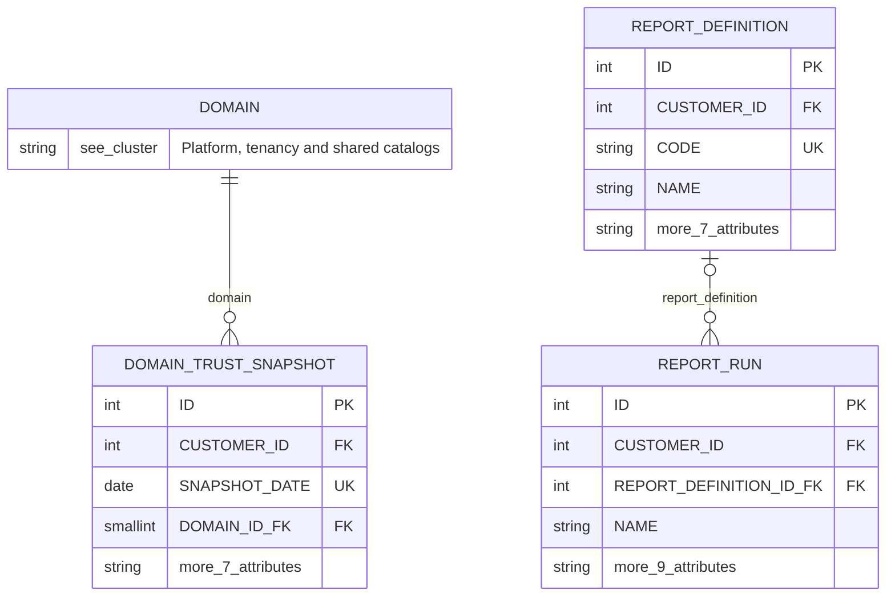

| Table | Columns | Foreign keys | Referenced by |
|---|---|---|---|
| `REPORT_DEFINITION` | 18 | 1 | REPORT_RUN |
| `REPORT_RUN` | 18 | 2 | — |
| `DOMAIN_TRUST_SNAPSHOT` | 16 | 2 | — |

## Table index (all 100)

| Table | Cluster |
|---|---|
| `ANTENNA` | RAN radio layer |
| `ATTRIBUTE_DEFINITION` | Platform, tenancy and shared catalogs |
| `CELL_ANTENNA` | RAN radio layer |
| `CELL_RADIO_UNIT` | RAN radio layer |
| `CLOUD_CLUSTER` | Network element lifecycle, hardware, ports and virtualisation |
| `COLLECTOR` | Discovery execution |
| `CREDENTIAL_PROFILE` | Discovery execution |
| `DISCOVERY_STEP_DEFINITION` | Discovery execution |
| `DISCREPANCY_TYPE` | Reconciliation rules, jobs, results and exceptions |
| `DOMAIN` | Platform, tenancy and shared catalogs |
| `DOMAIN_TRUST_SNAPSHOT` | Reporting and KPIs |
| `EQUIPMENT_COMPONENT` | Network element lifecycle, hardware, ports and virtualisation |
| `EXTERNAL_ENTITY_TYPE` | External systems and proxies |
| `EXTERNAL_RESOURCE` | External systems and proxies |
| `EXTERNAL_SYSTEM` | External systems and proxies |
| `FREQUENCY_BAND` | Platform, tenancy and shared catalogs |
| `GEOGRAPHY_LEVEL1` | Geography and organisation |
| `GEOGRAPHY_LEVEL2` | Geography and organisation |
| `GEOGRAPHY_LEVEL3` | Geography and organisation |
| `GEOGRAPHY_LEVEL4` | Geography and organisation |
| `IP_SUBNET` | Network element lifecycle, hardware, ports and virtualisation |
| `LINK` | Connectivity and services |
| `LINK_LAYER` | Connectivity and services |
| `LINK_MICROWAVE_ATTRIBUTE` | Connectivity and services |
| `LINK_PROTOCOL_ATTRIBUTE` | Connectivity and services |
| `NETWORK_ELEMENT` | Network element and its type-specific detail tables |
| `NETWORK_ELEMENT_CORE_DETAIL` | Network element and its type-specific detail tables |
| `NETWORK_ELEMENT_HEALTH` | Network element lifecycle, hardware, ports and virtualisation |
| `NETWORK_ELEMENT_IP_MPLS_DETAIL` | Network element and its type-specific detail tables |
| `NETWORK_ELEMENT_MICROWAVE_DETAIL` | Network element and its type-specific detail tables |
| `NETWORK_ELEMENT_MOVEMENT` | Network element lifecycle, hardware, ports and virtualisation |
| `NETWORK_ELEMENT_OPTICAL_DETAIL` | Network element and its type-specific detail tables |
| `NETWORK_ELEMENT_PON_DETAIL` | Network element and its type-specific detail tables |
| `NETWORK_ELEMENT_POWER_DETAIL` | Network element and its type-specific detail tables |
| `NETWORK_ELEMENT_RAN_DETAIL` | Network element and its type-specific detail tables |
| `NETWORK_ELEMENT_SECURITY_DETAIL` | Network element and its type-specific detail tables |
| `NETWORK_ELEMENT_SERVER_DETAIL` | Network element and its type-specific detail tables |
| `NETWORK_ELEMENT_STOCK_TRANSITION` | Network element lifecycle, hardware, ports and virtualisation |
| `NETWORK_ELEMENT_SWITCH_DETAIL` | Network element and its type-specific detail tables |
| `NETWORK_ELEMENT_TYPE` | Network element and its type-specific detail tables |
| `NETWORK_ELEMENT_TYPE_DOMAIN` | Network element and its type-specific detail tables |
| `NETWORK_ELEMENT_VIRTUAL_INSTANCE` | Network element lifecycle, hardware, ports and virtualisation |
| `NETWORK_ELEMENT_WIFI_DETAIL` | Network element and its type-specific detail tables |
| `NETWORK_FUNCTION_TYPE` | Network element and its type-specific detail tables |
| `NETWORK_SLICE` | RAN radio layer |
| `OPERATIONAL_AREA` | Geography and organisation |
| `PLMN` | Geography and organisation |
| `PORT` | Network element lifecycle, hardware, ports and virtualisation |
| `PORT_IP_ADDRESS` | Network element lifecycle, hardware, ports and virtualisation |
| `PORT_VLAN` | Network element lifecycle, hardware, ports and virtualisation |
| `PRODUCT_MODEL` | Platform, tenancy and shared catalogs |
| `PRODUCT_MODEL_POLICY` | Platform, tenancy and shared catalogs |
| `RADIO_CELL` | RAN radio layer |
| `RADIO_CELL_PLMN` | RAN radio layer |
| `RADIO_SECTOR` | RAN radio layer |
| `RECONCILIATION_EXCEPTION` | Reconciliation rules, jobs, results and exceptions |
| `RECONCILIATION_FIELD` | Reconciliation rules, jobs, results and exceptions |
| `RECONCILIATION_JOB` | Reconciliation rules, jobs, results and exceptions |
| `RECONCILIATION_JOB_RULE` | Reconciliation rules, jobs, results and exceptions |
| `RECONCILIATION_RESULT` | Reconciliation rules, jobs, results and exceptions |
| `RECONCILIATION_RESULT_FIELD` | Reconciliation rules, jobs, results and exceptions |
| `RECONCILIATION_RULE` | Reconciliation rules, jobs, results and exceptions |
| `RECONCILIATION_RULE_CONDITION` | Reconciliation rules, jobs, results and exceptions |
| `RECONCILIATION_RULE_EVENT` | Reconciliation rules, jobs, results and exceptions |
| `RECONCILIATION_RULE_TRANSITION` | Reconciliation rules, jobs, results and exceptions |
| `RECONCILIATION_RUN` | Reconciliation rules, jobs, results and exceptions |
| `RECONCILIATION_RUN_RULE` | Reconciliation rules, jobs, results and exceptions |
| `RECONCILIATION_STATE_MAP` | Reconciliation rules, jobs, results and exceptions |
| `RELATIONSHIP_RULE` | Resource supertype and its satellites |
| `RELATIONSHIP_TYPE` | Resource supertype and its satellites |
| `REPORT_DEFINITION` | Reporting and KPIs |
| `REPORT_RUN` | Reporting and KPIs |
| `RESOURCE` | Resource supertype and its satellites |
| `RESOURCE_ASSET` | Resource supertype and its satellites |
| `RESOURCE_ATTRIBUTE` | Resource supertype and its satellites |
| `RESOURCE_EXTERNAL_REFERENCE` | Resource supertype and its satellites |
| `RESOURCE_FIELD_PROVENANCE` | Resource supertype and its satellites |
| `RESOURCE_RELATIONSHIP` | Resource supertype and its satellites |
| `RESOURCE_TECHNOLOGY` | Resource supertype and its satellites |
| `RESOURCE_TYPE` | Resource supertype and its satellites |
| `SCAN_JOB` | Discovery execution |
| `SCAN_JOB_SCOPE` | Discovery execution |
| `SCAN_RUN` | Discovery execution |
| `SCAN_RUN_TARGET` | Discovery execution |
| `SCAN_STEP_PAYLOAD` | Discovery execution |
| `SCAN_STEP_RESULT` | Discovery execution |
| `SCAN_TARGET` | Discovery execution |
| `SERVICE_ENDPOINT` | Connectivity and services |
| `SERVICE_INSTANCE` | Connectivity and services |
| `SERVICE_TYPE` | Connectivity and services |
| `SITE` | Location |
| `SITE_CONTACT` | Location |
| `SITE_ISSUE` | Location |
| `SITE_TYPE` | Location |
| `TECHNOLOGY` | Platform, tenancy and shared catalogs |
| `TENANT` | Platform, tenancy and shared catalogs |
| `USER` | Platform, tenancy and shared catalogs |
| `VENDOR` | Platform, tenancy and shared catalogs |
| `VLAN` | Network element lifecycle, hardware, ports and virtualisation |
| `VRF` | Network element lifecycle, hardware, ports and virtualisation |
