# INVENTORY v5 — Screen-by-Screen Table Usage and Mock-API Guide

| | |
|---|---|
| **Database** | `inventory_schema_v5.sql` (revision 2, 2026-09-27) — 106 tables, loaded as `inventory_27sep` |
| **Frontend** | NetSingularity Discovery & Inventory, React 19, routes in `src/routes.ts` (screenshots taken from the current build on 2026-09-27) |
| **Companions** | `DATABASE_UI_MODULE_IDEATION.md` (module and API design) · `INVENTORY_DATABASE_MODULE_CATEGORIZATION.md` (ownership analysis) |
| **Audience** | UI, backend and integration engineers deciding what each screen reads, who owns that data, and what to mock until the owning module's API exists |

---

## Contents

1. [How to read this document](#1-how-to-read-this-document)
2. [Decisions: TEAM, TEAM_MEMBER and other "could be elsewhere" tables](#2-decisions-team-team_member-and-other-could-be-elsewhere-tables)
3. [Discovery & Reconciliation screens](#3-discovery--reconciliation-screens)
4. [Inventory screens](#4-inventory-screens)
5. [Integration dependencies per module](#5-integration-dependencies-per-module)
6. [Mock API catalogue](#6-mock-api-catalogue)
7. [Gaps between the UI and the schema](#7-gaps-between-the-ui-and-the-schema)
8. [Table-by-table matrix (all 106 tables)](#8-table-by-table-matrix-all-106-tables)
9. [Tables removed in v5 and how their screens are served](#9-tables-removed-in-v5-and-how-their-screens-are-served)
10. [Screenshot index](#10-screenshot-index)

---

## 1. How to read this document

Every screen section has the same shape:

- **Screenshot** of the current build.
- **What the screen is for**, in one or two sentences.
- **UI element → data** table: each visible card, column, filter or action, the table and column that feed it, and the access mode.
- **Owner · integration · mock** line: who owns the data, which module must be integrated, and which mock service is enough meanwhile.
- **Gaps**: where the current screen and the v5 schema disagree.

Access modes: **R** read · **W** create / edit · **A** action executed by the owning engine (run, hold, approve, dispose, move) · **D** derived (computed by the API, no single table).

Owner values: **Inventory** (written through the Inventory API) · **Catalog** (seeded reference rows) · **User Management** (CDC copy) · **Master data** (pending owner) · **Discovery / Reconciliation / Reporting service** (pipelines write, UI reads) · **Passive Inventory** (proxy only) · **Open/CoPEX** (no table here).

Mock rule: the UI talks only to module service interfaces. `MockXService` (in-memory, seeded from the dummy data in `inventory_schema_v5.sql`) and `ApiXService` implement the same interface, so a screen never changes when the real API arrives. For another module's data the mock imitates *that module's* contract, not a table.

---

## 2. Decisions: TEAM, TEAM_MEMBER and other "could be elsewhere" tables

### 2.1 Where TEAM shows up in the UI today

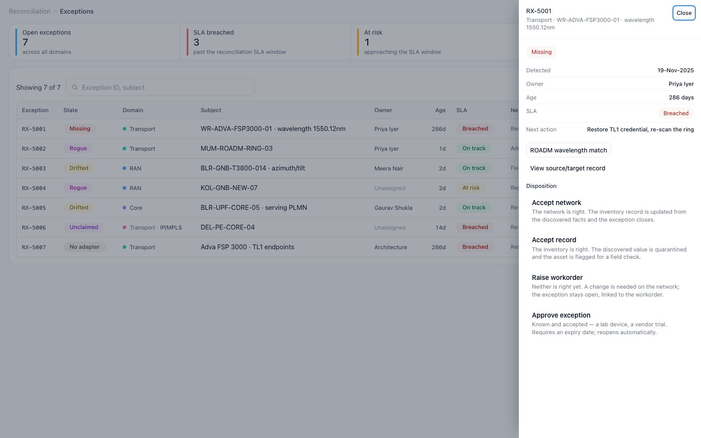

| Evidence | What it shows |
|---|---|
| Exceptions grid, **Owner** column | Mostly people (Priya Iyer, Meera Nair, Gaurav Shukla), "Unassigned", and for RX-5007 a team: **Architecture**. The queue-then-person model the schema anticipates is already on screen. |
| Rule details, **Responsibilities** | Owner, reviewer, approver, executor are people; the rule form has an **Exception reviewer** picker (a person today; `EXCEPTION_REVIEWER_TEAM_ID_FK` in the schema). |
| Site details, **Attention / Issues** | Issue owner is free text ("OSS platform team"). |
| Reports, "No owner" KPI | Counts exceptions "not yet assigned to a person or team". |

### 2.2 Verdict

| Table | Decision | Why |
|---|---|---|
| `TEAM` | **Keep, as a CDC reference copy owned by User Management** | Three FK columns need a local row: `RECONCILIATION_EXCEPTION.OWNER_TEAM_ID_FK`, `RECONCILIATION_RULE.EXCEPTION_REVIEWER_TEAM_ID_FK`, `SITE_ISSUE.OWNER_TEAM_ID_FK`. A queue such as "NOC RAN" or "Architecture" is an organisational group, which User Management owns. Inventory never creates teams; it receives them (same pattern as `USER`). |
| `TEAM_MEMBER` | **Not required. Drop in the next revision** | No table references it and no screen lists members. The only need, the assignee picker on an exception defaulting to "people in the owner team", is a User Management lookup. A local copy would be a second source of truth for membership. |

```sql
-- apply when ready (not applied to the loaded database)
DROP TABLE TEAM_MEMBER;
ALTER TABLE TEAM COMMENT = 'Reference copy of a User Management group used as owner queue for exceptions, exception-reviewer team of a rule and owner of a site issue; rows arrive by CDC and are never created here. [v5 rev 3]';
```

### 2.3 Other tables that could belong to another module

| Table(s) | Could belong to | Verdict for v5 | Why |
|---|---|---|---|
| `USER`, `TENANT` | User Management / platform | Keep as reference copies | 13 FK columns on `USER`; `TENANT` roots every `CUSTOMER_ID` |
| `OPERATIONAL_AREA`, `GEOGRAPHY_LEVEL1..4` | Master data / User Management scoping | Keep; **validate** owner | `SITE` binds to `GEOGRAPHY_LEVEL4`; the circle filter is used app-wide (Location, Scan jobs, Insights) |
| `VENDOR`, `PRODUCT_MODEL` | Shared catalog | Keep; **validate** | Passive Inventory and Open/CoPEX need the same vendors |
| `RESOURCE_ASSET` | Open/CoPEX (cost, PO) | Keep; **validate** column split | Element › Support position shows warranty and PO; cost is financial |
| `RACK`, `ANTENNA`, `POWER_FEED` | Passive Inventory | Keep; **validate** | Device placement (Element rack/U), cell-antenna binding and the Facility power panel depend on them |
| `SITE_CONTACT`, `SITE_ISSUE` | none / rollout tool | Keep | Contacts are encrypted external people; issues are UI-raised today |
| `NETWORK_ELEMENT_VIRTUAL_INSTANCE`, `CLOUD_CLUSTER` | Orchestrator | Keep, state read-only | "Lifecycle operation" button on the VNF view would call the orchestrator |
| `SCAN_*`, `COLLECTOR`, `CREDENTIAL_PROFILE`, `DISCOVERY_STEP_DEFINITION` | Discovery service (NiFi / Spark) | Keep for now | Scan jobs / targets / transcript read them |
| `RECONCILIATION_JOB*`, `_RUN*`, `_RESULT*` | Reconciliation service | Keep for now | Reconciliation jobs / results read them |
| `RECONCILIATION_RULE*`, `RECONCILIATION_EXCEPTION` | Reconciliation module, if carved out | Keep in Inventory | People-governed business objects (Rules, Exceptions screens) |
| `REPORT_RUN`, `DOMAIN_TRUST_SNAPSHOT` | Reporting service | Keep for now | Reports and Insights read them |
| `EXTERNAL_SYSTEM`, `EXTERNAL_OBJECT_TYPE`, `EXTERNAL_RESOURCE`, `RESOURCE_EXTERNAL_REFERENCE` | Integration layer | Keep in Inventory | Anchor of every cross-module link; Passive screens are proxy views over them |

---

## 3. Discovery & Reconciliation screens

### 3.1 Insights (`/discovery/insights`)

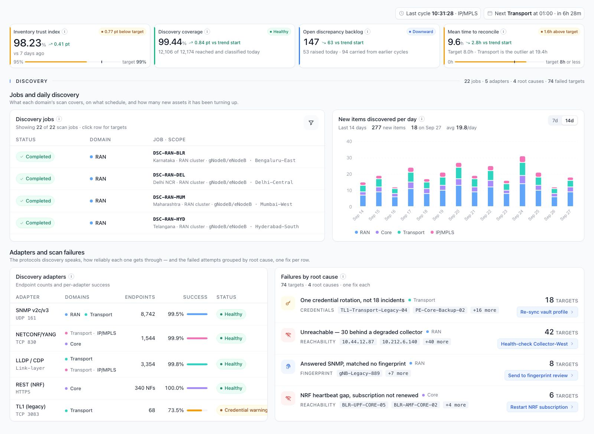

**What it is for.** Executive and operational dashboard: trust index, discovery coverage, discrepancy backlog, MTTR, per-domain jobs, adapters, failures by root cause, and the daily discovery volume chart.

| UI element | Table · column(s) | Mode |
|---|---|---|
| Inventory trust index, target, 7-day delta | `DOMAIN_TRUST_SNAPSHOT.TRUST_INDEX_PERCENT`, `IN_SCOPE`, `IN_SYNC` per day | R (D) |
| Discovery coverage "12,106 of 12,174 reached" | `NETWORK_ELEMENT` count vs `SCAN_TARGET.LAST_OUTCOME`, `LAST_SYNC_TIME` | D |
| Open discrepancy backlog, raised today, carried | `RECONCILIATION_EXCEPTION.STATUS`, `DETECTED_TIME` | D |
| Mean time to reconcile per domain | `DOMAIN_TRUST_SNAPSHOT.MTTR_HOURS` | R |
| Last cycle / next run banner | `RECONCILIATION_RUN.ENDED_TIME`, `RECONCILIATION_JOB.NEXT_RUN_TIME` | R |
| Discovery jobs card (status, domain, job, scope) | `SCAN_JOB.CODE`, `DOMAIN_ID_FK`, `SCAN_JOB_SCOPE.SCOPE_VALUE`, `OPERATIONAL_AREA.NAME`, last `SCAN_RUN.STATUS` | R |
| New items discovered per day (stacked by domain) | `NETWORK_ELEMENT.CREATED_TIME` where `RECORD_SOURCE = 'DISCOVERED'` grouped by `DOMAIN_ID_FK` | D |
| Discovery adapters (protocol, endpoints, success) | `DISCOVERY_STEP_DEFINITION.PROTOCOL` × `SCAN_STEP_RESULT.STATE` aggregated | D |
| Failures by root cause (credentials, reachability, fingerprint, NRF) | `SCAN_RUN_TARGET.FAILURE_REASON`, `FAILURE_STAGE`, `SCAN_TARGET.HOST_NAME` / `IP_ADDRESS`; collector name from `COLLECTOR.CODE` | D |
| Region drill-down (`/insights/region/:region`) | `OPERATIONAL_AREA` (REGION level) → `SITE.OPERATIONAL_AREA_ID_FK` → `NETWORK_ELEMENT` | D |
| Domain devices (`/insights/domain/:domain`): In scope, Open, Unverified, Trust; device list with issue | `DOMAIN_TRUST_SNAPSHOT` (cards); `RECONCILIATION_EXCEPTION` joined to `NETWORK_ELEMENT.NETWORK_ELEMENT_NAME`, `MANAGEMENT_IP`, `DISCREPANCY_TYPE.LABEL`, `SCAN_TARGET.LAST_SYNC_TIME` | D |
| Discrepancies (`/insights/discrepancies`): device, type, domain, match class, age, last scan | `RECONCILIATION_EXCEPTION` + `DISCREPANCY_TYPE.LABEL`, `CATEGORY` + `RECONCILIATION_RESULT.OUTCOME` (match class) | R |

**Owner · integration · mock.** All read models over Discovery- and Reconciliation-owned tables plus Inventory counts. Real path: aggregation endpoints (`GET /api/insights/*`) on the Inventory API fed by the two engines. Until then `MockInsightsService` derives every card from the other mock stores and the seven `DOMAIN_TRUST_SNAPSHOT` dummy rows.

**Gaps.** The page groups by 4 domains (RAN, Core, Transport, IP/MPLS); the schema has 9 `DOMAIN` rows. Regions on this page (West, Southeast, …) are not the `OPERATIONAL_AREA` circles used elsewhere; the region table must switch to `OPERATIONAL_AREA` rows.

### 3.2 Scan jobs (`/discovery/jobs`)

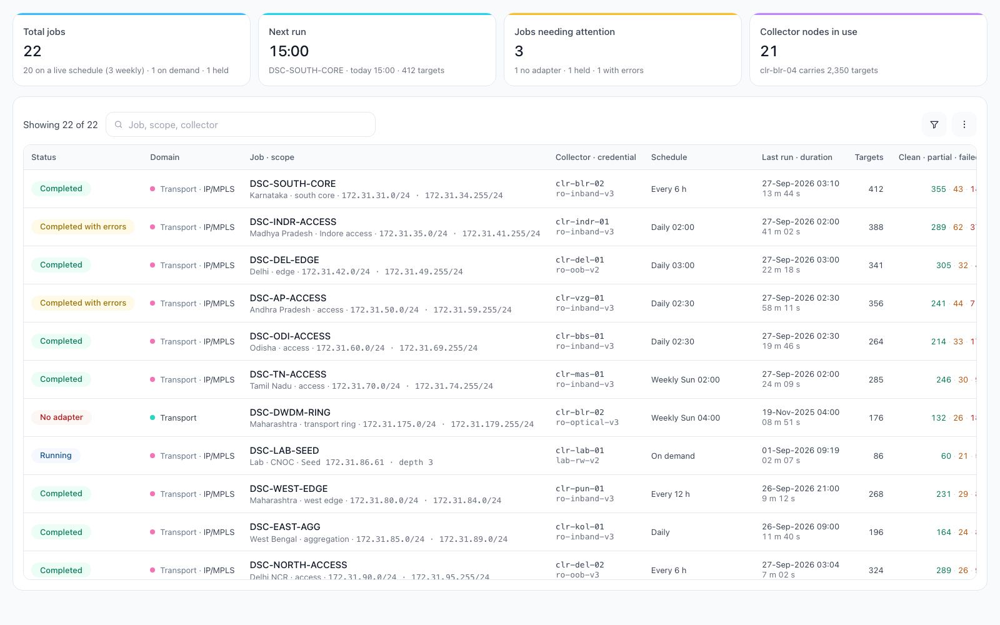

**What it is for.** Definition and health of every discovery job: schedule, collector, credential, last run and the clean / partial / failed split of its targets.

| UI element | Table · column(s) | Mode |
|---|---|---|
| Total jobs, live / on demand / held | `SCAN_JOB.SCHEDULE_KIND`, `SCHEDULE_STATE` | D |
| Next run card | `SCAN_JOB.NEXT_RUN_TIME`, `CODE`, target count from `SCAN_TARGET` | D |
| Jobs needing attention (no adapter, held, errors) | last `SCAN_RUN.STATUS` in (`NO_ADAPTER`, `COMPLETED_WITH_ERRORS`), `SCAN_JOB.SCHEDULE_STATE = 'HELD'` | D |
| Collector nodes in use | `COLLECTOR` count, targets per `SCAN_JOB.COLLECTOR_ID_FK` | D |
| Status column | last `SCAN_RUN.STATUS` (Running / Completed / Completed with errors / No adapter) | R |
| Domain column and filter | `SCAN_JOB.DOMAIN_ID_FK` → `DOMAIN.NAME`, parent for "Transport · IP/MPLS" | R |
| Job · scope (code, circle, scope values) | `SCAN_JOB.CODE`, `OPERATIONAL_AREA.NAME`, `SCAN_JOB_SCOPE.SCOPE_KIND` / `SCOPE_VALUE` (CIDR, seed + `MAX_CRAWL_DEPTH`) | R |
| Collector · credential | `COLLECTOR.CODE`, `CREDENTIAL_PROFILE.CODE` (or `EXTERNAL_SYSTEM.CODE` for API sources) | R |
| Schedule | `SCAN_JOB.SCHEDULE_KIND`, `INTERVAL_MINUTES`, `CRON_EXPRESSION` rendered as text | R |
| Last run · duration | `SCAN_RUN.STARTED_TIME`, `DURATION_MS` | R |
| Targets, clean · partial · failed | `SCAN_RUN_TARGET.STATUS` counts for the last run | D |
| Row actions: View targets, run / hold / resume | navigation; `POST /scan-jobs/{id}/actions/{run|hold|resume}` | A |
| Filter panel (domain, status, collector) | same columns | R |

**Owner · integration · mock.** Discovery service owns definitions' schedule state and every run. UI writes the definition (`SCAN_JOB`, `SCAN_JOB_SCOPE`) and triggers actions. Mock: `MockScanJobService` where `run()` creates a RUNNING `SCAN_RUN`, then completes it on a timer with generated run targets.

**Gaps.** Screen is still legacy JS (`legacy/app-views.js`) with a `domain` field added; port to React on the service interface.

### 3.3 Scan targets (`/discovery/targets`)

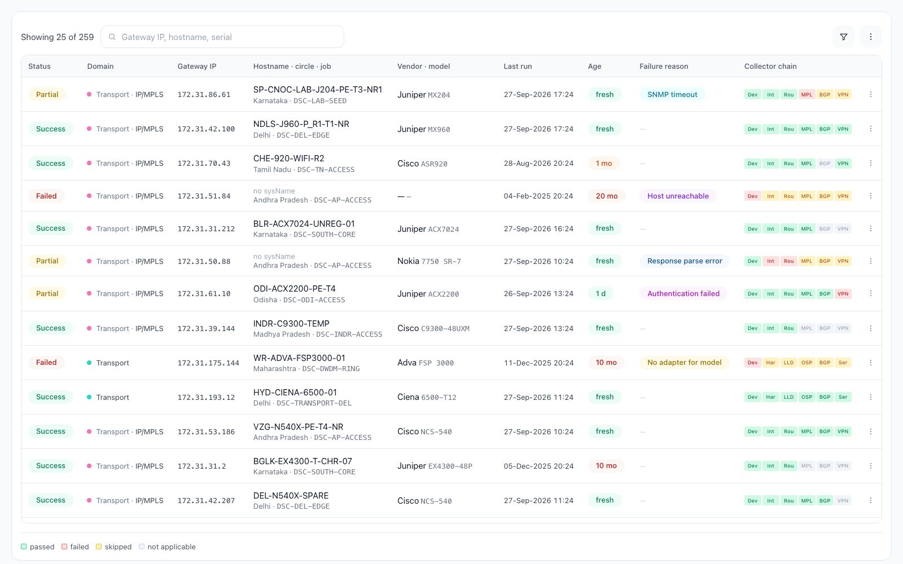

**What it is for.** Every polled address with its last outcome, vendor fingerprint, failure reason and the collector step chain (Dev · Int · Rou · MPL · BGP · VPN).

| UI element | Table · column(s) | Mode |
|---|---|---|
| Status (Success / Partial / Failed) | latest `SCAN_RUN_TARGET.STATUS` (cached as `SCAN_TARGET.LAST_OUTCOME`) | R |
| Domain | `SCAN_JOB.DOMAIN_ID_FK` | R |
| Gateway IP | `SCAN_TARGET.IP_ADDRESS` (identity of a target; hostname may be null) | R |
| Hostname · circle · job | `SCAN_TARGET.HOST_NAME`, `OPERATIONAL_AREA.NAME`, `SCAN_JOB.CODE` | R |
| Vendor · model | `SCAN_TARGET.OBSERVED_VENDOR_ID_FK` → `VENDOR.NAME`, `OBSERVED_MODEL` | R |
| Last run, Age chip (fresh / 1 mo / 20 mo) | `SCAN_TARGET.LAST_SYNC_TIME` | R |
| Failure reason | `SCAN_TARGET.LAST_FAILURE_REASON` (SNMP timeout, Host unreachable, Auth failed, Parse error, No adapter) | R |
| Collector chain chips | `SCAN_STEP_RESULT.STATE` per `DISCOVERY_STEP_DEFINITION` of the last run target | R |
| Row action: View transcript | navigation to 3.4 | – |

**Owner · integration · mock.** Discovery service. `MockScanJobService.targets()`.

### 3.4 Target transcript (`/discovery/targets/:host`)

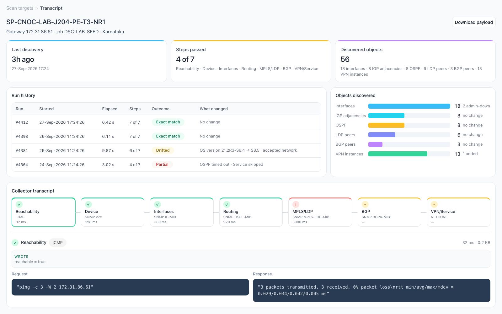

| UI element | Table · column(s) | Mode |
|---|---|---|
| Header (host, gateway, job, circle) | `SCAN_TARGET.HOST_NAME`, `IP_ADDRESS`, `SCAN_JOB.CODE`, `OPERATIONAL_AREA.NAME` | R |
| Last discovery, Steps passed, Discovered objects | `SCAN_RUN_TARGET.CREATED_TIME`; `SCAN_STEP_RESULT.STATE` counts; `WROTE_SUMMARY` parsed | D |
| Run history (run, started, elapsed, steps, outcome, what changed) | `SCAN_RUN.RUN_NUMBER`, `STARTED_TIME`; `SCAN_RUN_TARGET.DURATION_MS`, `OUTCOME`, `NOTE` | R |
| Objects discovered bars | `PORT`, `LINK` (by layer), `SERVICE_INSTANCE` counts written for the matched NE | D |
| Collector transcript step cards (protocol, ms) and detail (WROTE, Request, Response) | `SCAN_STEP_RESULT` joined to `DISCOVERY_STEP_DEFINITION.NAME`, `PROTOCOL`; `DURATION_MS`, `RESPONSE_BYTES`, `WROTE_SUMMARY`, `FAILURE_REASON`, `SUGGESTED_ACTION`; raw text from `SCAN_STEP_PAYLOAD` (decrypted server side, permissioned) | R |
| Download payload | `SCAN_STEP_PAYLOAD` via `GET /scan-step-results/{id}/payload` | R |

**Owner · integration · mock.** Discovery service / collector. `MockScanJobService.steps()`; payload as a stub string. **Gap:** the route is by hostname; targets are identified by IP in the schema (hostname nullable) → route by target id.

### 3.5 Reconciliation overview (`/discovery/reconcile`)

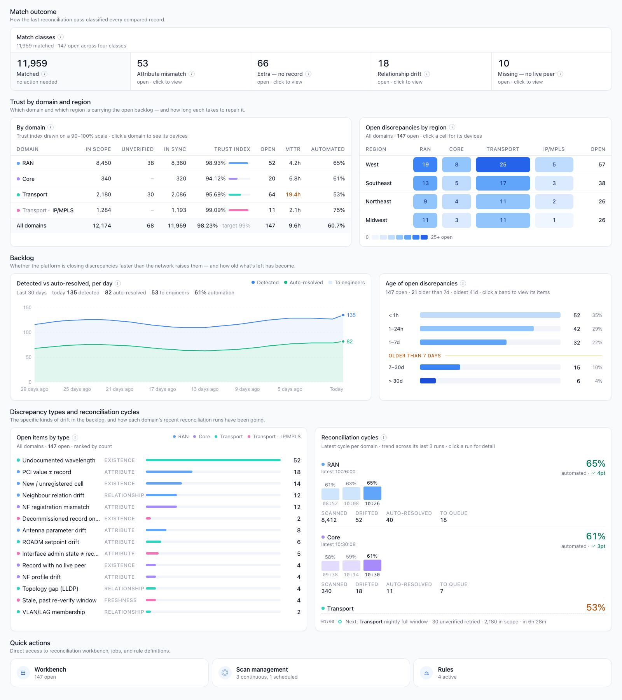

| UI element | Table · column(s) | Mode |
|---|---|---|
| Match classes tiles (matched, attribute mismatch, extra, relationship drift, missing) | `RECONCILIATION_RESULT.OUTCOME` counts of the last run per domain | D |
| Trust by domain (in scope, unverified, in sync, trust, open, MTTR, automated) | `DOMAIN_TRUST_SNAPSHOT` latest row per `DOMAIN_ID_FK` | R |
| Open discrepancies by region heat map | `RECONCILIATION_EXCEPTION` × `SITE.OPERATIONAL_AREA_ID_FK` × `DOMAIN_ID_FK` | D |
| Detected vs auto-resolved per day | `RECONCILIATION_EXCEPTION.DETECTED_TIME`, `IS_AUTO_RESOLVED`, `CLOSED_TIME` | D |
| Age of open discrepancies bands | `RECONCILIATION_EXCEPTION.DETECTED_TIME` where `STATUS` open | D |
| Open items by type | `RECONCILIATION_EXCEPTION.DISCREPANCY_TYPE_ID_FK` → `DISCREPANCY_TYPE.LABEL`, `CATEGORY` | D |
| Reconciliation cycles (last 3 runs per domain: scanned, drifted, auto-resolved, to queue) | `RECONCILIATION_RUN` + `RECONCILIATION_RUN_RULE.MATCHED_COUNT`, `EXCEPTION_COUNT`; `RECONCILIATION_JOB.NEXT_RUN_TIME` | D |
| Quick actions (Workbench, Scan management, Rules) | navigation | – |

**Owner · integration · mock.** Reconciliation service read models. `MockReconciliationService.overview()`.

### 3.6 Reconciliation jobs (`/discovery/reconcile/jobs`)

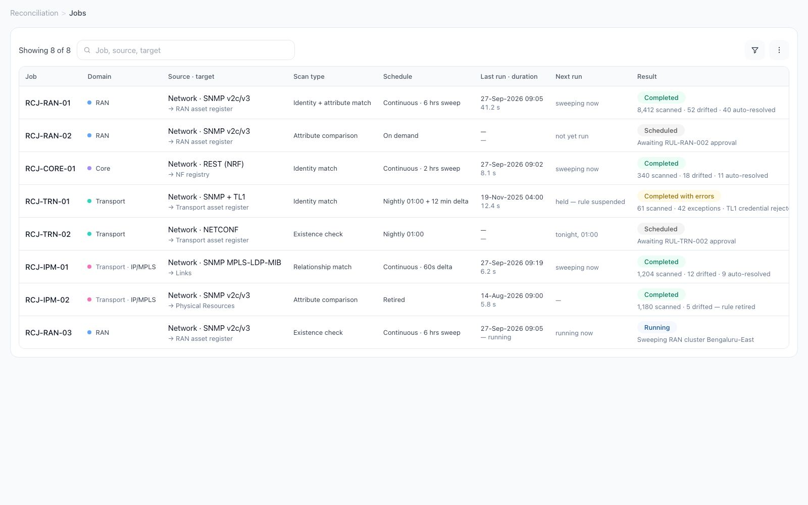

| UI element | Table · column(s) | Mode |
|---|---|---|
| Job, Domain | `RECONCILIATION_JOB.CODE`, `DOMAIN_ID_FK` | R |
| Source · target | `RECONCILIATION_JOB.SOURCE_DESCRIPTION`, `TARGET_DESCRIPTION` | R/W |
| Scan type | `RECONCILIATION_JOB.SCAN_TYPE` (IDENTITY_ATTRIBUTE, ATTRIBUTE, IDENTITY, EXISTENCE, RELATIONSHIP) | R/W |
| Schedule, Next run | `CRON_EXPRESSION`, `SCHEDULE_STATE` (LIVE / HELD / RETIRED), `NEXT_RUN_TIME` | R/W |
| Last run · duration | `RECONCILIATION_RUN.STARTED_TIME`, `ENDED_TIME` | R |
| Result (status, scanned, drifted, auto-resolved; "Awaiting RUL-… approval") | `RECONCILIATION_RUN.STATUS`; sums of `RECONCILIATION_RUN_RULE`; rule status from `RECONCILIATION_RULE.STATUS` via `RECONCILIATION_JOB_RULE` | D |
| Row click → rule | `RECONCILIATION_JOB_RULE.RECONCILIATION_RULE_ID_FK` | – |
| Run action | `POST /recon-jobs/{id}/actions/run` | A |

**Owner · integration · mock.** Reconciliation service. `MockReconciliationService` with a simulated run.

### 3.7 Reconciliation results (`/discovery/reconcile/results`)

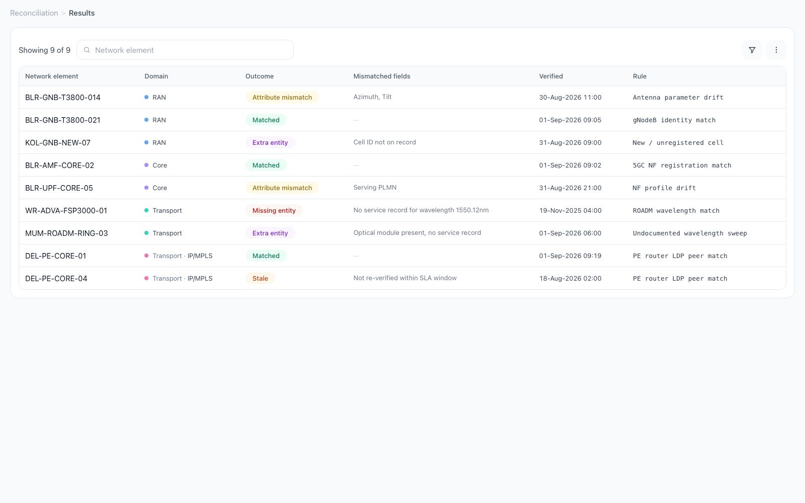

| UI element | Table · column(s) | Mode |
|---|---|---|
| Network element | `RECONCILIATION_RESULT.RESOURCE_ID_FK` → `NETWORK_ELEMENT.NETWORK_ELEMENT_NAME` (or `SCAN_TARGET.HOST_NAME` when the subject is a target) | R |
| Domain | via `RECONCILIATION_RULE.DOMAIN_ID_FK` | R |
| Outcome chip | `RECONCILIATION_RESULT.OUTCOME` → label via `RECONCILIATION_STATE_MAP` | R |
| Mismatched fields | `RECONCILIATION_RESULT_FIELD.FIELD_CODE` where `IS_MATCH = 0` → `RECONCILIATION_FIELD.LABEL` | R |
| Verified | `RECONCILIATION_RESULT.VERIFIED_TIME` | R |
| Rule | `RECONCILIATION_RULE.NAME` | R |
| Row drawer: inventory value vs network value, evidence | `RECONCILIATION_RESULT_FIELD.INVENTORY_VALUE`, `NETWORK_VALUE`, `EVIDENCE_SOURCE` | R |

**Owner · integration · mock.** Reconciliation service (high volume, server paging). `MockReconciliationService.results()`.

### 3.8 Reconciliation exceptions (`/discovery/reconcile/exceptions`)

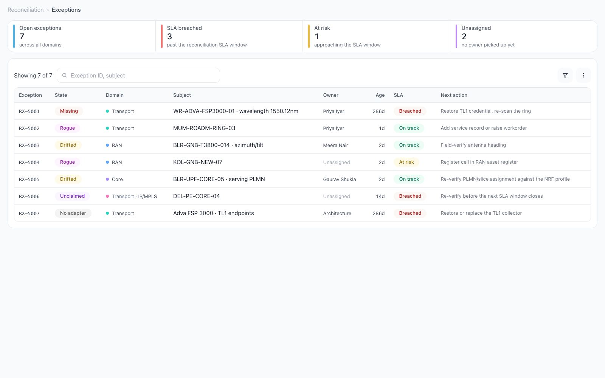

| UI element | Table · column(s) | Mode |
|---|---|---|
| Open, SLA breached, At risk cards | `RECONCILIATION_EXCEPTION.STATUS`, `SLA_DUE_TIME` vs now | D |
| Exception, State chip | `CODE`, `STATE` (ROGUE, DRIFTED, MISSING, DUPLICATE, UNCLAIMED, NO_ADAPTER, ZOMBIE) | R |
| Domain | `DOMAIN_ID_FK` | R |
| Subject (device · field) | `RESOURCE_ID_FK` → subtype name, `SUBJECT_DETAIL`; or `SCAN_TARGET_ID_FK` | R |
| Owner | `OWNER_TEAM_ID_FK` → `TEAM.NAME` and/or `ASSIGNEE_ID_FK` → `USER.DISPLAY_NAME`; "Unassigned" = both null | R |
| Age, SLA chip | `DETECTED_TIME`, `SLA_DUE_TIME` | D |
| Next action text | derived from `STATE` + `DISCREPANCY_TYPE` (UI copy) | D |
| Drawer: rule link, "View source/target record" | `RECONCILIATION_RULE_ID_FK`, `RECONCILIATION_RESULT_ID_FK`, resource route | R |
| Dispositions (Accept network, Accept record, Raise workorder, Approve exception) | `POST /recon-exceptions/{id}/actions/dispose` → `DISPOSITION`, `DISPOSITION_BY_FK`, `DISPOSITION_TIME`, `DISPOSITION_NOTE`, `WORK_ORDER_REFERENCE`, `EXCEPTION_EXPIRES_DATE`, `CLOSED_TIME` | A |
| Assign | `POST …/actions/assign` → `OWNER_TEAM_ID_FK`, `ASSIGNEE_ID_FK` | A |

**Owner · integration · mock.** Inventory owns the workflow row; the Reconciliation engine creates and auto-resolves exceptions; User Management supplies teams and people. Mocks: `MockReconciliationService.exceptions()`, `MockTeamService`, `MockUserService`.

### 3.9 Rules list (`/discovery/reconcile/rules`)

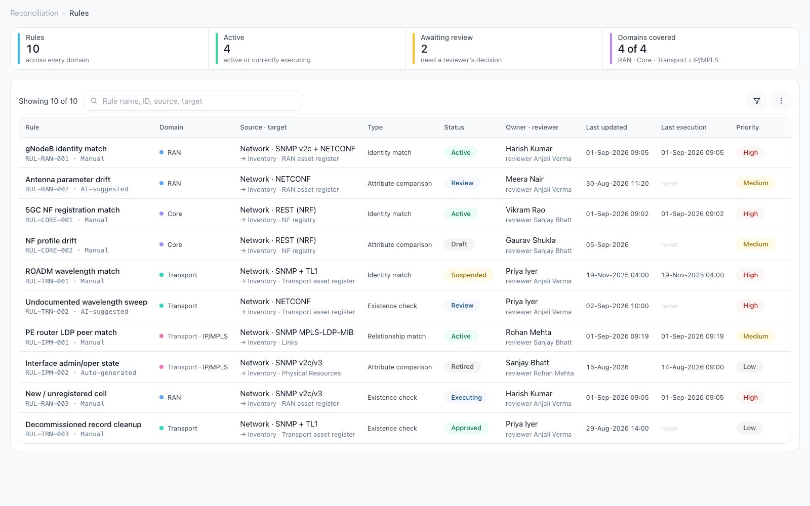

| UI element | Table · column(s) | Mode |
|---|---|---|
| Rules, Active, Awaiting review, Domains covered | `RECONCILIATION_RULE.STATUS` counts, distinct `DOMAIN_ID_FK` | D |
| Rule name, code, origin | `NAME`, `CODE`, `ORIGIN` (MANUAL, AUTO_GENERATED, AI_SUGGESTED) | R |
| Domain | `DOMAIN_ID_FK` | R |
| Source · target | `SOURCE_DESCRIPTION`, `TARGET_DESCRIPTION` | R |
| Type | `RULE_TYPE` | R |
| Status chip | `STATUS` (DRAFT, REVIEW, APPROVED, ACTIVE, EXECUTING, SUSPENDED, RETIRED) | R |
| Owner · reviewer | `OWNER_ID_FK`, `REVIEWER_ID_FK` → `USER.DISPLAY_NAME` | R |
| Last updated, Last execution | `MODIFIED_TIME`; latest `RECONCILIATION_RUN_RULE` → `RECONCILIATION_RUN.ENDED_TIME` | R |
| Priority | `PRIORITY` | R |
| Create rule, Edit, Review actions | navigation to 3.10 / 3.11 | – |

### 3.10 Rule definition (`/discovery/reconcile/rules/new`, `/rules/:id/edit`)

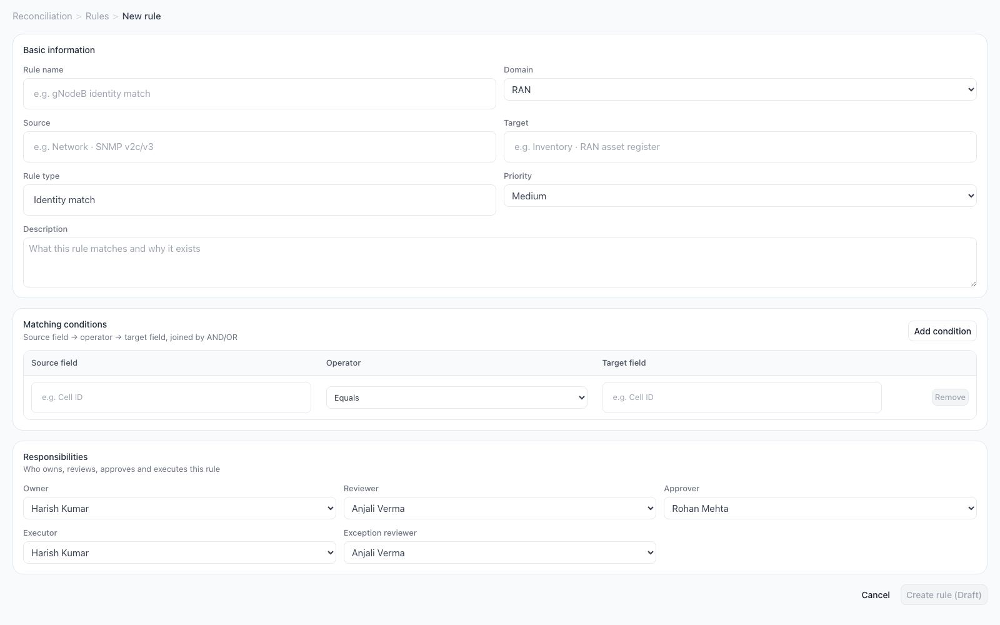

| UI element | Table · column(s) | Mode |
|---|---|---|
| Rule name, Domain, Source, Target, Rule type, Priority, Description | `RECONCILIATION_RULE.NAME`, `DOMAIN_ID_FK`, `SOURCE_DESCRIPTION`, `TARGET_DESCRIPTION`, `RULE_TYPE`, `PRIORITY`, `DESCRIPTION` | W |
| Matching conditions rows (source field, operator, target field, AND/OR, add / remove) | `RECONCILIATION_RULE_CONDITION.SEQUENCE_NUMBER`, `CONNECTOR`, `SOURCE_FIELD_CODE`, `OPERATOR`, `TARGET_KIND`, `TARGET_FIELD_CODE`, `TARGET_LITERAL`; pick-lists from `RECONCILIATION_FIELD` | W |
| Responsibilities: Owner, Reviewer, Approver, Executor | `OWNER_ID_FK`, `REVIEWER_ID_FK`, `APPROVER_ID_FK`, `EXECUTOR_ID_FK` (pickers from `USER`) | W |
| Exception reviewer | `EXCEPTION_REVIEWER_TEAM_ID_FK` (picker from `TEAM`) | W |
| Create rule (Draft) | `POST /recon-rules` → `STATUS = 'DRAFT'`, first `RECONCILIATION_RULE_EVENT` | W |

**Gap.** The form offers a *person* as exception reviewer; the schema expects a team. Either change the picker to `TEAM` or add a person column; the team form matches the queue model on the Exceptions screen.

### 3.11 Rule details (`/discovery/reconcile/rules/:id`)

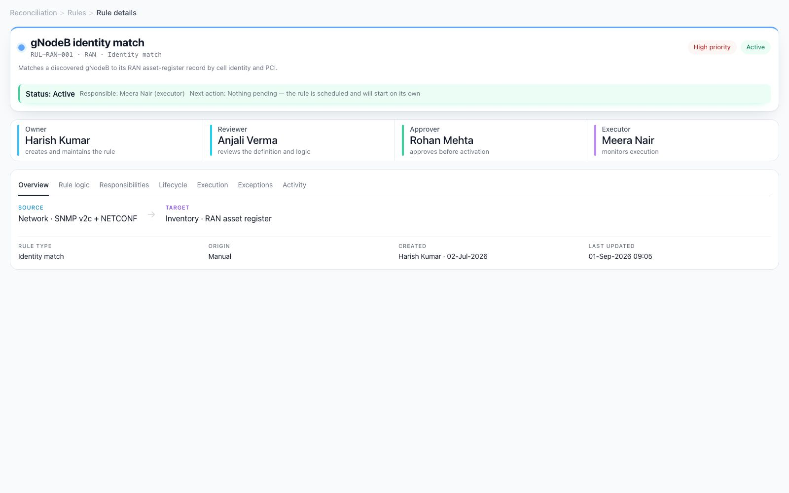

| UI element | Table · column(s) | Mode |
|---|---|---|
| Header: name, code, domain, type, description, priority, status | `RECONCILIATION_RULE` | R |
| Status banner "Responsible: … · Next action" | `STATUS` + `RECONCILIATION_RULE_TRANSITION.ACTOR_ROLE` for the next allowed move | D |
| Owner / Reviewer / Approver / Executor cards | `*_ID_FK` → `USER.DISPLAY_NAME` | R |
| Overview tab: source, target, rule type, origin, created, last updated | `SOURCE_DESCRIPTION`, `TARGET_DESCRIPTION`, `RULE_TYPE`, `ORIGIN`, `CREATED_TIME` + `CREATOR`, `MODIFIED_TIME` | R |
| Rule logic tab | `RECONCILIATION_RULE_CONDITION` rendered as chains | R |
| Responsibilities tab | roles + `EXCEPTION_REVIEWER_TEAM_ID_FK` → `TEAM.NAME` | R |
| Lifecycle tab (stage rail, who / when) | `RECONCILIATION_RULE_EVENT.FROM_STATUS`, `TO_STATUS`, `ACTION`, `ACTOR_ID_FK`, `EVENT_TIME`, `NOTE` | R |
| Execution tab | `RECONCILIATION_RUN_RULE.MATCHED_COUNT`, `EXCEPTION_COUNT`, `DURATION_MS` + `RECONCILIATION_RUN.STARTED_TIME` | R |
| Exceptions tab | `RECONCILIATION_EXCEPTION` where `RECONCILIATION_RULE_ID_FK = id` | R |
| Activity tab | `RECONCILIATION_RULE_EVENT` timeline | R |
| Approve / Reject / Request changes / Activate / Suspend / Resume / Retire | `POST /recon-rules/{id}/actions/{verb}`; allowed set computed from `RECONCILIATION_RULE_TRANSITION` × caller role; appends an event | A |

**Owner · integration · mock.** Inventory. Only ACTIVE ↔ EXECUTING flips come from the engine. `MockRuleService` derives `allowedActions` from the seeded transition table.

### 3.12 Discovery reports (`/discovery/reports`, `/discovery/reports/:id`)

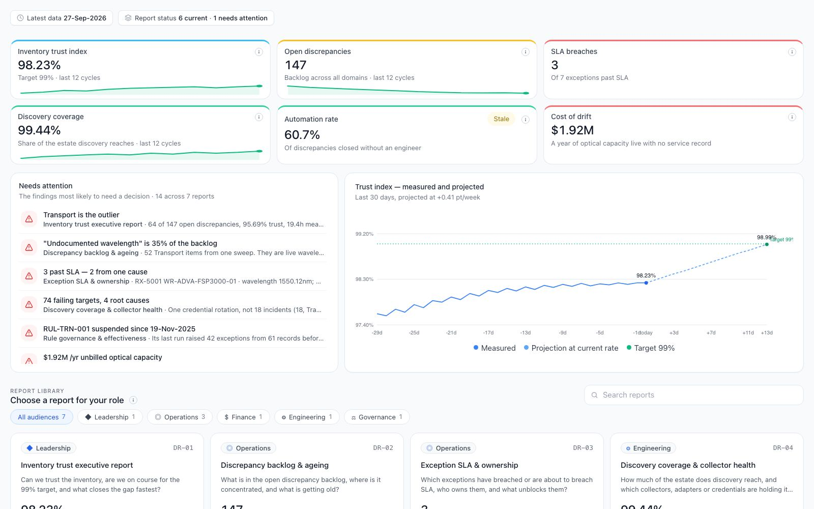

| UI element | Table · column(s) | Mode |
|---|---|---|
| KPI tiles (trust index, open discrepancies, SLA breaches, coverage, automation rate, cost of drift) | `DOMAIN_TRUST_SNAPSHOT` series, `RECONCILIATION_EXCEPTION` aggregates | D |
| Needs attention list | findings computed by each report definition (UI logic over the same read models) | D |
| Trust index measured and projected | `DOMAIN_TRUST_SNAPSHOT.TRUST_INDEX_PERCENT` last 30 days | R |
| Report library cards (audience, code, name, question) | `REPORT_DEFINITION.AUDIENCE`, `CODE`, `NAME`, `QUESTION`, `IS_FEATURED`, `MODULE = 'DISCOVERY'` | R/W |
| Report view: run / export, run history | `POST /reports/definitions/{id}/actions/run`; `REPORT_RUN.STATUS`, `FORMAT`, `FILE_REFERENCE`, `COMPLETED_TIME` | A / R |

**Owner · integration · mock.** Catalogue is Inventory; runs and files come from the Reporting service. `MockReportService` (run → COMPLETED with a stub file).


---

## 4. Inventory screens

### 4.1 Inventory home (`/inventory`)

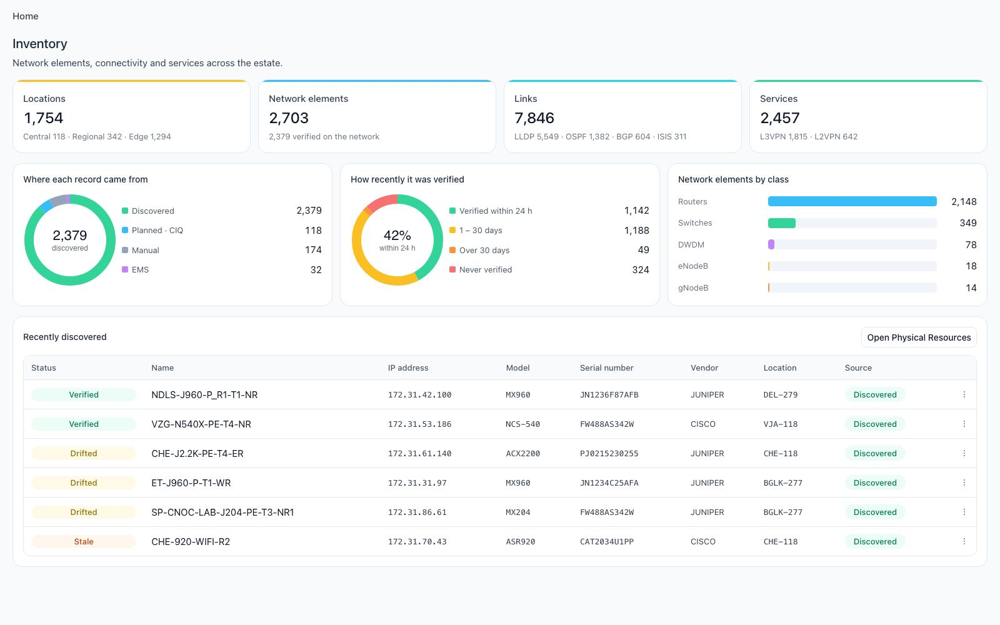

| UI element | Table · column(s) | Mode |
|---|---|---|
| Locations (central / regional / edge) | `SITE.CATEGORY` counts | D |
| Network elements, verified on the network | `NETWORK_ELEMENT` count; `RECONCILIATION_STATE = 'VERIFIED'` | D |
| Links by layer, Services by type | `LINK.LAYER`, `SERVICE_INSTANCE.SERVICE_TYPE` counts | D |
| Where each record came from | `NETWORK_ELEMENT.RECORD_SOURCE` (DISCOVERED, PLANNED_CIQ, MANUAL, EMS) | D |
| How recently it was verified | `NETWORK_ELEMENT.LAST_VERIFIED_TIME` bands | D |
| Network elements by class | `NETWORK_ELEMENT.NETWORK_ELEMENT_CLASS` → `NETWORK_ELEMENT_CLASS.NAME` | D |
| Recently discovered grid | `NETWORK_ELEMENT` ordered by `CREATED_TIME`: name, `MANAGEMENT_IP`, `PRODUCT_MODEL.MODEL`, `SERIAL_NUMBER`, `VENDOR.NAME`, `SITE.CODE`, `RECORD_SOURCE`, `RECONCILIATION_STATE` | R |

**Owner · integration · mock.** Inventory read model. `MockNetworkElementService.summary()`.

### 4.2 Location (`/inventory/location`) and Site create

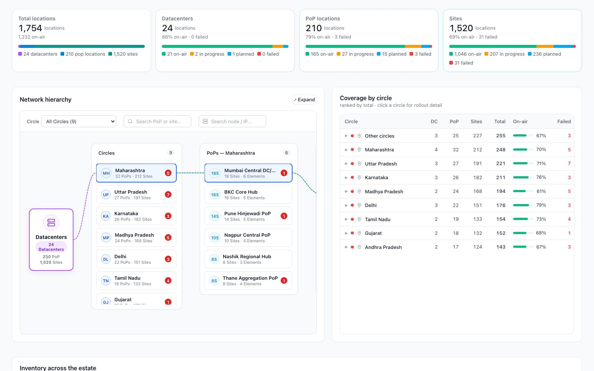

| UI element | Table · column(s) | Mode |
|---|---|---|
| Total locations, datacenters, PoPs, sites with status splits | `SITE.SITE_TYPE_ID_FK` → `SITE_TYPE`, `SITE.STATUS` (PLANNED, IN_PROGRESS, ON_AIR, FAILED, DECOMMISSIONED) | D |
| Network hierarchy (Datacenters → Circles → PoPs → Sites) | `OPERATIONAL_AREA` (CIRCLE level) → `SITE.OPERATIONAL_AREA_ID_FK`; `SITE.PARENT_SITE_ID_FK` for PoP → site | D |
| Circle picker, search PoP / site, search node / IP | `OPERATIONAL_AREA.NAME`; `SITE.CODE`, `NAME`; `NETWORK_ELEMENT.NETWORK_ELEMENT_NAME`, `MANAGEMENT_IP` | R |
| Coverage by circle (DC, PoP, sites, on-air %, failed) | `SITE` grouped by `OPERATIONAL_AREA_ID_FK` and `SITE_TYPE` | D |
| Site create form (type, category, geography cascade, address, lat / long, environment, rollout stage, landlord, lease end) | `SITE.SITE_TYPE_ID_FK`, `CATEGORY`, `GEOGRAPHY_LEVEL4_ID_FK` (cascade through `GEOGRAPHY_LEVEL1..3`), `ADDRESS`, `POSTAL_CODE`, `LATITUDE`, `LONGITUDE`, `ENVIRONMENT`, `ROLLOUT_STAGE`, `LANDLORD`, `LEASE_END_DATE`, `OPERATIONAL_AREA_ID_FK` | W |

**Owner · integration · mock.** Inventory; geography and operational areas pending a master-data owner (CDC if one exists). `MockSiteService`, `MockReferenceService`.

### 4.3 Site details (`/inventory/location/site/:id`)

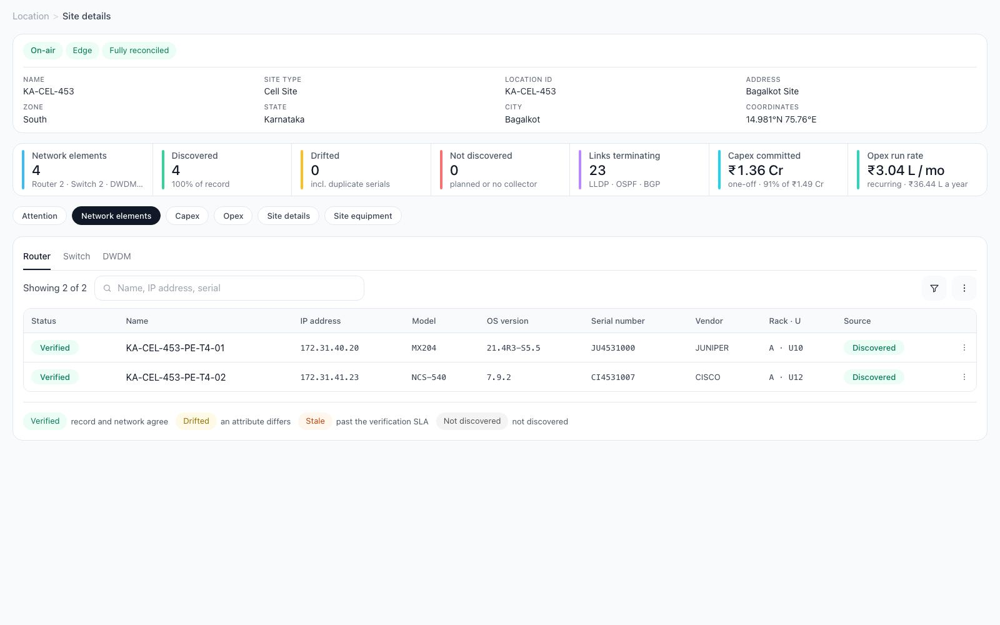

| UI element | Table · column(s) | Mode |
|---|---|---|
| Status chips (On-air, Edge, Fully reconciled) | `SITE.STATUS`, `CATEGORY`; reconciled = no open `RECONCILIATION_EXCEPTION` for NEs at the site | D |
| Name, Site type, Location ID, Address, Zone, State, City, Coordinates | `SITE.NAME`, `SITE_TYPE.NAME`, `SITE.CODE`, `ADDRESS`, `OPERATIONAL_AREA` (ZONE), `GEOGRAPHY_LEVEL1.GEOGRAPHY_NAME`, `GEOGRAPHY_LEVEL2.GEOGRAPHY_NAME`, `LATITUDE` / `LONGITUDE` | R/W |
| Network elements, Discovered, Drifted, Not discovered | `NETWORK_ELEMENT` at `SITE_ID_FK`: count, `RECORD_SOURCE`, `RECONCILIATION_STATE` | D |
| Links terminating (LLDP · OSPF · BGP) | `LINK.A_NETWORK_ELEMENT_ID_FK` / `Z_…` of the site's NEs, by `LAYER` | D |
| Capex committed, Opex run rate | **not in this database** → Open/CoPEX API (section 4.5) | Ext |
| Attention tab (issues) | `SITE_ISSUE.ISSUE_KIND`, `CATEGORY`, `REASON`, `RAISED_TIME`, `RESOLVED_TIME`, `OWNER_TEAM_ID_FK` → `TEAM.NAME` | R/W |
| Network elements tab (Router / Switch / DWDM tabs; status, name, IP, model, OS, serial, vendor, rack · U, source) | `NETWORK_ELEMENT` + `NETWORK_ELEMENT_CLASS`, `PRODUCT_MODEL.MODEL`, `OS_VERSION`, `SERIAL_NUMBER`, `VENDOR.NAME`, `RACK.CODE`, `RACK_UNIT_START`, `RECORD_SOURCE`, `RECONCILIATION_STATE` | R |
| Contacts (not visible in the shot; on the details panel) | `SITE_CONTACT.CONTACT_ROLE`, `CONTACT_NAME`, decrypted phone / email | R/W |

**Owner · integration · mock.** Inventory; Open/CoPEX for the two finance KPIs; User Management for issue owner teams. `MockSiteService` + `MockCopexService.summary(siteId)`.

### 4.4 Facility (`/inventory/location/site/:id/details`)

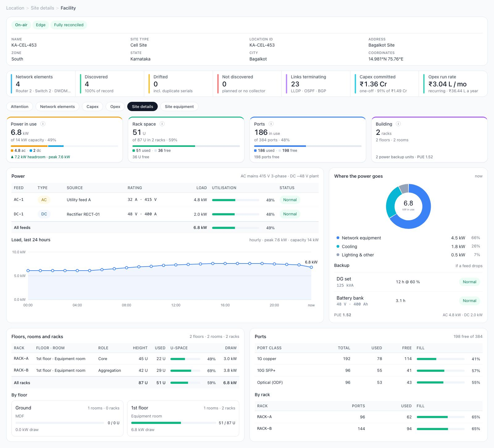

| UI element | Table · column(s) | Mode |
|---|---|---|
| Power in use, capacity, AC / DC split | `POWER_FEED.KIND`, `RATING_KW`, `LOAD_KW`, `STATUS` | R/W |
| Rack space (U used / free), Building (racks, floors, rooms) | `RACK.HEIGHT_RACK_UNITS`; used U from `NETWORK_ELEMENT.RACK_UNIT_START` / `END`; `FLOOR`, `ROOM` counts | D |
| Ports in use / free, port classes, by rack | `PORT.USAGE_STATE`, `MEDIA`, `SPEED_MBPS` for NEs at the site, grouped by `RACK` | D |
| Power feed table (feed, type, source, rating, load, utilisation, status) | `POWER_FEED.CODE`, `KIND`, `SOURCE`, `RATING_KW`, `LOAD_KW`, `STATUS` | R/W |
| Load last 24 hours chart | not stored (performance data belongs to PM) | Ext |
| Where the power goes, Backup (DG set, battery bank), PUE | DG / battery = power units → `EXTERNAL_RESOURCE` (class `POWER_UNIT`) + Passive Inventory API for rating / autonomy / last test | Ext |
| Floors, rooms and racks table (rack, floor · room, role, height, used, draw) | `RACK.CODE`, `ROOM.NAME`, `FLOOR.NAME`, `RACK.ROLE`, `HEIGHT_RACK_UNITS`, `POWER_BUDGET_KW`; used from NE placements | R/W |

**Owner · integration · mock.** Inventory for feeds, floors, rooms, racks; **Passive Inventory** for power units (DG, battery) and their tests; PM for the 24-hour load. `MockSiteService.facility()` + `MockPassiveService.powerUnits(siteId)`.

### 4.5 Capex and Opex (`/inventory/location/site/:id/capex`, `/opex`)

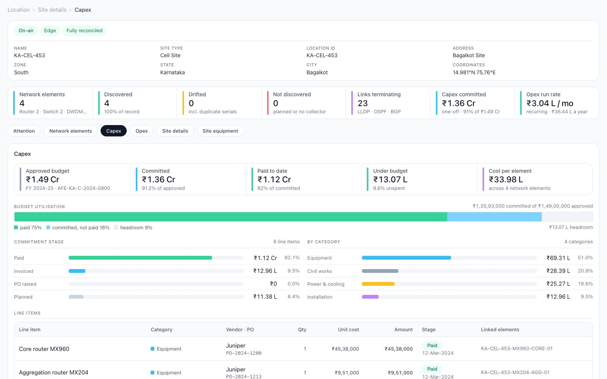

| UI element | Data | Mode |
|---|---|---|
| Approved budget, committed, paid, headroom, cost per element, AFE, FY | Open/CoPEX: capex plan header (site id, financial year, AFE number, approved amount, currency) | Ext |
| Commitment stage and category bars | Open/CoPEX: capex lines aggregated by state and category | Ext |
| Line items (item, category, vendor · PO, qty, unit cost, amount, stage, linked elements) | Open/CoPEX: capex lines; **linked elements are `RESOURCE.ID` / `NETWORK_ELEMENT` names supplied by Inventory** | Ext |
| Opex: monthly budget, run rate, contract lines, 12-month actuals | Open/CoPEX: opex plan, lines, monthly actuals | Ext |

**Owner · integration · mock.** Entirely **Open/CoPEX** (the `CAPEX_*` / `OPEX_*` tables were removed in v5). Inventory contributes `SITE.ID`, `RESOURCE.ID` and `VENDOR` ids. Until the module publishes its API: `MockCopexService.capexPlan(siteId, fy)`, `opexPlan(siteId, fy)`, `capexLinesForResource(resourceId)` (see 6.2). The screens keep working unchanged.

### 4.6 Site equipment (`/inventory/location/site/:id/equipment`)

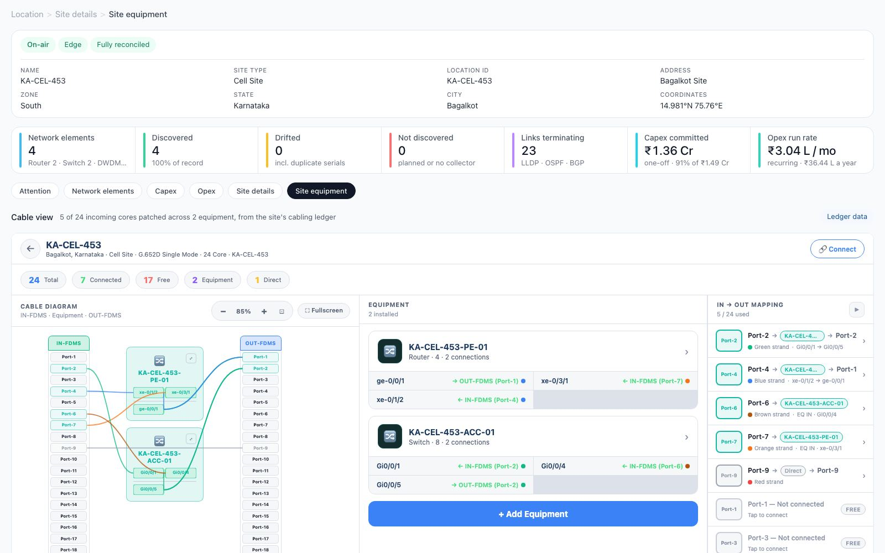

| UI element | Table · column(s) | Mode |
|---|---|---|
| Cable view header (site, fibre type, cores) | `SITE`; incoming fibre = `EXTERNAL_RESOURCE` (FIBER_SPAN / FIBER_CABLE, fiber app) | R / Ext |
| Equipment cards (router, switch, port count, connections) | `NETWORK_ELEMENT` at the site, `PORT` count, `LINK` (PHYSICAL) count | R |
| IN-FDMS / OUT-FDMS port strips | passive ODF positions → `EXTERNAL_RESOURCE` (class `PASSIVE_PORT`) via Passive Inventory | Ext |
| IN → OUT mapping, strand colours, Connect / Add equipment | physical `LINK` rows (`LAYER = 'PHYSICAL'`, `A_PORT_ID_FK`, `Z_PORT_ID_FK`) for device-to-device; patch cords to ODF positions belong to Passive Inventory | R/W / Ext |

**Owner · integration · mock.** Inventory for equipment and device-side links; **Passive Inventory** for ODF positions and patch cords; fiber app for spans. `MockNetworkElementService` + `MockPassiveService.ports(assetId)`, `patchCords(portId)`.

### 4.7 Node view (`/inventory/node/:name`)

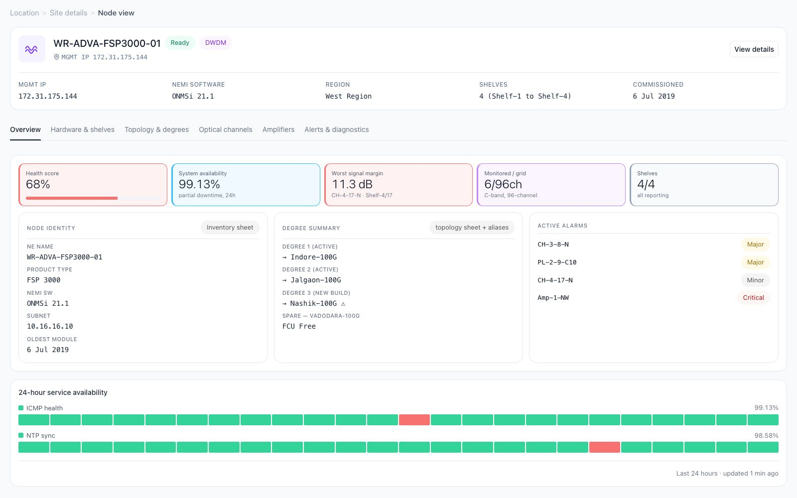

| UI element | Table · column(s) | Mode |
|---|---|---|
| Header (name, status, class chip, management IP), NEMI software, region, shelves, commissioned | `NETWORK_ELEMENT.NETWORK_ELEMENT_NAME`, `OPERATIONAL_STATUS`, `NETWORK_ELEMENT_CLASS`, `MANAGEMENT_IP`, `OS_VERSION`, `OPERATIONAL_AREA`, `EQUIPMENT_COMPONENT` (SHELF) count, `CREATED_TIME` / `RESOURCE_ASSET.PURCHASE_DATE` | R |
| Health score, availability, ICMP / NTP strips | `NETWORK_ELEMENT_HEALTH.REACHABILITY`, `AVAILABILITY_24H_PERCENT`, `NTP_STATUS` (latest only; 24-h history belongs to PM) | R / Ext |
| Node identity (NE name, product type, software, subnet, oldest module) with "Inventory sheet" source | `RESOURCE_FIELD_PROVENANCE.FIELD_CODE`, `FIELD_VALUE`, `SOURCE` | R |
| Degree summary (optical degrees, spare) | `LINK` rows with optical `LAYER` (OCH, OMS) from this NE; `NETWORK_ELEMENT_OPTICAL_DETAIL.ROADM_DEGREES` | R |
| Worst signal margin, monitored channels, active alarms | performance and fault data — **not in this database** (PM / FM systems) | Ext |
| Hardware & shelves tab | `EQUIPMENT_COMPONENT` tree (`COMPONENT_CLASS`, `SLOT_POSITION`, `PART_NUMBER`, `SERIAL_NUMBER`, `STATUS`) | R |
| Topology & degrees, Optical channels tabs | `LINK` (optical layers), `SERVICE_INSTANCE` (WAVELENGTH, OTN_CIRCUIT) | R |

**Owner · integration · mock.** Inventory + Discovery (provenance, health); PM / FM for margins and alarms (out of scope of this database). `MockNetworkElementService`; alarms remain UI-mock only.

### 4.8 Physical Resources (`/inventory/physical`)

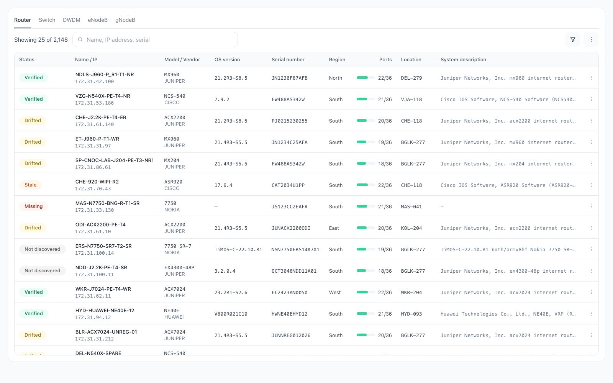

| UI element | Table · column(s) | Mode |
|---|---|---|
| Class tabs (Router, Switch, DWDM, eNodeB, gNodeB) with counts | `NETWORK_ELEMENT_CLASS` (catalog) × `NETWORK_ELEMENT.NETWORK_ELEMENT_CLASS` counts | R |
| Stock chips (planned / in store / deployed / faulty) | `NETWORK_ELEMENT.STOCK_STATE` | D |
| Status chip (Verified, Drifted, Stale, Missing, Not discovered) | `NETWORK_ELEMENT.RECONCILIATION_STATE` | R |
| Name / IP | `NETWORK_ELEMENT_NAME`, `MANAGEMENT_IP` | R |
| Model / Vendor | `PRODUCT_MODEL.MODEL`, `VENDOR.NAME` | R |
| OS version, Serial number | `OS_VERSION`, `SERIAL_NUMBER` | R |
| Region | `SITE.OPERATIONAL_AREA_ID_FK` → REGION ancestor | R |
| Ports (used / total bar) | `PORT.USAGE_STATE` counts | D |
| Location | `SITE.CODE` | R |
| System description | `RESOURCE_FIELD_PROVENANCE` (`sysDescr`) or `PRODUCT_MODEL.DESCRIPTION` | R |
| Row actions: View details, Node view, Move, Decommission | navigation; `POST /network-elements/{id}/actions/move` (`NETWORK_ELEMENT_MOVEMENT`, `NETWORK_ELEMENT_STOCK_TRANSITION`), `…/actions/decommission` (`DECOMMISSIONED_TIME`, `DECOMMISSION_REASON`, `DECOMMISSIONED_BY_FK`) | A |
| Filter panel (vendor, model, region, status, source) | same columns | R |

**Owner · integration · mock.** Inventory (discovery writes discovered rows). `MockNetworkElementService`. **Gap:** the UI has 6 class tabs, the schema 25 classes; drive the tab bar from `NETWORK_ELEMENT_CLASS.SORT_ORDER` grouped by `NETWORK_ELEMENT_CLASS_DOMAIN`.

### 4.9 Element (`/inventory/resource/:name`)

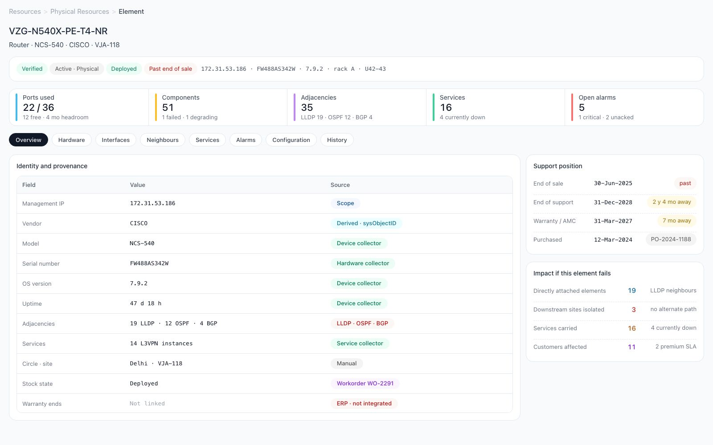

| UI element | Table · column(s) | Mode |
|---|---|---|
| Header chips (Verified, Active · Physical, Deployed, Past end of sale), IP, serial, OS, rack · U | `RECONCILIATION_STATE`, `RESOURCE_CLASS`, `STOCK_STATE`, `PRODUCT_MODEL.END_OF_SALE_DATE`, `MANAGEMENT_IP`, `SERIAL_NUMBER`, `OS_VERSION`, `RACK.CODE`, `RACK_UNIT_START` / `END` | R |
| Ports used / free / headroom | `PORT.USAGE_STATE` | D |
| Components (failed, degrading) | `EQUIPMENT_COMPONENT.STATUS` | D |
| Adjacencies (LLDP / OSPF / BGP) | `LINK.LAYER` counts where A or Z is this NE | D |
| Services (currently down) | `SERVICE_ENDPOINT.NETWORK_ELEMENT_ID_FK` → `SERVICE_INSTANCE.STATUS` | D |
| Open alarms | FM system — not in this database | Ext |
| Identity and provenance table (field, value, source chip) | `RESOURCE_FIELD_PROVENANCE.FIELD_CODE` → `RECONCILIATION_FIELD.LABEL`, `FIELD_VALUE`, `SOURCE` (SCOPE, DERIVED_SYS_OBJECT_ID, DEVICE_COLLECTOR, HARDWARE_COLLECTOR, LINK_COLLECTOR, SERVICE_COLLECTOR, MANUAL, WORK_ORDER); "ERP · not integrated" = no `RESOURCE_ASSET.WARRANTY_END_DATE` | R |
| Support position (end of sale, end of support, warranty / AMC, purchased, PO) | `PRODUCT_MODEL.END_OF_SALE_DATE`, `END_OF_LIFE_DATE`; `RESOURCE_ASSET.WARRANTY_END_DATE`, `MAINTENANCE_CONTRACT_END_DATE`, `PURCHASE_DATE`, `PURCHASE_ORDER_NUMBER` | R |
| Impact if this element fails | `RESOURCE_RELATIONSHIP` (`DEPENDS_ON`, `BACKHAULED_BY`, `SERVED_BY`) + `LINK` neighbours + `SERVICE_ENDPOINT` | D |
| Hardware tab | `EQUIPMENT_COMPONENT` tree with `PRODUCT_MODEL`, `PART_NUMBER`, `SERIAL_NUMBER` | R/W |
| Interfaces tab | `PORT` + `PORT_IP_ADDRESS`, `PORT_VLAN`, `VRF` | R/W |
| Neighbours tab | `LINK` + `LINK_PROTOCOL_ATTRIBUTE` | R |
| Services tab | `SERVICE_ENDPOINT` → `SERVICE_INSTANCE` | R |
| Alarms, Configuration tabs | FM / config management — not in this database | Ext |
| History tab | `NETWORK_ELEMENT_MOVEMENT` (from / to state, sites, work order, moved time) | R |
| Class detail panel (router role, IGP, MPLS …) | `NETWORK_ELEMENT_IP_MPLS_DETAIL` (or the detail table of the class) | R/W |

**Owner · integration · mock.** Inventory; Discovery for provenance and health; FM / config outside scope. `MockNetworkElementService.get(id)` returns the class detail as a discriminated union.

### 4.10 Virtual Resources (`/inventory/virtual`, `/virtual/details`, `/virtual/lifecycle`)

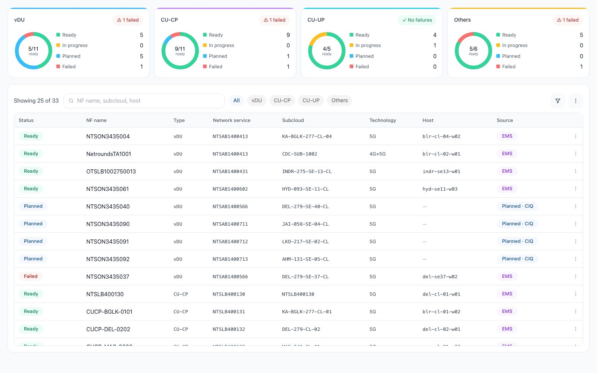

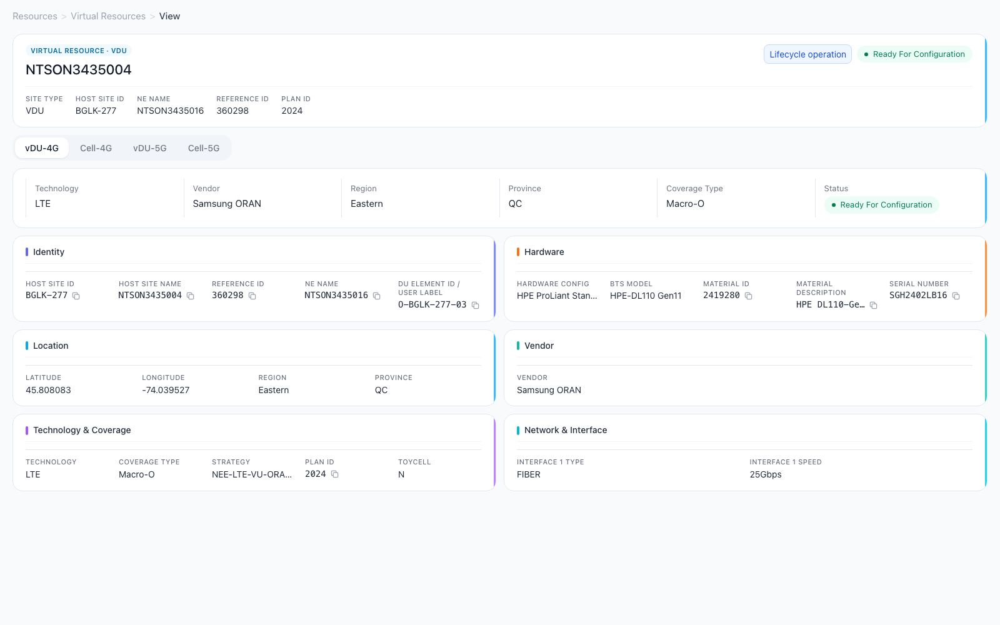

| UI element | Table · column(s) | Mode |
|---|---|---|
| NF type cards (vDU, CU-CP, CU-UP, Others; ready / in progress / planned / failed) | `NETWORK_ELEMENT` where `IS_VIRTUAL = 1`, grouped by `NETWORK_ELEMENT_CORE_DETAIL.NETWORK_FUNCTION_TYPE_CODE` (or RAN split function for vDU / CU) and `OPERATIONAL_STATUS` / `STOCK_STATE` | D |
| Status, NF name, Type | `OPERATIONAL_STATUS`, `NETWORK_ELEMENT_NAME`, NF type | R |
| Network service | `SERVICE_INSTANCE` linked through `SERVICE_ENDPOINT` | R |
| Subcloud | `NETWORK_ELEMENT_VIRTUAL_INSTANCE.CLOUD_CLUSTER_ID_FK` → `CLOUD_CLUSTER.CODE` | R |
| Technology | `RESOURCE_TECHNOLOGY` → `TECHNOLOGY.CODE` | R |
| Host | `NETWORK_ELEMENT_VIRTUAL_INSTANCE.HOST_NETWORK_ELEMENT_ID_FK` → host `NETWORK_ELEMENT_NAME` | R |
| Source chip (EMS, Planned · CIQ) | `RECORD_SOURCE` | R |
| View: identity (host site, reference id, NE name, DU element id), hardware (config, model, material id, serial), location, vendor, technology & coverage, network & interface | `NETWORK_ELEMENT` + `NETWORK_ELEMENT_VIRTUAL_INSTANCE.INSTANCE_UUID`, `DESCRIPTOR_ID`, `DESCRIPTOR_VERSION`; host `NETWORK_ELEMENT_SERVER_DETAIL`; `SITE.LATITUDE` / `LONGITUDE`; `RESOURCE_ATTRIBUTE` for plan id, material id, strategy (custom attributes) | R |
| Lifecycle operation button / lifecycle screen | orchestrator action; `INSTANTIATION_STATE` reflects the result | A (Ext) |

**Owner · integration · mock.** Inventory for the records; **orchestrator** (to validate) for instantiation state and lifecycle operations. `MockVirtualService` flips `INSTANTIATION_STATE` locally. **Gap:** vDU / CU-CP / CU-UP are RAN split functions; in the schema they are `GNB_DU` / `GNB_CU` classes with `IS_VIRTUAL = 1`, not `CORE_NF`.

### 4.11 Cell 4G / 5G details (`/inventory/virtual/cell-4g-details`, `/cell-5g-details`)

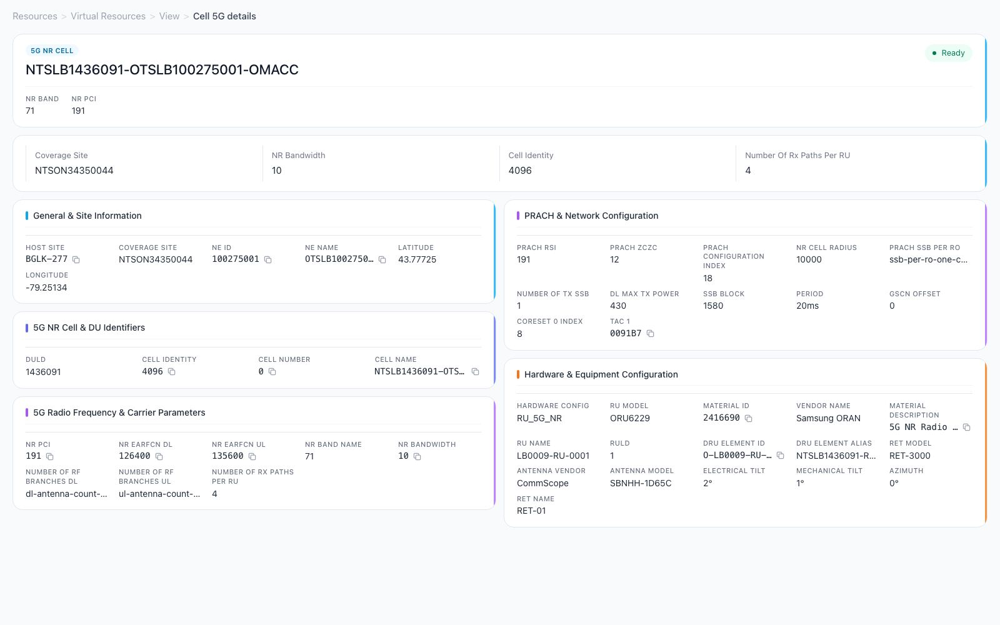

| UI element | Table · column(s) | Mode |
|---|---|---|
| Header (cell name, status, NR band, PCI) | `RADIO_CELL.CELL_NAME`, `CELL_STATUS`, `BAND_CODE`, `PHYSICAL_CELL_ID` | R |
| Coverage site, bandwidth, cell identity, Rx paths per RU | `RADIO_SECTOR` / `SITE.CODE`, `BANDWIDTH_MHZ`, `CELL_IDENTITY`; RU paths from `CELL_RADIO_UNIT` → RU `NETWORK_ELEMENT` | R |
| General & site (host site, NE id / name, lat / long) | `NETWORK_ELEMENT_ID_FK` → node, `SITE.LATITUDE` / `LONGITUDE` | R |
| Cell & DU identifiers (DU id, cell identity, cell number, name) | `RADIO_CELL.LOCAL_CELL_ID`, `CELL_IDENTITY`, node `NETWORK_ELEMENT_RAN_DETAIL.NODE_ID` | R |
| Radio frequency (PCI, EARFCN DL / UL, band, bandwidth, RF branches, Rx paths) | `PHYSICAL_CELL_ID`, `ARFCN_DOWNLINK`, `ARFCN_UPLINK`, `BAND_CODE`, `BANDWIDTH_MHZ`, `MIMO_MODE` | R/W |
| PRACH & network config (RSI, TAC, SSB, max Tx power …) | `ROOT_SEQUENCE_INDEX`, `LAC_TAC`, `MAX_TRANSMIT_POWER_DBM`; the remaining vendor parameters → `RESOURCE_ATTRIBUTE` | R/W |
| Hardware & equipment (RU model, vendor, antenna vendor / model, tilts, azimuth, RET) | `CELL_RADIO_UNIT` → RU `NETWORK_ELEMENT` + `PRODUCT_MODEL`; `CELL_ANTENNA` → `ANTENNA.VENDOR_ID_FK`, `PRODUCT_MODEL_ID_FK`, `ELECTRICAL_TILT_DEG`, `MECHANICAL_TILT_DEG`, `AZIMUTH_DEG`, `REMOTE_ELECTRICAL_TILT_CAPABLE` | R/W |
| PLMNs (not shown on the shot; on the 4G page) | `RADIO_CELL_PLMN` → `PLMN.MCC`, `MNC`, `IS_PRIMARY` | R |

**Owner · integration · mock.** Inventory; EMS discovery writes cell parameters; **Passive Inventory** for the antenna mount (`ANTENNA.MOUNT_EXTERNAL_RESOURCE_ID_FK`). `MockRanService`. **Gap:** these screens live under Virtual Resources; the proposed RAN Inventory module gives them a home under Resources.

### 4.12 Passive Infrastructure (`/inventory/passive` and element pages)

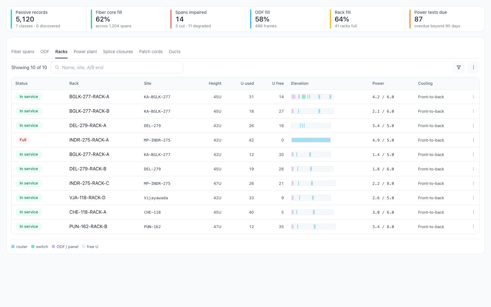

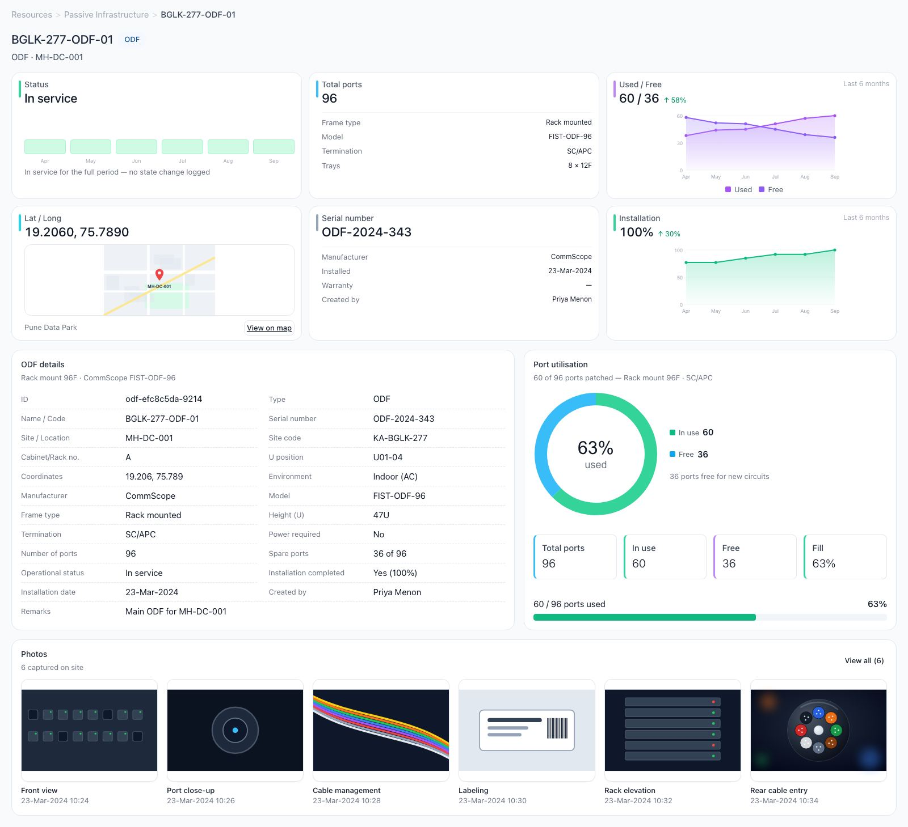

| Tab / page | Data today (v5) | Owner | Mode |
|---|---|---|---|
| Summary cards (passive records, fiber core fill, spans impaired, ODF fill, rack fill, power tests due) | counts of `EXTERNAL_RESOURCE` by `OBJECT_TYPE`; rack fill from `RACK` + NE placements; fibre, ODF fill and power tests from Passive Inventory / fiber app | mixed | D / Ext |
| **Racks** tab and `/passive/rack/:id` (status, rack, site, height, U used / free, elevation, power, cooling) | `RACK.CODE`, `SITE.CODE`, `HEIGHT_RACK_UNITS`, `POWER_BUDGET_KW`; elevation from `NETWORK_ELEMENT.RACK_UNIT_START` / `END` (router / switch) and passive occupants from Passive proxies | Inventory (validate) | R/W |
| **ODF** tab and `/passive/odf/:id` (frame, ports total / used / free, trays, model, photos) | `EXTERNAL_RESOURCE` (class `PASSIVE_ASSET`, `OBJECT_TYPE = PASSIVE_ASSET`) gives id, label, last sync; every attribute on the page comes from **Passive Inventory API**; photos from the same module | Passive Inventory | Ext |
| **Power plant** tab and `/passive/power/:id` (DG set, rectifier, battery; rating, runtime, last test) | `EXTERNAL_RESOURCE` (class `POWER_UNIT`) + Passive API (unit, tests, overdue flag); linked controller = `NETWORK_ELEMENT_POWER_DETAIL.POWER_UNIT_EXTERNAL_RESOURCE_ID_FK` | Passive Inventory | Ext |
| **Splice closures**, **Ducts**, **Fiber spans** tabs and pages | `EXTERNAL_RESOURCE` (`OBJECT_TYPE` = SPLICE_CLOSURE, DUCT, FIBER_SPAN; `SYSTEM_TYPE = FIBER_INVENTORY`) + fiber app deep link (`EXTERNAL_SYSTEM.BASE_URL`) | Fiber application | Ext |
| **Patch cords** tab and `/passive/cord/:id` (A / Z port, type, length, loss) | Passive Inventory API (`PATCH_CORD` object type); device-side ports resolved against `PORT` | Passive Inventory | Ext |

**Owner · integration · mock.** Racks stay Inventory for now; everything else on this screen is **Passive Inventory** or the **fiber application**. `MockPassiveService` returns proxy lists from `EXTERNAL_RESOURCE` plus a mocked detail per object type so all seven pages keep rendering; the real API replaces the detail calls one object type at a time.

### 4.13 Links (`/inventory/links`)

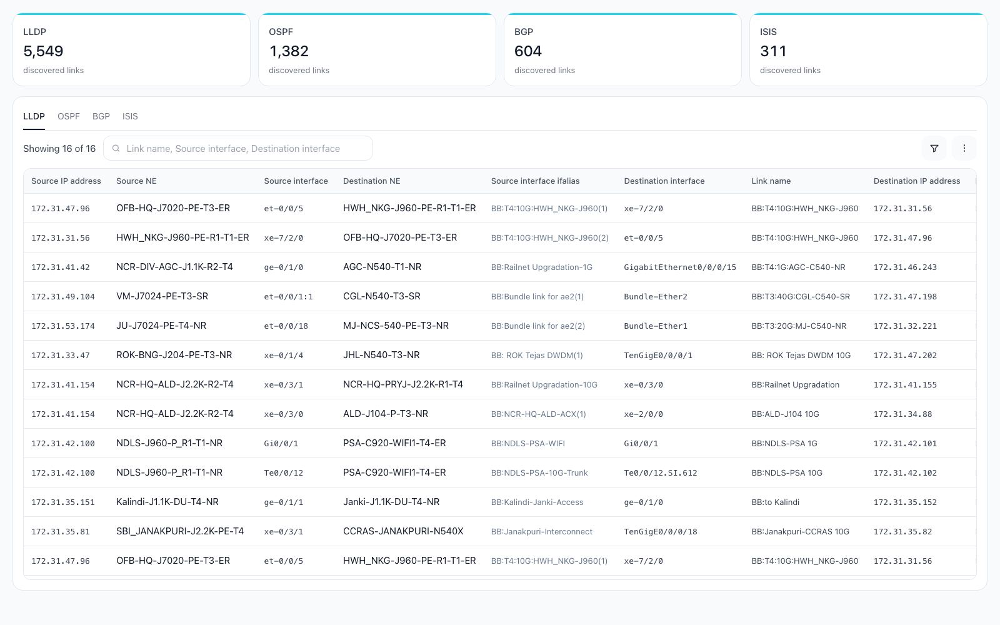

| UI element | Table · column(s) | Mode |
|---|---|---|
| Layer cards and tabs (LLDP, OSPF, BGP, ISIS) | `LINK.LAYER` counts → `LINK_LAYER.NAME`, `CATEGORY` | D |
| Source IP, Source NE, Source interface, ifalias | `LINK.A_IP_ADDRESS`, `A_NETWORK_ELEMENT_ID_FK` → name, `A_PORT_ID_FK` → `PORT.NAME`, `PORT.DESCRIPTION` | R |
| Destination NE / interface / IP, remote name | `Z_NETWORK_ELEMENT_ID_FK`, `Z_PORT_ID_FK`, `Z_IP_ADDRESS`, `Z_REMOTE_NAME` | R |
| Link name | `LINK.LINK_NAME` | R/W |
| Status, first / last seen, source | `STATUS`, `FIRST_SEEN_TIME`, `LAST_SEEN_TIME`, `RECORD_SOURCE` | R |
| Protocol columns (AS numbers, OSPF area, neighbour state, IS-IS level) | `LINK_PROTOCOL_ATTRIBUTE` | R |
| Microwave hop fields (when present) | `LINK_MICROWAVE_ATTRIBUTE` | R/W |
| NE filter (`?ne=`) | `A_` / `Z_NETWORK_ELEMENT_ID_FK` | R |

**Owner · integration · mock.** Inventory; discovery writes the adjacency layers. `MockLinkService`. **Gap:** only 4 routing / L2 layers are shown; the catalog has 45 layers in 9 categories (physical, tunnel, optical, microwave, fronthaul, RAN and core interfaces) that need tabs.

### 4.14 Services (`/inventory/services`)

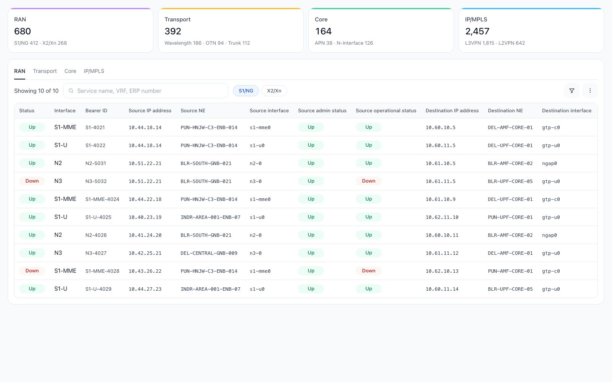

| UI element | Table · column(s) | Mode |
|---|---|---|
| Domain cards and tabs (RAN, Transport, Core, IP/MPLS) with type splits | `SERVICE_INSTANCE.DOMAIN_ID_FK`, `SERVICE_TYPE` counts | D |
| Sub-type chips (S1/NG, X2/Xn) | `SERVICE_TYPE` (or `LINK_LAYER` for RAN interfaces — see gap) | R |
| Status | `SERVICE_INSTANCE.STATUS` | R |
| Interface, Bearer ID | `REFERENCE_KIND` / `REFERENCE_VALUE` (BEARER_ID, CIRCUIT_ID, APN_ID, VC_ID) | R |
| Source / Destination IP, NE, interface, admin and operational status | `SERVICE_ENDPOINT.ENDPOINT_ROLE` (SOURCE / DESTINATION / PE / CE), `IP_ADDRESS`, `NETWORK_ELEMENT_ID_FK`, `PORT_ID_FK`, `ADMIN_STATUS`, `OPERATIONAL_STATUS` | R |
| VRF, ERP number (search) | `VRF.NAME` via `VRF.SERVICE_INSTANCE_ID_FK`; `REFERENCE_KIND = 'ERP_NUMBER'` | R |

**Owner · integration · mock.** Inventory; LCM / discovery write discovered services. `MockServiceService`. **Gap:** S1-MME, N2, N3 rows are 3GPP interfaces; in v5 those are `LINK` rows with `LAYER` S1_MME / NG_C / NG_U, while `SERVICE_INSTANCE` covers L3VPN, backhaul, wavelength, APN and voice. The RAN tab should read `LINK` (RAN_INTERFACE category).

### 4.15 Inactive inventory (`/inventory/inactive`)

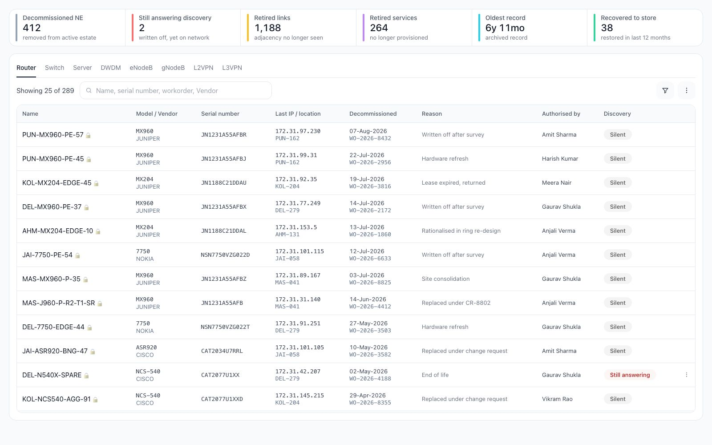

| UI element | Table · column(s) | Mode |
|---|---|---|
| Decommissioned NE, still answering discovery, retired links, retired services, oldest record, recovered to store | `NETWORK_ELEMENT.STOCK_STATE = 'DECOMMISSIONED'`, `LAST_SEEN_TIME` after `DECOMMISSIONED_TIME`; `LINK.RECORD_STATE = 'INACTIVE'`; `SERVICE_INSTANCE.RECORD_STATE`; `NETWORK_ELEMENT_MOVEMENT` (RECOVER) | D |
| Class tabs (Router … gNodeB, L2VPN, L3VPN) | `NETWORK_ELEMENT_CLASS`; `SERVICE_TYPE` | R |
| Name, Model / Vendor, Serial, Last IP / location | `NETWORK_ELEMENT` + `PRODUCT_MODEL`, `VENDOR`, `MANAGEMENT_IP`, `SITE.CODE` | R |
| Decommissioned date · work order, Reason, Authorised by | `DECOMMISSIONED_TIME`, `WORK_ORDER_REFERENCE`, `DECOMMISSION_REASON`, `DECOMMISSIONED_BY_FK` → `USER.DISPLAY_NAME` | R |
| Discovery chip (Silent / Still answering) | `SCAN_TARGET.LAST_SYNC_TIME` for the NE's IP | D |
| Row action: recover to store, open exception | `POST /network-elements/{id}/actions/move` (DECOMMISSIONED → IN_STORE, RECOVER); link to `RECONCILIATION_EXCEPTION` (ZOMBIE state) | A |

**Owner · integration · mock.** Inventory. Derived from the NE / link / service mock stores.

### 4.16 Inventory reports (`/inventory/reports`, `/inventory/reports/:id`)

Same structure as 3.12 with `REPORT_DEFINITION.MODULE = 'INVENTORY'` (Hardware lifecycle risk reads `PRODUCT_MODEL.END_OF_SALE_DATE` / `END_OF_LIFE_DATE` against `NETWORK_ELEMENT` and `EQUIPMENT_COMPONENT`).


---

## 5. Integration dependencies per module

| Module | Screens that depend on it | What is exchanged | Mock that is enough until the API exists |
|---|---|---|---|
| **Open / CoPEX** | Capex, Opex (4.5); the two finance KPIs on Site details (4.3) | out: `SITE.ID`, `RESOURCE.ID`, `VENDOR.ID`, financial year · in: plan header, lines, monthly actuals | `MockCopexService` — `capexPlan(siteId, fy)`, `opexPlan(siteId, fy)`, `capexLinesForResource(resourceId)`, `summary(siteId)` |
| **Passive Inventory** | Passive Infrastructure ODF / Power plant / Patch cords pages (4.12); Facility backup panel (4.4); Site equipment ODF strips (4.6); antenna mount on cells (4.11); power controller detail (4.9) | out: site id, rack code, port ids · in: proxy list (always local in `EXTERNAL_RESOURCE`), full attributes, tests, occupancy, deep link | `MockPassiveService` — `proxies(siteId, objectType)`, `asset(externalId)`, `ports(assetId)`, `rackOccupancy(rackCode)`, `powerUnits(siteId)`, `powerUnit(externalId)`, `patchCords(portId)`, `deepLink(externalId)` |
| **Fiber application** | Splice closures, Ducts, Fiber spans pages (4.12); incoming fibre on Site equipment | in: proxies (`SYSTEM_TYPE = FIBER_INVENTORY`) and deep link | same `MockPassiveService` with fiber object types |
| **User Management** | Rules roles (3.10, 3.11); Exceptions owner / assignee (3.8); Site issues owner (4.3); Inactive "Authorised by" (4.15) | in: CDC copy of `USER` and `TEAM`; by API: group members, role claims | `MockUserService.list()`, `roles(id)`; `MockTeamService.list()`, `members(teamId)` — static lists |
| **Discovery service (NiFi / Spark)** | Scan jobs, Scan targets, Target transcript (3.2 – 3.4); Insights adapters / failures / jobs cards (3.1); provenance and health on Element and Node view (4.7, 4.9) | out: job definitions, run / hold / resume · in: runs, target outcomes, step results, health, provenance | `MockScanJobService` with a simulated scheduler |
| **Reconciliation service** | Overview, Jobs, Results (3.5 – 3.7); exception creation and auto-resolve (3.8); ACTIVE ↔ EXECUTING on rules (3.11); cycles on Insights | out: job definitions, run · in: runs, results, fields, exceptions | `MockReconciliationService` with a simulated run |
| **Reporting service** | Report runs and downloads (3.12, 4.16); trust trend on Insights | out: run request · in: run status, file, KPI series | `MockReportService`, `MockInsightsService` |
| **Orchestrator** (validate) | Lifecycle operation on the VNF view (4.10) | out: instance id, operation · in: instantiation state | `MockVirtualService` |
| **PM / FM systems** (out of scope) | Node view margins, alarms, 24-h availability; Element alarms and configuration; Facility 24-h load | in: telemetry and alarms | UI-mock only; not represented in this database |
| **Master data** (validate) | Geography cascade and circle filters everywhere | in: `GEOGRAPHY_LEVEL1..4`, `OPERATIONAL_AREA` | `MockReferenceService` from the dummy rows |

Screens that need **no other module** for their own data: Home, Location list, Site details (except finance KPIs and issue teams), Physical Resources, Element (except alarms), Links, Services, Inactive inventory, Rules, and the RAN cell pages (except antenna mounts).

---

## 6. Mock API catalogue

Contracts are proposals. Each mock lives in `src/services/<module>/Mock<X>Service.ts` and is seeded from `src/mock/<module>`, mirroring the dummy data in `inventory_schema_v5.sql`. `ApiXService` implements the same interface; a screen never changes when the real endpoint arrives. Every mock applies paging, filtering, `rowVersion` conflicts and the lifecycle rules of the seeded transition tables.

### 6.1 Inventory API mocks (own data)

| Service | Key methods | Backing tables |
|---|---|---|
| `MockReferenceService` | `domains()`, `neClasses(domain?)`, `resourceClasses()`, `technologies()`, `frequencyBands(tech)`, `linkLayers()`, `serviceTypes()`, `siteTypes()`, `nfTypes()`, `discoverySteps(domain)`, `discrepancyTypes()`, `reconFields(class?)`, `ruleTransitions()`, `stockTransitions()`, `relationshipTypes()`, `relationshipRules()`, `externalObjectTypes()`, `vendors()`, `productModels(vendor?, class?)`, `geo(level, parent?)`, `operationalAreas()` | all seeded catalogs, `VENDOR`, `PRODUCT_MODEL`, `GEOGRAPHY_LEVEL1..4`, `OPERATIONAL_AREA` |
| `MockSiteService` | `list(q)`, `get(id)`, `create`, `update`, `floors / rooms / racks / powerFeeds / contacts / issues (siteId)`, `facility(siteId)`, `rackElevation(rackId)`, `hierarchy()` | `SITE`, `FLOOR`, `ROOM`, `RACK`, `POWER_FEED`, `SITE_CONTACT`, `SITE_ISSUE` |
| `MockNetworkElementService` | `summary()`, `list(q)`, `get(id)` (class detail union), `create`, `update`, `components(id)`, `ports(id)`, `health(id)`, `movements(id)`, `move(id, body)`, `decommission(id, body)`, `asset / attributes / technologies / provenance / externalRefs / relationships / impact (resourceId)` | `NETWORK_ELEMENT` + 11 detail tables, `EQUIPMENT_COMPONENT`, `PORT`, `PORT_IP_ADDRESS`, `PORT_VLAN`, `NETWORK_ELEMENT_HEALTH`, `NETWORK_ELEMENT_MOVEMENT`, `RESOURCE_*` |
| `MockVirtualService` | `list(q)`, `instance(id)`, `clusters()`, `lifecycle(id, op)` | `NETWORK_ELEMENT_VIRTUAL_INSTANCE`, `CLOUD_CLUSTER` |
| `MockRanService` | `cells(q)`, `cell(id)`, `sectors(siteId)`, `antennas(siteId)`, `plmns()`, `slices()` | `RADIO_CELL`, `RADIO_CELL_PLMN`, `CELL_ANTENNA`, `CELL_RADIO_UNIT`, `RADIO_SECTOR`, `ANTENNA`, `PLMN`, `NETWORK_SLICE` |
| `MockLinkService` | `list(q)`, `get(id)`, `create`, `update` | `LINK`, `LINK_PROTOCOL_ATTRIBUTE`, `LINK_MICROWAVE_ATTRIBUTE` |
| `MockServiceService` | `list(q)`, `get(id)` (endpoints embedded) | `SERVICE_INSTANCE`, `SERVICE_ENDPOINT` |
| `MockIpamService` | `subnets(context?)`, `vrfs(neId)`, `vlans(neId)` | `IP_SUBNET`, `VRF`, `VLAN` |
| `MockRuleService` | `list(q)`, `get(id)` (conditions, `allowedActions`), `create`, `update`, `action(id, verb, note)`, `events(id)`, `executions(id)` | `RECONCILIATION_RULE`, `_CONDITION`, `_EVENT`, `_TRANSITION`, `RECONCILIATION_RUN_RULE` |
| `MockReportService` | `definitions(module)`, `run(defId, format)`, `runs(q)`, `file(runId)` | `REPORT_DEFINITION`, `REPORT_RUN` |
| `MockInactiveService` | `list(kind, domain)` | derived from the NE / port / link / service stores |

### 6.2 Other-module mocks (contract to be replaced by the module's real API)

| Service | Methods that are enough for the current screens | Stands in for |
|---|---|---|
| `MockCopexService` (Open / CoPEX) | `summary(siteId)` → committed capex, opex run rate; `capexPlan(siteId, fy)` → header (AFE, approved amount, currency) + lines (description, category, vendor, PO, qty, unit cost, state, state date, linked resource ids); `opexPlan(siteId, fy)` → header + lines (category, supplier, contract, frequency, amount, state, due, end, escalation) + 12 monthly actuals; `capexLinesForResource(resourceId)` | removed `CAPEX_*` / `OPEX_*` tables; Capex and Opex screens; Site details finance KPIs |
| `MockPassiveService` (Passive Inventory + fiber app) | `proxies(siteId, objectType)` from `EXTERNAL_RESOURCE`; `asset(externalId)` → type, code, site, rack, U range, vendor, model, serial, status, install date, ports (total / used / free), photos; `ports(assetId)`; `rackOccupancy(rackCode)`; `powerUnits(siteId)`, `powerUnit(externalId)` → kind, rating, runtime, last test, overdue; `patchCords(portId)`; `deepLink(externalId)` | removed `PASSIVE_ASSET`, `PASSIVE_ASSET_TYPE`, `PATCH_CORD`, `POWER_UNIT`, `POWER_UNIT_TEST`; the seven Passive pages; Facility backup panel |
| `MockUserService` (User Management) | `list()`, `get(id)`, `roles(id)` | CDC copy of `USER` plus role claims |
| `MockTeamService` (User Management groups) | `list()`, `members(teamId)` | CDC copy of `TEAM`; replaces `TEAM_MEMBER` |

### 6.3 Integration-engine mocks

| Service | Behaviour the mock must simulate | Backing tables |
|---|---|---|
| `MockScanJobService` | `run(jobId)` creates a `SCAN_RUN` in RUNNING, then after a delay writes run targets and step results and flips the status; `hold` / `resume` toggle `SCHEDULE_STATE`; targets keep a cached last outcome | `SCAN_JOB`, `SCAN_JOB_SCOPE`, `SCAN_TARGET`, `SCAN_RUN`, `SCAN_RUN_TARGET`, `SCAN_STEP_RESULT`, `COLLECTOR`, `CREDENTIAL_PROFILE` |
| `MockReconciliationService` | `run(jobId)` creates a run, results, result fields and exceptions from the current mock inventory; `assign` / `dispose` update an exception and set `CLOSED_TIME` when resolved; `overview()` aggregates | `RECONCILIATION_JOB`, `_JOB_RULE`, `_RUN`, `_RUN_RULE`, `_RESULT`, `_RESULT_FIELD`, `RECONCILIATION_EXCEPTION`, `RECONCILIATION_STATE_MAP` |
| `MockInsightsService` | derives every Insights card from the other mock stores; trust trend from `DOMAIN_TRUST_SNAPSHOT` | read models |
| `MockIntegrationService` | `systems()`, `system(id)`, `proxies(systemId)`, `externalRefs(resourceId)` | `EXTERNAL_SYSTEM`, `EXTERNAL_RESOURCE`, `RESOURCE_EXTERNAL_REFERENCE` |

---

## 7. Gaps between the UI and the schema

| # | Gap | Screens | What to change |
|---|---|---|---|
| 1 | UI has 4 domains (RAN, Core, Transport, IP/MPLS); schema has 9 `DOMAIN` rows | every domain filter | Load domains from the reference API; extend `DomainKey` |
| 2 | UI has 6 NE class tabs; schema has 25 classes with detail tables | Physical Resources, Inactive | Drive tabs from `NETWORK_ELEMENT_CLASS` grouped by `NETWORK_ELEMENT_CLASS_DOMAIN` |
| 3 | Insights regions (West, Southeast …) differ from `OPERATIONAL_AREA` circles | Insights | Use REGION-level `OPERATIONAL_AREA` rows |
| 4 | Target transcript routes by hostname; targets are identified by IP (hostname nullable) | Scan targets | Route by `SCAN_TARGET.ID` |
| 5 | Exception reviewer on the rule form is a person; schema has `EXCEPTION_REVIEWER_TEAM_ID_FK` | Rule definition | Picker from `TEAM` (queue model already visible on Exceptions) |
| 6 | RAN "services" (S1-MME, N2, N3) are `LINK` rows of category RAN_INTERFACE in v5 | Services | RAN tab reads `LINK`, other tabs read `SERVICE_INSTANCE` |
| 7 | Links screen shows 4 layers; catalog has 45 in 9 categories | Links | Tabs by `LINK_LAYER.CATEGORY` |
| 8 | vDU / CU-CP / CU-UP are RAN split classes (`GNB_DU`, `GNB_CU`, `IS_VIRTUAL = 1`), not core NFs | Virtual Resources | Group by NE class for RAN and by `NETWORK_FUNCTION_TYPE` for core |
| 9 | Cell pages sit under Virtual Resources | Cell 4G / 5G | Move under the RAN Inventory module |
| 10 | Capex / Opex screens have no tables in v5 | Capex, Opex, Site details KPIs | `MockCopexService` now, Open/CoPEX API later |
| 11 | ODF / power / patch cord / fibre pages show full attributes that v5 no longer stores | Passive Infrastructure, Facility, Site equipment | Proxy views + `MockPassiveService` now, Passive Inventory API later |
| 12 | Alarms, signal margins, 24-h load / availability, configuration are PM / FM data | Node view, Element, Facility | Keep as UI mocks; not a schema concern |
| 13 | Append-only trails (`NETWORK_ELEMENT_MOVEMENT`, `RECONCILIATION_RULE_EVENT`) have no triggers in v5 | Element History, Rule Activity | Application layer enforces append-only |

---

## 8. Table-by-table matrix (all 106 tables)

Owner values as in section 1. "Screens" names the sections above.

| # | Table | Used for | Screens / UI usage | Owner | Integration required from | Mock API when integration is not available | Notes |
|---|---|---|---|---|---|---|---|
| 1 | `ANTENNA` | Installed antenna with azimuth, tilts, RET, mount proxy | RAN Inventory: antennas per site; cell detail | Inventory (validate: Passive may own the physical asset) | Passive Inventory for the mount asset (proxy) and possibly the antenna itself | GET /api/sites/{id}/antennas mocked |  |
| 2 | `ATTRIBUTE_DEFINITION` | Tenant custom attribute schema | Admin: Custom attributes; Element detail Attributes tab | Inventory | none | Inventory API mocked (MockXService over src/mock) |  |
| 3 | `CELL_ANTENNA` | Antennas a cell radiates through | Cell detail antennas list | Inventory | none | embedded in cell DTO (mock) |  |
| 4 | `CELL_RADIO_UNIT` | Radio units transmitting a cell | Cell detail radio units list | Inventory | EMS discovery | embedded in cell DTO (mock) |  |
| 5 | `CLOUD_CLUSTER` | Edge cloud / subcloud hosting VNFs | Virtual Resources: cluster column, cluster detail | Inventory | Orchestrator (validate) | GET /api/cloud-clusters mocked |  |
| 6 | `COLLECTOR` | Collector node health | Insights Collector health card; Scan job collector picker | Integration: Discovery service | Collector fleet | GET /api/collectors mocked | Read-only |
| 7 | `CREDENTIAL_PROFILE` | Access profile (vault reference only) | Scan job form credential picker; credential list | Integration: Discovery service | Vault (rotation), Discovery | GET/POST /api/credential-profiles mocked (no secrets) |  |
| 8 | `DISCOVERY_STEP_DEFINITION` | Collector steps per domain in execution order | Target transcript: rows and their order | Inventory (seeded catalog) | Discovery service owns the catalog | Reference API mocked from the seed rows in this file |  |
| 9 | `DISCREPANCY_TYPE` | Exception types by category and domain | Insights Discrepancies drill-down, Exceptions type filter | Inventory (seeded catalog) | none | Reference API mocked from the seed rows in this file | Not seeded in dump; dummy data adds 6 |
| 10 | `DOMAIN` | Network domain taxonomy (RAN, Core, Transport, IP/MPLS, Optical, Microwave, Fixed access, IT/cloud, Facility) | Every domain filter, tab and colour: Insights, Scan jobs/targets, Reconciliation, Rules, Physical/Virtual Resources, Links, Services | Inventory (seeded catalog) | none | Reference API mocked from the seed rows in this file | Frontend DomainKey must grow from 4 to 9 codes |
| 11 | `DOMAIN_TRUST_SNAPSHOT` | Daily trust KPIs per domain | Insights trust trend chart; Inventory trust executive report | Integration: Reporting service | Nightly aggregation job | GET /api/insights/trust-trend mocked series | Read-only |
| 12 | `EQUIPMENT_COMPONENT` | Chassis / slot / card / optic tree incl. empty slots | Element detail Hardware tab; Node view | Inventory | Discovery writes hardware tree | GET /api/network-elements/{id}/components mocked |  |
| 13 | `EXTERNAL_OBJECT_TYPE` | Kinds of externally owned objects per system type | Proxy views (Passive, fiber): type labels | Inventory (seeded catalog) | Integration layer | Reference API mocked from the seed rows in this file |  |
| 14 | `EXTERNAL_RESOURCE` | Proxy (ids + label) of an object owned elsewhere: passive assets, power units, fiber spans, CMDB CIs | Passive Infrastructure screens (ODF, Power plant, Ducts, Fiber spans, Splice) as proxy views; antenna mount; power detail | Passive Inventory (proxy only) / fiber app | Passive Inventory API and fiber app for anything beyond the label | GET /api/external-resources?systemType=&objectType= mocked; detail = deep link | The pattern that replaced the removed passive tables |
| 15 | `EXTERNAL_SYSTEM` | Registry of every external system (EMS, Passive Inventory, Finance, IAM, fiber app ...) | Integrations screen; discovery source picker; "also known in" labels | Integration layer (registry) | Integration layer | GET /api/external-systems mocked | Registration CRUD pending validation |
| 16 | `FLOOR` | Floor of a site | Facility tab | Inventory | none | GET /api/sites/{id}/floors mocked |  |
| 17 | `FREQUENCY_BAND` | Bands per technology | RAN Inventory: cell band picker and filter | Inventory (seeded catalog) | none | Reference API mocked from the seed rows in this file |  |
| 18 | `GEOGRAPHY_LEVEL1` | Country / state | Location filters, Site create geography cascade, Insights region drill-down | Shared master data (validate) | Master-data owner if one exists (CDC) | GET /api/ref/geo?level=1 mocked |  |
| 19 | `GEOGRAPHY_LEVEL2` | District / city | as LEVEL1 | Shared master data (validate) | as LEVEL1 | GET /api/ref/geo?level=2 mocked |  |
| 20 | `GEOGRAPHY_LEVEL3` | Locality | as LEVEL1 | Shared master data (validate) | as LEVEL1 | GET /api/ref/geo?level=3 mocked |  |
| 21 | `GEOGRAPHY_LEVEL4` | Cluster / pin area with morphology; SITE binds here | Site create (mandatory), Location list geo column | Shared master data (validate) | as LEVEL1 | GET /api/ref/geo?level=4 mocked |  |
| 22 | `IP_SUBNET` | IP prefix per routing context | IP & Logical (IPAM) subnet tree | Inventory | Discovery | GET /api/ip-subnets mocked | IPAM scope itself pending validation |
| 23 | `LINK` | Connection between two devices at one layer | Links screen (tabs by layer category), Element Links tab, Node view topology | Inventory | Discovery writes LLDP / OSPF / BGP adjacencies | GET /api/links mocked |  |
| 24 | `LINK_LAYER` | Kinds of link (45) grouped by category | Links screen tabs and layer filter | Inventory (seeded catalog) | none | Reference API mocked from the seed rows in this file |  |
| 25 | `LINK_MICROWAVE_ATTRIBUTE` | Hop attributes of a microwave link | Link drawer microwave section | Inventory | none | embedded in link DTO (mock) | No dummy rows |
| 26 | `LINK_PROTOCOL_ATTRIBUTE` | BGP / OSPF / IS-IS attributes of a routing adjacency | Link drawer protocol section | Inventory | Discovery | embedded in link DTO (mock) |  |
| 27 | `NETWORK_ELEMENT` | Golden record of every device or network function | Physical Resources, Element, Node view, Virtual Resources, Site equipment, Inactive inventory, Insights counts, Scan target match, Reconciliation subject | Inventory | Discovery writes discovered rows and LAST_SEEN / RECONCILIATION_STATE | GET/POST/PUT /api/network-elements + actions/move mocked | Aggregate root; 22 referencing tables |
| 28 | `NETWORK_ELEMENT_CLASS` | Device classes (25) and which detail table each uses | Physical Resources tabs, Element detail panel selection, Create/Edit NE class picker | Inventory (seeded catalog) | none | Reference API mocked from the seed rows in this file |  |
| 29 | `NETWORK_ELEMENT_CLASS_DOMAIN` | Allowed (class, domain) pairs | NE create/edit: class picker filtered by domain | Inventory (seeded catalog) | none | Reference API mocked from the seed rows in this file |  |
| 30 | `NETWORK_ELEMENT_CORE_DETAIL` | Core NF type, redundancy, pool, capacity | Virtual Resources view; Element detail Core panel | Inventory | Discovery | embedded in DTO (mock) |  |
| 31 | `NETWORK_ELEMENT_HEALTH` | Latest reachability and NTP check | Element header health strip; Insights collector/failure cards | Integration: Discovery service | Collector writes it | GET /api/network-elements/{id}/health mocked | Read-only |
| 32 | `NETWORK_ELEMENT_IP_MPLS_DETAIL` | Router role, IGP, MPLS flags, AS number, redundancy | Element detail Router panel | Inventory | Discovery | embedded in DTO (mock) |  |
| 33 | `NETWORK_ELEMENT_MICROWAVE_DETAIL` | Microwave terminal attributes | Element detail Microwave panel | Inventory | Discovery | embedded in DTO (mock) | No dummy rows |
| 34 | `NETWORK_ELEMENT_MOVEMENT` | Append-only stock movement trail with work order | Element detail Movements tab; Inactive inventory history | Inventory | Work-order system may post installs (validate) | POST .../actions/move appends to mock store | Application enforces append-only (no triggers in v5) |
| 35 | `NETWORK_ELEMENT_OPTICAL_DETAIL` | ROADM / OTN attributes, wavelengths, protection | Element detail Optical panel | Inventory | TL1 discovery | embedded in DTO (mock) |  |
| 36 | `NETWORK_ELEMENT_PON_DETAIL` | OLT / ONU / ONT attributes and PON tree | Element detail PON panel; fixed-access tree | Inventory | Discovery | embedded in DTO (mock) | No dummy rows |
| 37 | `NETWORK_ELEMENT_POWER_DETAIL` | Monitored power controller; links to the Passive power-unit proxy | Element detail Power panel; Facility power | Inventory | Passive Inventory for the power unit (proxy) | embedded in DTO (mock); proxy label from EXTERNAL_RESOURCE mock |  |
| 38 | `NETWORK_ELEMENT_RAN_DETAIL` | RAN node attributes (deployment, architecture, node id, PLMN, sync, backhaul) | Element detail: RAN panel for BTS..RADIO_UNIT classes | Inventory | EMS discovery | embedded in network-element DTO (mock) |  |
| 39 | `NETWORK_ELEMENT_SECURITY_DETAIL` | Firewall role, HA peer, capacities | Element detail Security panel | Inventory | Discovery | embedded in DTO (mock) | No dummy rows |
| 40 | `NETWORK_ELEMENT_SERVER_DETAIL` | Compute host capacity, hypervisor, cluster | Virtual Resources hosts; Element detail Server panel | Inventory | Discovery | embedded in DTO (mock) |  |
| 41 | `NETWORK_ELEMENT_STOCK_TRANSITION` | Allowed stock-state moves | Element detail: which Move actions are offered; Inactive inventory recover action | Inventory (seeded catalog) | none | Reference API mocked from the seed rows in this file |  |
| 42 | `NETWORK_ELEMENT_SWITCH_DETAIL` | Switch role, STP, stacking, PoE | Element detail Switch panel | Inventory | Discovery | embedded in DTO (mock) |  |
| 43 | `NETWORK_ELEMENT_VIRTUAL_INSTANCE` | VNF / CNF instance: UUID, descriptor, cluster, host, instantiation state | Virtual Resources view and lifecycle screen | Inventory | Orchestrator owns INSTANTIATION_STATE and lifecycle actions (validate) | GET /api/virtual-instances/{id} mocked; lifecycle actions mocked as state flips |  |
| 44 | `NETWORK_ELEMENT_WIFI_DETAIL` | Access point / WLAN controller attributes | Element detail Wi-Fi panel | Inventory | Discovery | embedded in DTO (mock) | No dummy rows |
| 45 | `NETWORK_FUNCTION_TYPE` | Core network-function catalog (AMF, SMF, HSS ...) | Virtual Resources: NF type column and filter | Inventory (seeded catalog) | none | Reference API mocked from the seed rows in this file |  |
| 46 | `NETWORK_SLICE` | 5G slice (S-NSSAI) of a PLMN | Services: Slices tab; RAN cell drawer | Inventory | none | GET /api/network-slices mocked |  |
| 47 | `OPERATIONAL_AREA` | Region > Circle > Zone > Division > Territory ownership hierarchy | The circle / region filter on Location, Scan jobs, Insights region table; credential profile scope | Shared master data (validate) | User Management scoping or master data (validate) | GET /api/ref/operational-areas mocked as a tree |  |
| 48 | `PLMN` | Operator PLMNs (MCC + MNC) | RAN Inventory: PLMN admin; cell drawer | Inventory | none | GET /api/plmns mocked |  |
| 49 | `PORT` | Device interfaces (physical and logical) | Element detail Ports tab; Node view; link and service endpoints | Inventory | Discovery | GET /api/network-elements/{id}/ports mocked | Passive ODF/DDF ports are now proxies in Passive Inventory |
| 50 | `PORT_IP_ADDRESS` | IP on an interface and its subnet | Ports tab; IP & Logical | Inventory | Discovery | embedded in port DTO (mock) |  |
| 51 | `PORT_VLAN` | VLAN membership of a port | Ports tab; VLAN list | Inventory | Discovery | embedded in port DTO (mock) |  |
| 52 | `POWER_FEED` | AC / DC feed of a site with rating and load | Facility tab power panel | Inventory (validate) | Passive Inventory if facility power moves | GET /api/sites/{id}/power-feeds mocked |  |
| 53 | `PRODUCT_MODEL` | Vendor product catalog incl. cards, optics, antennas, power products; EoS/EoL dates | Element detail (model, EoL badge), Hardware tab, Hardware lifecycle risk report, Admin catalog | Shared master data (validate) | Master-data / vendor feed if one exists | GET /api/ref/product-models mocked |  |
| 54 | `PRODUCT_MODEL_POLICY` | Tenant golden OS version per model | Admin: Product models; Insights OS-drift card; rule RUL-IPM-001 target | Inventory | none | Inventory API mocked (MockXService over src/mock) |  |
| 55 | `RACK` | Rack / cabinet; device placement (U positions) | Racks screen, Facility tab rack elevation, Element detail rack field | Inventory (validate: Passive may own racks) | Passive Inventory if it owns racks (then sync a reference copy) | GET /api/racks/{id}/elevation mocked | Kept in v5 pending validation |
| 56 | `RADIO_CELL` | Radio cell of any generation | Cell 4G / 5G detail screens, RAN cell list, Reconciliation subject | Inventory | EMS discovery (cell parameters) | GET /api/radio-cells mocked |  |
| 57 | `RADIO_CELL_PLMN` | PLMNs broadcast by a cell | Cell detail PLMN list | Inventory | EMS discovery | embedded in cell DTO (mock) |  |
| 58 | `RADIO_SECTOR` | Sector of a radio site | RAN Inventory: site radio view | Inventory | none | GET /api/sites/{id}/sectors mocked |  |
| 59 | `RECONCILIATION_EXCEPTION` | Discrepancy needing a human: owner team, assignee, SLA, disposition | Reconciliation Exceptions screen and drawer; Rule details Exceptions tab; Inactive inventory link; Insights open exceptions | Inventory | Reconciliation service creates / auto-resolves; dispositions may update RECONCILIATION_STATE | GET /api/recon-exceptions + actions assign / dispose mocked | Workflow object stays in Inventory |
| 60 | `RECONCILIATION_FIELD` | Comparable fields | Rule definition condition builder pick-lists; Result drawer field labels; Provenance table | Inventory (seeded catalog) | none | Reference API mocked from the seed rows in this file |  |
| 61 | `RECONCILIATION_JOB` | Reconciliation job definition and cron | Reconciliation Jobs screen, job drawer | Integration: Reconciliation service | Reconciliation service: run action, NEXT_RUN_TIME | GET/POST/PUT /api/recon-jobs + actions/run mocked |  |
| 62 | `RECONCILIATION_JOB_RULE` | Rules a job runs | Job drawer rule chips; Rule details jobs list | Integration: Reconciliation service | Reconciliation service | embedded in recon-job DTO (mock) |  |
| 63 | `RECONCILIATION_RESULT` | Outcome of one rule on one subject | Reconciliation Results screen; Overview outcome tiles | Integration: Reconciliation service | Reconciliation service | GET /api/recon-results mocked | High volume: server paging |
| 64 | `RECONCILIATION_RESULT_FIELD` | Inventory vs network value per field | Result drawer, Exception drawer evidence | Integration: Reconciliation service | Reconciliation service | GET /api/recon-results/{id}/fields mocked |  |
| 65 | `RECONCILIATION_RULE` | Rule with lifecycle roles and status | Rules list, Rule definition, Rule details (all tabs) | Inventory | Reconciliation engine flips ACTIVE/EXECUTING | GET/POST/PUT /api/recon-rules + lifecycle actions mocked using RECONCILIATION_RULE_TRANSITION | Business-governed; stays in Inventory |
| 66 | `RECONCILIATION_RULE_CONDITION` | Condition rows joined by AND / OR | Rule definition condition builder; Rule Logic tab | Inventory | none | embedded in rule DTO (mock) |  |
| 67 | `RECONCILIATION_RULE_EVENT` | Append-only approval / lifecycle trail | Rule details Activity tab and review packet | Inventory | none | created by mocked lifecycle actions | Application enforces append-only |
| 68 | `RECONCILIATION_RULE_TRANSITION` | Rule lifecycle state machine with actor role | Rule details: which lifecycle buttons appear (Submit, Approve, Reject, Request changes, Activate, Suspend, Resume, Retire) | Inventory (seeded catalog) | none | Reference API mocked from the seed rows in this file | Server should compute allowedActions from it |
| 69 | `RECONCILIATION_RUN` | One reconciliation cycle | Job drawer runs; Insights Reconciliation cycles timeline; Overview | Integration: Reconciliation service | Reconciliation service | GET /api/recon-jobs/{id}/runs mocked |  |
| 70 | `RECONCILIATION_RUN_RULE` | Per-rule figures of a run | Rule details Execution tab | Integration: Reconciliation service | Reconciliation service | GET /api/recon-rules/{id}/executions mocked |  |
| 71 | `RECONCILIATION_STATE_MAP` | Outcome to resource / target / exception state | Labels on Reconciliation Results and Exceptions | Inventory (seeded catalog) | shared contract with Reconciliation service | Reference API mocked from the seed rows in this file |  |
| 72 | `RELATIONSHIP_RULE` | Allowed from/to class per relationship type | Relationship editor validation | Inventory (seeded catalog) | none | Reference API mocked from the seed rows in this file |  |
| 73 | `RELATIONSHIP_TYPE` | Kinds of dependency between resources | Relationships tab, Impact drawer legend | Inventory (seeded catalog) | none | Reference API mocked from the seed rows in this file |  |
| 74 | `REPORT_DEFINITION` | Report catalogue entry | Discovery Reports and Inventory Reports landing pages | Inventory | none | GET /api/reports/definitions mocked from src/data/reports |  |
| 75 | `REPORT_RUN` | Generated report file and status | Report view: runs list, download | Integration: Reporting service | Reporting service generates files | POST .../actions/run mocked to a COMPLETED run with a stub file |  |
| 76 | `RESOURCE` | Supertype id of every inventory object | Never shown; carried as resourceId in every DTO for cross-links (relationships, provenance, asset, exceptions) | Inventory | none | Implicit ids in mock stores |  |
| 77 | `RESOURCE_ASSET` | Asset tag, purchase, warranty, maintenance contract of a resource | Element detail Asset tab; Hardware lifecycle report | Inventory | Open/CoPEX may take purchase cost / PO columns (validate) | GET /api/resources/{id}/asset mocked | Pending validation |
| 78 | `RESOURCE_ATTRIBUTE` | Custom attribute values | Element detail Attributes tab | Inventory | none | Inventory API mocked (MockXService over src/mock) |  |
| 79 | `RESOURCE_CLASS` | Registry of resource subtypes with inventory category and layer | Grouping into Physical / Passive / Logical / Service views; relationship editor validation | Inventory (seeded catalog) | none | Reference API mocked from the seed rows in this file | Marks PASSIVE classes now proxied from Passive Inventory |
| 80 | `RESOURCE_EXTERNAL_REFERENCE` | Id of a resource in another system; system-of-record flag | "Also known in" panel on Element / Site detail; Integrations screen | Integration layer (registry) | Sync from each external system | GET /api/resources/{id}/external-refs mocked | Read-only in UI |
| 81 | `RESOURCE_FIELD_PROVENANCE` | Per-field source and evidence of the golden record | Node view "Identity and provenance" table; Result drawer evidence | Integration: Discovery service | Discovery pipelines write it | GET /api/resources/{id}/provenance mocked | Read-only in UI |
| 82 | `RESOURCE_RELATIONSHIP` | Typed dependency between resources (backhauled by, powered by, carried by ...) | Relationships tab on every resource detail; Impact drawer | Inventory | Discovery writes discovered edges | GET /api/resources/{id}/relationships and /impact mocked |  |
| 83 | `RESOURCE_TECHNOLOGY` | Technology tags per resource | Element detail header chips; RAN filters | Inventory | none | Inventory API mocked (MockXService over src/mock) |  |
| 84 | `ROOM` | Room on a floor | Facility tab; rack placement | Inventory | none | GET /api/sites/{id}/rooms mocked |  |
| 85 | `SCAN_JOB` | Discovery job definition and schedule | Scan jobs screen, job drawer, Insights Discovery jobs card | Integration: Discovery service | Discovery service: run / hold / resume, NEXT_RUN_TIME | GET/POST/PUT /api/scan-jobs + actions mocked (run creates a RUNNING run that completes on a timer) |  |
| 86 | `SCAN_JOB_SCOPE` | CIDR / seed / site / NF set of a job | Job drawer scopes list, job form | Integration: Discovery service | Discovery service | embedded in scan-job DTO (mock) |  |
| 87 | `SCAN_RUN` | One execution of a job | Job drawer last runs; Insights run stats | Integration: Discovery service | Discovery service | GET /api/scan-jobs/{id}/runs mocked |  |
| 88 | `SCAN_RUN_TARGET` | Per-target result of a run with identity match | Run detail targets; Scan targets outcome columns | Integration: Discovery service | Discovery service | GET /api/scan-runs/{id}/targets mocked |  |
| 89 | `SCAN_STEP_PAYLOAD` | Encrypted raw request / response | Transcript "view raw" (permissioned) only | Integration: Discovery service | Collector; server-side decryption | Not mocked (or a fixed stub string) | Never listed |
| 90 | `SCAN_STEP_RESULT` | Step-level transcript line | Target transcript screen | Integration: Discovery service | Collector | GET /api/scan-run-targets/{id}/steps mocked |  |
| 91 | `SCAN_TARGET` | Polled address with cached last outcome | Scan targets screen, Target transcript header, Rogue exception subject | Integration: Discovery service | Discovery service writes outcomes | GET /api/scan-targets mocked |  |
| 92 | `SERVICE_ENDPOINT` | Termination of a service on a device interface | Service drawer endpoints list | Inventory | Discovery | embedded in service DTO (mock) |  |
| 93 | `SERVICE_INSTANCE` | Network service instance | Services screen, Element Services tab | Inventory | LCM / discovery | GET /api/services mocked |  |
| 94 | `SERVICE_TYPE` | Service kinds (12) | Services screen tabs and type filter | Inventory (seeded catalog) | none | Reference API mocked from the seed rows in this file |  |
| 95 | `SITE` | Location that hosts equipment | Location list, Site details, Site create, Facility, Site equipment, Node view; site filter everywhere | Inventory | none (Capex/Opex and Passive reference SITE.ID) | GET/POST/PUT /api/sites mocked | Shared identity: other modules hold SITE.ID |
| 96 | `SITE_CONTACT` | Site contact people (PII encrypted) | Site details: Contacts panel | Inventory | none (validate: not a User Management concern) | GET /api/sites/{id}/contacts mocked with plain values | API decrypts server side |
| 97 | `SITE_ISSUE` | Rollout blocker / standing risk at a site | Site details: Issues panel; Insights rollout risk | Inventory | Rollout tool may raise issues (validate) | GET/POST /api/sites/{id}/issues mocked |  |
| 98 | `SITE_TYPE` | Site kinds | Location list filter, Site create form | Inventory (seeded catalog) | none | Reference API mocked from the seed rows in this file | Not seeded in dump; dummy data adds 3 |
| 99 | `TEAM` | Owner queue of an exception, exception-reviewer team of a rule, owner of a site issue | Exceptions 3.8 (Owner column shows a team such as Architecture), Rule definition / details 3.10 – 3.11, Site details 4.3 (Issues) | User Management group (CDC copy) — section 2 | User Management (CDC of groups) | GET /api/teams mocked from a static list | Keep as reference copy (3 FK columns). Never created in this UI |
| 100 | `TEAM_MEMBER` | Which users are in a team | none (only the assignee picker on an exception) | User Management | User Management API (group membership) | MockTeamService.members(teamId); no table needed | Not required by Inventory; drop in the next revision (section 2) |
| 101 | `TECHNOLOGY` | Technology catalog with generation | Technology tags on Element detail, RAN cell filters | Inventory (seeded catalog) | none | Reference API mocked from the seed rows in this file |  |
| 102 | `TENANT` | Root of every CUSTOMER_ID; identifies the operator | none (tenant comes from the login token) | User Management (CDC copy) | User Management / platform (CDC) | Static tenant constant in the mock session | Reference copy |
| 103 | `USER` | Names shown for owner / reviewer / approver / assignee / tested-by | Rules (all), Reconciliation Exceptions, Node view movements, Site details issues | User Management (CDC copy) | User Management (CDC for names; API or token for roles) | GET /api/users mocked from MOCK_USERS; roles from a static role map | Keep. 13 FK columns depend on it; no PII stored |
| 104 | `VENDOR` | Vendor catalog | Vendor column and picker on Physical Resources, Element, Antennas, Product model admin | Shared master data (validate) | Master-data owner if one exists (CDC); else Inventory | GET /api/ref/vendors mocked from a static list | DDL restored in v5 |
| 105 | `VLAN` | VLAN configured on a device | IP & Logical: VLANs per switch; switch detail | Inventory | Discovery | GET /api/network-elements/{id}/vlans mocked | DDL restored in v5 |
| 106 | `VRF` | VRF instance on a router, optionally tied to an L3VPN | IP & Logical: VRFs per router; Service detail | Inventory | Discovery | GET /api/network-elements/{id}/vrfs mocked | DDL restored in v5 |

---

## 9. Tables removed in v5 and how their screens are served

| Removed in v5 | Screens affected | Served by |
|---|---|---|
| `PASSIVE_ASSET`, `PASSIVE_ASSET_TYPE`, `PATCH_CORD` | Passive Infrastructure: ODF, Patch cords; Site equipment ODF strips | `EXTERNAL_RESOURCE` proxies (class `PASSIVE_ASSET` / `PASSIVE_PORT`) + Passive Inventory API, mocked by `MockPassiveService` |
| `POWER_UNIT`, `POWER_UNIT_TEST` | Passive Infrastructure: Power plant; Facility backup panel; power controller detail | `EXTERNAL_RESOURCE` proxies (class `POWER_UNIT`) + Passive API |
| `CAPEX_PLAN`, `CAPEX_LINE`, `CAPEX_LINE_RESOURCE`, `OPEX_PLAN`, `OPEX_LINE`, `OPEX_MONTH_ACTUAL` | Capex, Opex; Site details finance KPIs | Open/CoPEX API, mocked by `MockCopexService`; `SITE.ID` and `RESOURCE.ID` are the keys exchanged |
| `USER_IDENTITY` | none | User Management |

Already external before v5 and unchanged: fibre plant (ducts, spans, splice closures, strands) via `EXTERNAL_RESOURCE` with `SYSTEM_TYPE = FIBER_INVENTORY`.

---

## 10. Screenshot index

All images are in `db/inventory/screenshots/`, captured at 1600 × 1000 from the production build on 2026-09-27.

| File | Screen | Route |
|---|---|---|
| `insights.jpg` | Insights | `/discovery/insights` |
| `insights_region.jpg`, `insights_discovered.jpg`, `insights_domain.jpg`, `insights_discrepancies.jpg` | Insights drill-downs | `/discovery/insights/…` |
| `jobs.jpg` | Scan jobs | `/discovery/jobs` |
| `targets.jpg`, `target.jpg` | Scan targets, Target transcript | `/discovery/targets`, `/discovery/targets/:host` |
| `reconcile.jpg` | Reconciliation overview | `/discovery/reconcile` |
| `reconcilejobs.jpg`, `reconcilejobs_rowlink.jpg` | Reconciliation jobs (row click opens the rule) | `/discovery/reconcile/jobs` |
| `reconcileresults.jpg` | Reconciliation results | `/discovery/reconcile/results` |
| `reconcileexceptions.jpg`, `reconcileexceptions_drawer.jpg` | Reconciliation exceptions, drawer | `/discovery/reconcile/exceptions` |
| `rules.jpg`, `rulenew.jpg`, `ruledetails.jpg` | Rules list, New rule, Rule details | `/discovery/reconcile/rules…` |
| `discoveryreports.jpg`, `discoveryreport.jpg` | Discovery reports, Report view | `/discovery/reports…` |
| `home.jpg` | Inventory home | `/inventory` |
| `location.jpg` | Location | `/inventory/location` |
| `site.jpg`, `capex.jpg`, `opex.jpg`, `sitedetails.jpg`, `siteequipment.jpg` | Site details, Capex, Opex, Facility, Site equipment | `/inventory/location/site/:id…` |
| `node.jpg` | Node view | `/inventory/node/:name` |
| `physical.jpg`, `resource.jpg` | Physical Resources, Element | `/inventory/physical`, `/inventory/resource/:name` |
| `virtual.jpg`, `vnfdetails.jpg`, `vnflifecycle.jpg`, `cell5gdetails.jpg` | Virtual Resources, VNF view, Lifecycle, Cell 5G | `/inventory/virtual…` |
| `passive.jpg`, `passive_<tab>.jpg`, `passive_<tab>_detail.jpg` (rack, odf, power, splice, cord, duct, fiber) | Passive Infrastructure tabs and element pages | `/inventory/passive…` |
| `links.jpg`, `services.jpg`, `inactive.jpg`, `reports.jpg` | Links, Services, Inactive inventory, Inventory reports | `/inventory/…` |
